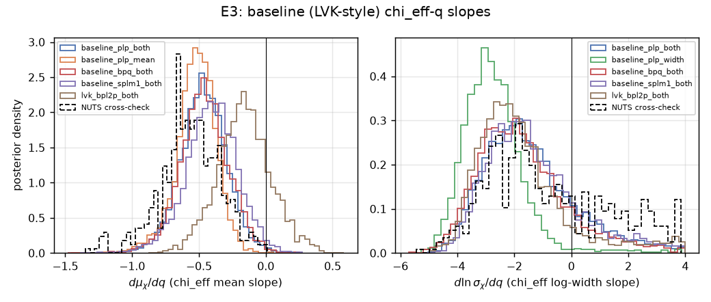
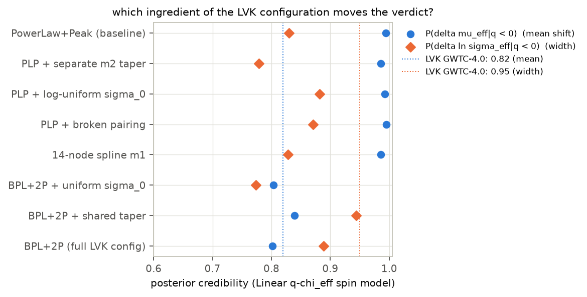
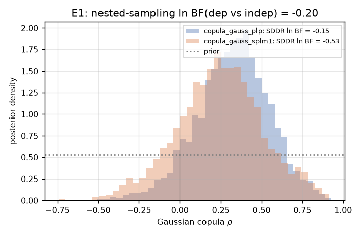
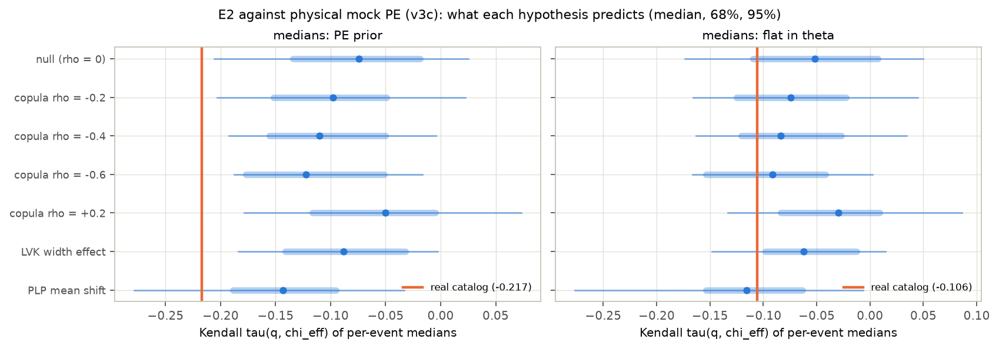
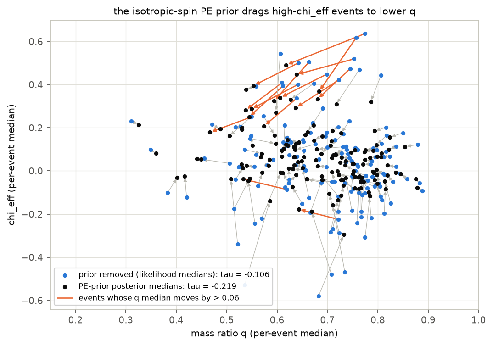
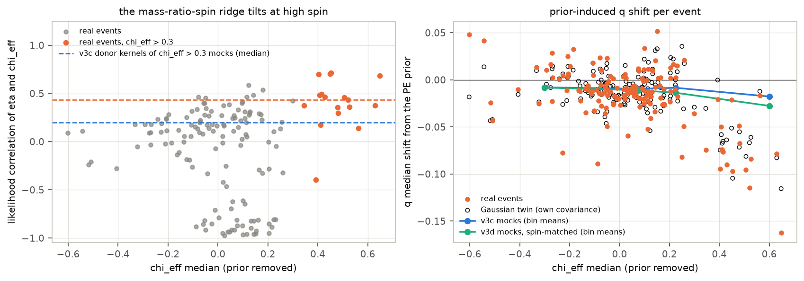
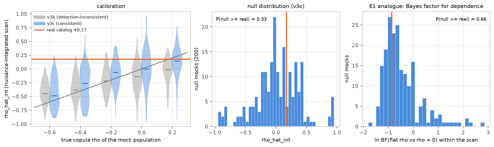
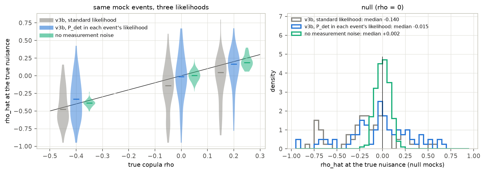
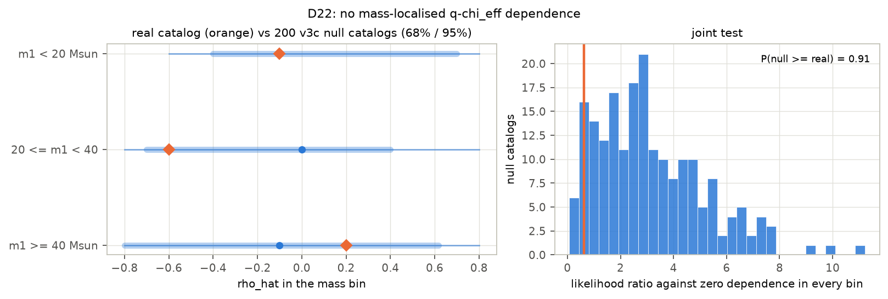

# Is the mass-ratio–effective-spin anticorrelation in GWTC-4.0 real?

*A preregistered stress test on 153 binary black holes — and why the honest answer is "not established"*

Run directory: `research-lab/runs/astronomy-gwtc4-q-chieff-copula-stress-test` · Preregistration: [`plan.md`](plan.md) ·
Every departure from it: [`deviations.md`](deviations.md) (D1–D30) · Draft of 2026-09-25, revised after independent review

> **Correction (6 October 2026).** A self-audit of the lab (`research-lab/paper/`) found that this study's plan.md was first committed to git in the same commit as its full results (258616c, 25 September 2026). The plan may have been written before the analysis, but the public record cannot show that, so "preregistered" in this report should be read as "analysis plan written by the agent", not as a verified preregistration. The verdict is unchanged. The lab's session logs (not public) show that the plan was written by an agent (the executor workflow's scoping subagent, logged model Claude Sonnet 5) on 2 September 2026, and existed then with the committed content.

## In plain terms

When two black holes orbit each other and merge, they send out ripples in space (gravitational waves) that detectors
in the US, Italy and Japan can pick up. From each signal, scientists estimate the black holes' masses and how they
spin. The latest public catalogue has 153 such pairs.

Several analyses report a pattern: pairs with more unequal masses tend to spin more in line with their orbit. If real,
it is a clue to how these pairs form, as partners from birth or by meeting in crowded star clusters. This study asked
whether the pattern is real or a by-product of analysis choices. The tests were written down in advance, and hundreds
of simulated catalogues showed what chance alone produces.

The answer is "not established":

- **About half of the simple version of the pattern comes from a default assumption.** Each measurement assumes
  spins point in random directions, and that assumption nudges fast-spinning pairs towards unequal masses.
- **The more careful measurement sees no link.** It uses each pair's full uncertainty, though it could only have
  caught a strong effect.
- **The result depends on modelling choices.** One published version of the pattern appears with one reasonable
  description of black-hole masses and disappears with the LVK's own. Switching between the standard computer models
  of the signal moves the answer by about as much as its uncertainty.

## Abstract

Several binary-black-hole (BBH) population analyses report that the effective inspiral spin χ_eff is anticorrelated
with the mass ratio q. We preregistered a test of the hypothesis that the GWTC-4.0 version of this correlation is an
artifact of mass- and pairing-model misspecification. The test used the LVK's own 153 BBHs, the public posterior
samples and the O1–O4a sensitivity injections, with two primary endpoints:

- **E1:** a Bayes factor for dependence in a copula model whose q and χ_eff marginals are left flexible;
- **E2:** a mock-calibrated false-positive rate for the rank correlation of per-event point estimates.

**The preregistered verdict is indeterminate.**

- **E1 is inconclusive.** It gives ln BF = −0.20. The copula posterior mildly favours *positive* dependence (median
  ρ = +0.33, P(ρ < 0) = 0.08).
- **E2's preregistered statistic is strongly negative, but it cannot be calibrated as a population measurement.**
  The point-estimate Kendall τ = −0.217 has a false-positive rate (FPR) of 0.010 against validated mock catalogs
  (posterior means, the plan's literal choice, give −0.237 and the same FPR). No more than 2.5% of catalogs from
  strongly anticorrelated populations or the LVK width effect reach it, and 10% of those from the PowerLaw+Peak mean
  shift.
- **About half of that signal comes from the PE prior.** The isotropic-spin prior drags high-χ_eff events to lower q medians
  (Figure F17). In the real catalog this shifts τ by −0.11. In simulated catalogs the same prior shifts it by about
  −0.03, and none of 880 reaches −0.11, so the statistic cannot be calibrated with Gaussian mock PE. With the prior
  removed, τ = −0.106 has FPR 0.19.
- **Every statistic that can be calibrated is consistent with no dependence,** under the detection-consistent mock
  model, though with low power against |ρ| ≤ 0.4. The hierarchical copula estimate ρ̂ = +0.17 has FPR 0.33, and its
  Bayes factor for dependence is smaller than in 66% of null catalogs (Figure F19).

Four results survive three independent adversarial reviews; the second was revised downward after recalibration:

1. **The Linear-model "mean shift" follows the mass model.** The LVK Linear model's evidence for a χ_eff mean that
   falls with q is present with PowerLaw+Peak masses: P(δμ < 0) = 0.995, ln BF = +3.4. It disappears with the LVK's
   own Broken Power Law + 2 Peaks masses: P(δμ < 0) = 0.80, ln BF = −1.0. A single-ingredient ablation attributes
   this to the primary-mass shape.
2. **Waveform choice moves the dependence estimate by about one posterior standard deviation.** On the calibrated
   hierarchical statistic the combined ("Mixed") posteriors give ρ̂ = +0.17, IMRPhenom-family posteriors −0.03 and
   SEOBNR +0.07; the posterior standard deviation of ρ is 0.22. Every variant is typical of no dependence. A
   fixed-nuisance version of the scan exaggerated the shift to 0.43.
3. **The posterior-median "anticorrelation" is largely a prior effect.** The parameter-estimation (PE) prior allows
   large χ_eff only at unequal masses. So along the mass-ratio–spin degeneracy it moves the q medians of high-χ_eff
   events down by about 0.1: GW190517_055101 goes from 0.77 to 0.62, GW231028_153006 from 0.75 to 0.64, and
   GW170729 from 0.64 to 0.55. This doubles the rank correlation of the medians, from −0.106 to −0.219. The statistic
   also has no power against the width effect the LVK report.
4. **A strong anticorrelation is disfavoured,** as is dependence localised in one mass range: a single-ρ Gaussian
   copula with ρ ≲ −0.5 does not fit under PowerLaw+Peak masses with spline marginals, and only 2.5% of mock catalogs
   with ρ = −0.4 or −0.6 reach the observed ρ̂.

The study also documents six failure modes of common shortcuts, each caught and quantified here:

- mock catalogs whose detection is decided by the true parameters while the measurement noise is drawn independently,
  which biased our dependence estimate by −0.14 (Figure F20);
- mock PE built by translating likelihood shapes;
- MAP optimisation of the Monte Carlo selection-corrected likelihood;
- a bounded penalty for Monte Carlo variance, which one repeat of a fit exploited through a single-sample spike (D28);
- plug-in parametric bootstraps;
- comparing point estimates taken under different measures.

## 1. Background and the gap

The anticorrelation was first reported in GWTC-2 (Callister et al. 2021, ApJL). In the GWTC-3.0 Linear model the
credibility that the χ_eff mean decreases with q, P(δμ_eff|q < 0), was 0.98.

The GWTC-4.0 population paper (Abac et al. 2025, arXiv:2508.18083 §6.5.1) softens this to 0.82. It reports instead
P(δ ln σ_eff|q < 0) = 0.95, a broadening at unequal masses, and excludes "no correlation of any kind" at > 99%. Its
Frank-copula fit gives κ_q,eff = −2.1 (+2.4/−2.9), with 92% credibility for κ < 0. The paper itself cautions that the
Linear model's correlation parameters also reshape the χ_eff marginal.

Four 2025–26 analyses bear on the same question:

- **Symbolic regression** (arXiv:2604.20941) calls the correlation width-driven.
- **A binned Gaussian-process analysis** (arXiv:2511.22093) finds no significant correlation, using a null-mock test.
- **A parametric mass–spin analysis** (arXiv:2512.03152) cautions that variance cuts and spin priors can inflate Bayes
  factors.
- **A subpopulation analysis** (arXiv:2605.24281) proposes mass-dependent spin subpopulations instead.

The copula construction (Adamcewicz & Thrane 2022) isolates dependence from marginal shape. The gap this study
addressed has three parts: a flexible-marginal copula test on GWTC-4.0, an explicit false-positive calibration, and a
check of whether the verdict depends on the mass model.

## 2. Data

**Events.** 153 BBHs, matching the LVK count exactly: 10 from O1/O2, 36 from O3a, 23 from O3b and 84 from O4a. The
selection criteria were:

- FAR < 1/yr in any pipeline;
- both component masses above 3 M⊙ at the 1% lower limit;
- GW190814 and GW230630_070659 excluded.

Two O3a events sit on the mass-cut boundary and are kept, following the paper's GWTC-3.0-inherited classification
(D7, D9).

**Posterior samples.** Each event uses its preferred "Mixed" release. The single-waveform families are used for the
systematics control (D25).

**PE priors.** The priors are uniform in detector-frame component masses, uniform in source-frame comoving volume, and
isotropic spins with magnitudes up to 0.99. They are evaluated analytically at every sample. An independent reviewer
checked that they reproduce bilby's stored prior terms (to four decimals on two events).

**Selection.** The LVK O1–O4a cumulative sensitivity injections, with 1.07 million found injections. The draw density
is converted with each run component's spin family (D2). The reviewer checked this against the Zenodo usage formula.

## 3. Methods

**Hierarchical likelihood.** This is the standard selection-corrected Monte Carlo likelihood with 10,000 samples per
event. The LVK convergence criteria (variance < 1, injection effective sample size > 4N) are applied as a steep penalty
(D11).

**Models.** 21 population models are fitted with nautilus (two more were dropped for runtime; §6).

| Sector | Variants |
|---|---|
| Primary mass | PowerLaw+Peak (PLP); LVK Broken Power Law + 2 Peaks (BPL+2P, App. B.3; D15); 14-node spline in ln m1 |
| Pairing q\|m1 | power law; broken power law; spline (copula models) |
| Spin | LVK "Linear" model: truncated-Gaussian χ_eff with mean and log-width linear in q (App. B.7); flexible spline χ_eff marginal; truncated-Gaussian marginal (LVK-marginal copulas, D24) |
| Dependence | Gaussian or Frank copula between u = F(q\|m1) and v = F(χ_eff); independence; a ρ per mass bin (D22) |

**Mock catalogs.** Mocks draw populations from the fitted models and events from the found injections, which applies
the real selection function. Measurement scatter went through four versions (D27, D27c):

- **v1 (stage 04):** translated real-event likelihood shapes. Independent review found two construction defects.
- **v2:** the two defects corrected.
- **v3b:** the standard physical mock PE. Measurement noise is Gaussian in (ln 𝓜_det, η, χ_eff, ln d_L) with each
  donor's covariance and the physical bound η ≤ 1/4, and samples are resampled to the PE prior.
- **v3c:** v3b with the detection probability P_det(θ) in each mock event's likelihood. v3b decides detection from the
  true parameters and draws the noise independently, so the standard likelihood is inconsistent with it (§4.4).
  v3c is used for every headline false-positive rate in this report.
- **v3d (diagnostic):** v3c with donors also matched in spin. It fails validation and is used only to test the
  PE-prior mechanism (§4.4).

No headline false-positive rate is quoted from a mock set that fails validation against the real catalog; numbers
from v1, v3b and v3d appear only as history or as labelled sensitivity checks.

**E2 statistics.**

- **Point estimates (preregistered primary).** Kendall τ between per-event medians of q and χ_eff (the plan specified
  posterior means; medians were used without a logged deviation until D30, and means give the same FPR). It is computed
  under four measures, applied identically to real and mock samples (D21).
- **Hierarchical statistic.** A likelihood scan in the copula ρ (D20). After review it became nuisance-integrated
  (D27): the likelihood is averaged over 16 posterior draws of the other hyperparameters, identically for the real
  catalog and every mock.

**Decision rule (plan §7).**

- **Artifact-consistent:** E1's ln BF < ln 3 and E2's false-positive rate (FPR) > 5%.
- **Refuted:** ln BF ≥ ln 3 and FPR ≤ 5%, holding under the mass-model variants.
- **Indeterminate:** otherwise, including when E1 and E2 disagree.

## 4. Results

### 4.1 Reproducing the LVK: it depends on the mass model

With PLP masses, the plan's acceptance gate fails. The Linear model gives P(δμ < 0) = 0.995 and
P(δ ln σ < 0) = 0.830, against the LVK's 0.82 and 0.95. With the LVK's BPL+2P masses the same pipeline gives 0.802 and
0.889, and the gate passes.

The BPL+2P fit has a narrow 9.7 M⊙ peak carrying about 56% of the population, a break at 35 M⊙, and evidence 2.5 nats
above PLP. The reviewers confirmed the implementation against the paper's Appendix B equations. The plan's primary E1
configuration (PLP) is therefore not the gate-passing one. D24 repeats E1 inside the LVK configuration.

### 4.2 E3/E4: the "mean shift" is a mass-model effect (robust)

Table 1. Log Bayes factors of the Linear model's q-dependence against no q-dependence, under two mass models.

| Linear-model q-dependence vs none | PowerLaw+Peak | LVK BPL+2P |
|---|---|---|
| mean only (E3a) | **+3.44** | −0.98 |
| width only (E3b) | +1.84 | **+0.84** |
| mean + width (E3c) | +2.88 | −0.93 |

The pairing function does not matter: E4c ln BF = +0.03. A 14-node spline in m1 keeps the mean shift at
P(δμ < 0) = 0.985.

The ablation (D17, Figure F13) changes one element of the LVK configuration at a time. The mean-shift credibility
follows the mass shape: 0.985–0.995 for PLP-family models and 0.80–0.84 for BPL+2P. It does not depend on the m2 taper
or the spin-width prior. This split is far larger than sampler noise.

The width credibility moves with the σ₀ prior: 0.88–0.94 for log-uniform and 0.77–0.87 for uniform. Treat that
attribution as tentative. On the same model nautilus and NUTS give 0.830 and 0.676. Repeated nautilus seeds agree to 0.01
(D28), so this 0.15 difference is not sampler noise: the NUTS cross-check samples the likelihood without the Monte
Carlo variance penalty, so it targets a slightly different distribution. Treat the width credibility as uncertain at
that level.

### 4.3 E1: inconclusive, with a mild positive lean

The Gaussian copula with spline marginals and PLP masses gives:

- **Evidence.** ln BF = −0.20; the Savage–Dickey cross-check gives −0.15.
- **Posterior.** ρ has a median of +0.33 with a 90% interval of [−0.05, +0.67], and P(ρ < 0) = 0.08.
- **Spline masses (E1c).** Savage–Dickey gives ln BF = −0.53, and the median ρ is +0.25.

Three caveats from review (D26, D26b):

- **The Bayes factor is an Occam balance, not evidence of absence.** The likelihood gain from dependence (0.3–0.9 nats)
  is offset by the prior-volume cost of ρ (about 1 nat).
- **E1 itself is not mock-calibrated.** Refitting hundreds of mocks with nested sampling is out of reach. The nearest
  calibrated proxy is the Bayes factor from the hierarchical scan (§4.4): −0.86 for the real catalog, exceeded by 66%
  of null catalogs.
- **The positive lean contradicts the Linear model's negative mean slope under the same masses.** Per-event slopes show
  ρ is pulled positive by a few high-q, high-χ_eff events: GW231028_153006, GW190620_030421, GW190805_211137 and
  GW170729. It is pulled negative by GW190412 and GW231226_101520.

**E1 inside the LVK configuration (D24).** The paper's own construction is a Frank copula on the LVK null model's
marginals, fitted to the same 153 events. It gives ln BF(dependence vs independence) = **−2.10** (Savage–Dickey
−2.07). The best-fit likelihood does not improve (−4567.24 against −4567.09), so the Bayes factor is the Occam cost of
the κ ∈ [−20, 20] prior.

κ has a median of −0.51 with a 90% interval of [−3.9, +2.7], and P(κ < 0) = 0.60. The paper reports −2.1
(+2.4/−2.9) with P(κ < 0) = 0.92. The intervals overlap and the lean has the same sign, but ours is centred
closer to zero.

The Gaussian-copula twin gives ln BF = **−0.98** (Savage–Dickey −0.84). Its median ρ is −0.09 with a 90% interval of
[−0.53, +0.37], P(ρ < 0) = 0.61, and again no likelihood gain.

Inside the gate-passing configuration, both copula families find no dependence, with a slight negative lean. Under
PowerLaw+Peak masses with spline marginals the lean was positive. The sign of a weak dependence estimate follows the
marginal and mass model, like the Linear-model mean shift.

### 4.4 E2: the preregistered statistic is dominated by the PE prior and cannot be calibrated

**Mock catalogs (D27, D27c).** The original mock catalogs, and a version with their construction defects fixed,
failed validation against the real catalog. Both translate real likelihood shapes to new locations. Mass-ratio
likelihoods are not a location family: the waveform measures the symmetric mass ratio η, which is flat at q = 1.

The replacement uses standard physical mock PE:

- Gaussian noise in (ln 𝓜_det, η, χ_eff, ln d_L), using the covariance of a real donor event matched in chirp mass
  and distance;
- the physical bound η ≤ 1/4;
- each mock event's samples resampled to the real PE prior;
- in the final version (v3c), the detection probability P_det(θ) in each mock event's likelihood (see "A
  detection-consistency trap" below).

Both physical versions match the real catalog in Monte Carlo variance and measurement widths, and reproduce most of
the q → 1 pile-up:

| | Monte Carlo variance | q width (90%) | χ_eff width (90%) | Events with most likelihood at q > 0.9 |
|---|---|---|---|---|
| real | 0.89 [0.71, 1.06] | 0.48 | 0.52 | 81% |
| v1 (original) | 2.17 | 0.59 | 0.59 | 41% |
| v3b (physical) | 0.96 [0.72, 1.19] | 0.46 | 0.55 | 70% |
| v3c (physical, detection-consistent) | 0.89 [0.67, 1.16] | 0.44 | 0.55 | 69% |

**Result (D27c, Figure F18).** Kendall τ of the q and χ_eff medians, against 200 v3c null catalogs and 240
alternative-hypothesis catalogs:

| Point estimate | Real τ | Null median [95%] | FPR one-/two-sided |
|---|---|---|---|
| PE-prior posterior medians (preregistered) | −0.217 | −0.074 [−0.206, +0.025] | 0.010 / 0.015 |
| prior removed (flat in m1, q, χ_eff, z) | −0.106 | −0.052 [−0.173, +0.050] | 0.190 / 0.380 |
| flat internal coordinates | −0.057 | −0.007 [−0.102, +0.094] | 0.190 / 0.410 |
| population-informed | −0.102 | −0.063 [−0.168, +0.049] | 0.185 / 0.475 |

The preregistered statistic sits in the 2.5% tail of every simulated hypothesis except the PowerLaw+Peak mean shift,
where it is in the 10% tail:

| Simulated hypothesis | Median τ, PE-prior medians | Catalogs with τ ≤ −0.217 |
|---|---|---|
| no dependence | −0.074 | 1.0% |
| copula ρ = −0.4 | −0.110 | 2.5% |
| copula ρ = −0.6 | −0.123 | 0% |
| LVK width effect | −0.088 | 0% |
| PowerLaw+Peak mean shift | −0.144 | 10% |
| real catalog | **−0.217** | |

With the PE prior removed, the real value is ordinary under every hypothesis. The statistic also has almost no power
against the LVK width effect: 5% of width-effect catalogs fall below the null's 5% quantile, the rate expected with no
effect at all.

**Mechanism (D29, Figure F17).** Swapping one coordinate at a time shows the prior acts mainly through the q medians:

| Kendall τ between | Value |
|---|---|
| q and χ_eff likelihood medians | −0.106 |
| q posterior medians, χ_eff likelihood medians | −0.188 |
| q likelihood medians, χ_eff posterior medians | −0.142 |
| q and χ_eff posterior medians | −0.219 |

The events the prior moves most are high-χ_eff events pulled to lower q. GW190517_055101 goes from q = 0.77 to 0.62,
GW231028_153006 from 0.75 to 0.64, GW190620_030421 from 0.70 to 0.61, and GW170729 from 0.64 to 0.55. The
isotropic-spin prior h(χ_eff | q) admits large χ_eff only at unequal masses. Along the mass-ratio–spin degeneracy, a
high-χ_eff event is pulled toward lower q, producing "high χ_eff at low q" in posterior medians with no population
correlation.

**The mocks cannot reproduce this prior effect (D29b–d, Figure F21).** In the real catalog the PE prior shifts τ by −0.111, from
−0.106 to −0.217. In the mocks it shifts τ by about −0.03, under every hypothesis and in every mock version tested (v3b, v3c, v3d). None of
880 v3b and v3c catalogs reaches −0.111; the most extreme is −0.083.

The Gaussian measurement model is not itself at fault. A noise-free Gaussian twin of each real event, built with that
event's own covariance, reproduces the real catalog's shift to three decimals (−0.120 against −0.120), although the
twins' τ values themselves are offset (−0.258 and −0.138 against −0.218 and −0.098).

The shift is carried by the high-spin events:

- **Real events.** Those with χ_eff > 0.3 have broad likelihoods whose mass-ratio–spin ridge tilts toward high q and
  high χ_eff. Their η–χ_eff correlation is +0.43, against +0.09 for the other events. The isotropic prior pushes them
  down that ridge by 0.07 in q on average.
- **Mock events.** Each borrows its covariance from a real donor matched in chirp mass and distance. Those donors are
  mostly low-spin events, so high-spin mock events move by only 0.017.
- **Matching donors in spin as well (v3d).** This restores the tilt but makes the likelihoods about 25% too narrow, so
  the mocks fail validation. The shift is still only −0.031.

These are largely the events that pull the copula ρ positive (§4.3): GW231028_153006, GW190620_030421,
GW190805_211137 and GW170729. Their likelihoods put high χ_eff at fairly high q, which pushes ρ up. The PE prior moves
their medians to lower q, which pushes τ down. This accounts for part of the sign disagreement between the
hierarchical and posterior-median statistics; the prior-removed τ (−0.106) is still negative while ρ̂ is positive.

The real catalog has only 17–18 high-spin events (depending on the sample subset), and no Gaussian mock construction we built reproduces both their tilt
and their breadth. So the preregistered statistic cannot be calibrated even with validated mocks. Its FPR of 0.010
reflects the mocks' weak prior response, not the population.

**The hierarchical statistic (D27, D27c, Figure F19).** The Gaussian-copula likelihood is averaged over 16 posterior
draws of the other hyperparameters and maximised in ρ, identically for the real catalog and every mock. Under the v3c
mock-PE model it is null-centred and monotone, with an attenuated response: the null median is +0.002, and
ρ_true = −0.6, −0.4, −0.2 and +0.2 give medians of −0.48, −0.26, −0.06 and +0.14.

| Statistic | Real catalog | v3c null median [68%] | FPR |
|---|---|---|---|
| ρ̂ | +0.17 (Monte Carlo sd 0.02) | +0.00 [−0.31, +0.35] | 0.33 (one-sided) |
| likelihood ratio against ρ = 0 | 0.48 | 0.63 | 0.56 |
| ln BF, flat prior on ρ | −0.86 | −0.66 | 0.66 |

The statistic is weak, so being "typical of the null" says little on its own. Its null spread is ±0.33, and its
likelihood ratio exceeds the null's 95th percentile in only 45% of ρ = −0.6 catalogs and 20% of mean-shift catalogs.
The discriminating fact is on the other side: only 2.5% of catalogs with ρ_true = −0.4 or −0.6 reach the real ρ̂, so a
strong anticorrelation is disfavoured. The mean-shift and width alternatives are not excluded: 12.5% and 32.5% of
their catalogs reach it. The calibration does not hinge on the mocks' weak prior response. Against the spin-matched
v3d mocks, which carry the real events' degeneracy tilt, the same statistic gives FPR 0.25 and a Bayes-factor FPR of
0.65 (a sensitivity check only; v3d fails validation).

**A detection-consistency trap (D27c, Figure F20).** Against the first physical mocks (v3b), the same statistic had a
null median of −0.14. The bias persisted when the scan used each mock's true population, so it was not a
nuisance-parameter effect. It vanished for noise-free events, so it was not the estimator.

The cause is how v3b decides detection. It draws each event's true parameters from the found injections, so detection
depends on the true parameters, and then draws the measurement noise independently. For such data the correct
per-event likelihood contains P_det(θ). The standard hierarchical likelihood omits that factor. That is right for real
events, whose detection and measurement come from the same data, but wrong for these mocks. Essick & Fishbach (2024,
arXiv:2310.02017) describe this class of inconsistency. Within an event's posterior P_det varies mostly with distance,
so the error enters through the distance and source-mass parameters.

Adding P_det(θ), estimated from the found injections, to each mock event's likelihood removes the bias: the null
median becomes −0.015. The v3c mocks build this in. The bias matters because it is half the null spread. Calibrated
against v3b, the real catalog's ρ̂ would have looked like mild evidence of *positive* dependence (FPR 0.09).

### 4.5 Waveform systematics (D25)

The same 153 events were rebuilt from single waveform families, with the same PE-prior treatment.

| Posterior samples | ρ̂, calibrated scan | ρ̂, fixed-nuisance scan (superseded) | τ, PE-prior medians |
|---|---|---|---|
| Mixed (preferred release) | +0.17 | +0.07 | −0.217 |
| IMRPhenomXPHM / -SpinTaylor | −0.03 | **−0.36** | −0.254 |
| SEOBNRv4PHM / v5PHM | +0.07 | −0.05 | −0.175 |

On the calibrated statistic (the nuisance-integrated scan of §4.4; Monte Carlo sd 0.02 per variant), waveform choice
moves the dependence estimate by 0.21. That is about one posterior standard deviation of ρ (0.22), and every variant
lies inside the 68% range of the v3c null distribution. The fixed-nuisance scan, whose value depends on the plug-in
nuisance (§4.4), exaggerated the shift to 0.43. Waveform systematics are therefore comparable to the statistical
uncertainty. A claim of q–χ_eff dependence at the |ρ| ≈ 0.2 level in GWTC-4.0 would need to hold across waveform
families.

### 4.6 Exploratory follow-ups

**Mass-localised dependence (D22, Figure F16).** A copula with a ρ per E5 mass bin finds flat likelihoods in all bins.
The likelihood ratio against zero dependence is 0.61, and 91% of v3c null catalogs exceed it. For the difference
between bins the ratio is 0.55, exceeded by 79%. The per-bin null spreads are wide, so this statistic has little
power.

**Precision split (D23).** Splitting events by measurement precision is inconclusive.

### 4.7 Preregistered verdict: indeterminate

- **E1:** ln BF = −0.20, below ln 3.
- **E2 (preregistered point-estimate statistic):** FPR 0.010 against the validated, detection-consistent v3c mocks
  (0/200 against v1 and v3b; posterior means give the same FPR, D30). It also sits in the 2.5% tail of every simulated
  alternative except the PowerLaw+Peak mean shift (10%), because it is dominated by a PE-prior effect the mocks
  cannot reproduce.

Per plan §7, E1 < ln 3 with E2 FPR ≤ 5% is "indeterminate: E1 and E2 disagree". The substantive reading is stronger
than a tie. Once the PE prior is removed from the point estimates (FPR 0.19), and in the calibrated hierarchical
statistic (FPR 0.33) and its Bayes factor (0.66), the real catalog is consistent with a population without q–χ_eff
dependence under the detection-consistent mock model. Those statistics have low power against |ρ| ≤ 0.4, so this is
consistency, not a constraint; only a strong anticorrelation (ρ ≤ −0.4) is disfavoured. An earlier draft of this report called the result "artifact-consistent" by
substituting the hierarchical ρ scan for the preregistered statistic under a rule written with its outcome
foreseeable. Independent review rejected that, rightly (D26).

## 5. Discussion

**What this study establishes:**

1. **The mean-shift reading is a mass-model outcome.** The parametric "χ_eff mean decreases with q" signal comes from
   PowerLaw+Peak-family mass models and vanishes under the LVK's own mass model. The ablation attributes it to the
   mass shape.
2. **Waveform systematics are as large as the statistical uncertainty.** The same events give dependence estimates
   from +0.17 to −0.03 depending on the waveform family (calibrated statistic).
3. **Point-estimate correlations are fragile.** They depend strongly on the measure, and half the posterior-median
   signal is prior-induced. Part of the sign disagreement between the point-estimate and hierarchical statistics
   traces to a handful of high-spin events whose likelihoods sit at high q and whose PE-prior medians sit at low q.
4. **Calibrating these statistics is harder than the literature's shortcuts assume.** Mock PE that translates real
   likelihood shapes cannot reproduce the q → 1 pile-up. Mass-ratio likelihoods are not a location family in any of
   the usual coordinates, because the waveform measures the symmetric mass ratio η, which is flat at q = 1.
5. **Mock catalogs must be detection-consistent.** Drawing events from found injections and adding independent
   measurement noise biased our dependence estimate by −0.14, half the null spread. Including P_det(θ) in each mock
   event's likelihood removes the bias. This is a concrete, quantified case of the inconsistency Essick & Fishbach
   (2024) warn about.
6. **Other shortcuts fail in specific ways.** MAP optimisation of the Monte Carlo likelihood exploits injection
   sparsity. A finite variance penalty lets a sampler trade a bounded cost for an unbounded single-event gain.
   Plug-in bootstraps are not orthogonal to the nuisance parameters.

**What it does not establish:**

- **Whether GWTC-4.0 contains any q–χ_eff dependence.** A single global Gaussian copula detects monotone dependence
  only. It cannot test the width (heteroscedastic) effect the LVK reports. Our width-effect credibility is prior- and
  sampler-sensitive.
- **Whether the posterior-median signal holds any population information beyond the PE-prior effect.** Answering that
  needs mock PE that reproduces how real posteriors respond to the prior, which means full waveform inference on
  simulated signals.

**Relation to the literature:**

- The results agree with the "no significant correlation" analysis (arXiv:2511.22093) and with the variance-cut and
  prior caution of arXiv:2512.03152.
- They support the GWTC-4.0 paper's own warning that the Linear model's parameters confound marginal shape and trend.
- They add three things: the mass-model dependence of the mean shift, the size of the waveform systematic, and a
  quantified case of the detection-consistency requirement for mock catalogs.

## 6. Limitations

1. **E2 calibration.** The false-positive rates rest on v3c. It is validated and detection-consistent, but its mock
   PE is Gaussian and its P_det is a smoothed estimate from the injections. It reproduces only about a quarter of the
   real PE-prior shift in τ, so the preregistered statistic remains uncalibrated.
2. **E1 null calibration.** E1 itself is not mock-calibrated. The calibrated proxy is the scan's Bayes factor, which
   integrates over a fixed 16-draw ensemble of the other hyperparameters rather than over their full posterior.
3. **Sampler noise and a penalty loophole.** Three nautilus seeds agree to 0.07 nats in ln Z and 0.012 in the slope
   credibilities (D28). One repeat found a Monte Carlo likelihood spike, where a single posterior sample of one event
   dominates its integral. The finite variance penalty (D11) is bounded and cannot suppress such a spike; the LVK
   hard cut would. Screening every fit shows no other fit is affected. Nautilus and NUTS still differ by 0.15 on the
   width credibility, because they sample slightly different likelihoods.
4. **The variance cut is active.** The Monte Carlo variance cut bites, with var_tot at the 99th percentile about 0.99.
   Its effect is similar across models but not zero.
5. **Dropped fits.** The E1c independence twin (D18) and the PLP Frank copula (D16) were dropped for runtime.
6. **Prior settings.** β_q uses U(−4, 12), against the LVK's U(−2, 7). The Linear-model intercept is anchored at q = 1
   (D14).
7. **The gate.** The primary E1/E2 configuration fails the plan's reproduction gate; D24 addresses this.

## 7. Reproducibility

The code is in `code/`, with the pipeline in `src/` and the 2026-09-25 statistics, mock builders, validation and
figures in `analysis/`. Every departure from the plan, with timing and rationale, is in `deviations.md`. The reviews'
scratch code is referenced from D26 and D26b. The nested-sampling checkpoints (about 1.6 GB) are regenerable and not
committed.
