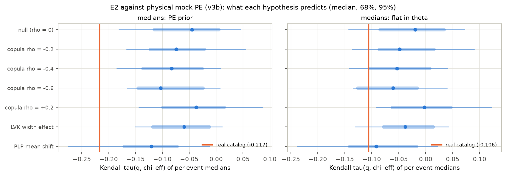
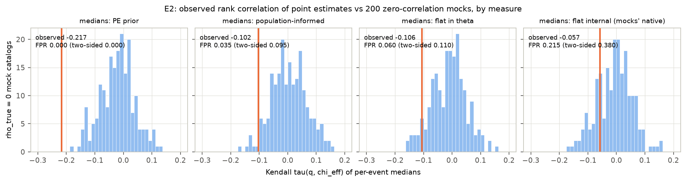

# Is the mass-ratio–effective-spin anticorrelation in GWTC-4.0 real?

*A preregistered stress test on 153 binary black holes — and why the honest answer is "not established"*

Run directory: `research-lab/runs/astronomy-gwtc4-q-chieff-copula-stress-test` · Preregistration: [`plan.md`](plan.md) ·
Every departure from it: [`deviations.md`](deviations.md) (D1–D28) · Draft of 2026-09-25, revised after independent review

## Abstract

Several binary-black-hole (BBH) population analyses report that the effective inspiral spin χ_eff is anticorrelated
with the mass ratio q. We preregistered a test of the hypothesis that the GWTC-4.0 version of this correlation is an
artifact of mass- and pairing-model misspecification. The test used the LVK's own 153 BBHs, the public posterior
samples and the O1–O4a sensitivity injections, with two primary endpoints:

- **E1:** a Bayes factor for dependence in a copula model whose q and χ_eff marginals are left flexible;
- **E2:** a mock-calibrated false-positive rate for the rank correlation of per-event point estimates.

**The preregistered verdict is indeterminate.**

- **E1 is inconclusive.** It gives ln BF = −0.20. The copula posterior mildly favours *positive* dependence (median
  ρ = +0.33, P(ρ < 0) = 0.08).
- **E2's statistic is strongly negative, but it does not measure the population.** The point-estimate Kendall
  τ = −0.217 is more extreme than every mock catalog we simulated. That includes mocks built with physical measurement
  noise and validated against the real catalog. It also includes strongly anticorrelated populations, the LVK width
  effect and the PowerLaw+Peak mean shift.
- **Most of that signal comes from the PE prior.** The isotropic-spin prior drags high-χ_eff events to lower q medians
  (Figure F17). With the prior removed, τ = −0.106 is ordinary against every hypothesis (FPR 0.085).

Four results hold up under two independent adversarial reviews:

1. **The Linear-model "mean shift" follows the mass model.** The LVK Linear model's evidence for a χ_eff mean that
   falls with q is present with PowerLaw+Peak masses: P(δμ < 0) = 0.995, ln BF = +3.4. It disappears with the LVK's
   own Broken Power Law + 2 Peaks masses: P(δμ < 0) = 0.80, ln BF = −1.0. A single-ingredient ablation attributes
   this to the primary-mass shape.
2. **Waveform choice moves the dependence estimate by three null standard deviations.** Replacing the combined
   ("Mixed") posteriors with IMRPhenom-family posteriors shifts it by 0.43 (+0.07 → −0.36); SEOBNR gives −0.05.
3. **The posterior-median "anticorrelation" is largely a prior effect.** The parameter-estimation (PE) prior allows
   large χ_eff only at unequal masses. So along the mass-ratio–spin degeneracy it moves the q medians of high-χ_eff
   events down by about 0.1: GW190517_055101 goes from 0.77 to 0.62, GW231028_153006 from 0.75 to 0.64, and
   GW170729 from 0.64 to 0.55. This doubles the rank correlation of the medians, from −0.106 to −0.219. The statistic
   also has no power against the width effect the LVK report.
4. **A strong anticorrelation is disfavoured,** as is dependence localised in one mass range: a single-ρ Gaussian
   copula with ρ ≲ −0.5 does not fit.

The study also documents four failure modes of common shortcuts, each caught and quantified here:

- mock PE built by translating likelihood shapes;
- MAP optimisation of the Monte Carlo selection-corrected likelihood;
- plug-in parametric bootstraps;
- comparing point estimates taken under different measures.

## 1. Background and the gap

The anticorrelation was first reported in GWTC-2 (Callister et al. 2021, ApJL). In the GWTC-3.0 Linear model the
credibility that the χ_eff mean decreases with q, P(δμ_eff|q < 0), was 0.98.

The GWTC-4.0 population paper (Abac et al. 2025, arXiv:2508.18083 §6.5.1) softens this to 0.82. It reports instead
P(δ ln σ_eff|q < 0) = 0.95, a broadening at unequal masses, and excludes "no correlation of any kind" at > 99%. Its
Frank-copula fit gives κ_q,eff = −2.1 (+2.4/−2.9), with 92% credibility for κ < 0. The paper itself cautions that the
Linear model's correlation parameters also reshape the χ_eff marginal.

Four 2025–26 analyses bear on the same question:

- **Symbolic regression** (arXiv:2604.20941) calls the correlation width-driven.
- **A binned Gaussian-process analysis** (arXiv:2511.22093) finds no significant correlation, using a null-mock test.
- **A parametric mass–spin analysis** (arXiv:2512.03152) cautions that variance cuts and spin priors can inflate Bayes
  factors.
- **A subpopulation analysis** (arXiv:2605.24281) proposes mass-dependent spin subpopulations instead.

The copula construction (Adamcewicz & Thrane 2022) isolates dependence from marginal shape. The gap this study
addressed has three parts: a flexible-marginal copula test on GWTC-4.0, an explicit false-positive calibration, and a
check of whether the verdict depends on the mass model.

## 2. Data

**Events.** 153 BBHs, matching the LVK count exactly: 10 from O1/O2, 36 from O3a, 23 from O3b and 84 from O4a. The
selection criteria were:

- FAR < 1/yr in any pipeline;
- both component masses above 3 M⊙ at the 1% lower limit;
- GW190814 and GW230630_070659 excluded.

Two O3a events sit on the mass-cut boundary and are kept, following the paper's GWTC-3.0-inherited classification
(D7, D9).

**Posterior samples.** Each event uses its preferred "Mixed" release. The single-waveform families are used for the
systematics control (D25).

**PE priors.** The priors are uniform in detector-frame component masses, uniform in source-frame comoving volume, and
isotropic spins with magnitudes up to 0.99. They are evaluated analytically at every sample. An independent reviewer
checked that they reproduce bilby's stored prior terms exactly.

**Selection.** The LVK O1–O4a cumulative sensitivity injections, with 1.07 million found injections. The draw density
is converted with each run component's spin family (D2). The reviewer checked this against the Zenodo usage formula.

## 3. Methods

**Hierarchical likelihood.** This is the standard selection-corrected Monte Carlo likelihood with 10,000 samples per
event. The LVK convergence criteria (variance < 1, injection effective sample size > 4N) are applied as a steep penalty
(D11).

**Models.** 23 population models are fitted with nautilus.

| Sector | Variants |
|---|---|
| Primary mass | PowerLaw+Peak (PLP); LVK Broken Power Law + 2 Peaks (BPL+2P, App. B.3; D15); 14-node spline in ln m1 |
| Pairing q\|m1 | power law; broken power law; spline (copula models) |
| Spin | LVK "Linear" model: truncated-Gaussian χ_eff with mean and log-width linear in q (App. B.7); flexible spline χ_eff marginal; truncated-Gaussian marginal (LVK-marginal copulas, D24) |
| Dependence | Gaussian or Frank copula between u = F(q\|m1) and v = F(χ_eff); independence; a ρ per mass bin (D22) |

**Mock catalogs.** Mocks draw populations from the fitted models and events from the found injections, which applies
the real selection function. Measurement scatter went through three versions (D27):

- **v1 (stage 04):** translated real-event likelihood shapes. Independent review found two construction defects.
- **v2:** the two defects corrected.
- **v3b:** the standard physical mock PE. Measurement noise is Gaussian in (ln 𝓜_det, η, χ_eff, ln d_L) with each
  donor's covariance and the physical bound η ≤ 1/4, and samples are resampled to the PE prior.

No false-positive rate is quoted from a mock set that fails validation against the real catalog.

**E2 statistics.**

- **Point estimates (preregistered primary).** Kendall τ between per-event medians of q and χ_eff. It is computed
  under four measures, applied identically to real and mock samples (D21).
- **Hierarchical statistic.** A likelihood scan in the copula ρ (D20). It was improved after review into a
  nuisance-integrated version (D27).

**Decision rule (plan §7).**

- **Artifact-consistent:** E1's ln BF < ln 3 and E2's false-positive rate (FPR) > 5%.
- **Refuted:** ln BF ≥ ln 3 and FPR ≤ 5%, holding under the mass-model variants.
- **Indeterminate:** otherwise, including when E1 and E2 disagree.

## 4. Results

### 4.1 Reproducing the LVK: it depends on the mass model

With PLP masses, the plan's acceptance gate fails. The Linear model gives P(δμ < 0) = 0.995 and
P(δ ln σ < 0) = 0.830, against the LVK's 0.82 and 0.95. With the LVK's BPL+2P masses the same pipeline gives 0.802 and
0.889, and the gate passes.

The BPL+2P fit has a narrow 9.7 M⊙ peak carrying about 56% of the population, a break at 35 M⊙, and evidence 2.5 nats
above PLP. The reviewers confirmed the implementation against the paper's Appendix B equations. The plan's primary E1
configuration (PLP) is therefore not the gate-passing one. D24 repeats E1 inside the LVK configuration.

### 4.2 E3/E4: the "mean shift" is a mass-model effect (robust)

Table 1. Log Bayes factors of the Linear model's q-dependence against no q-dependence, under two mass models.

| Linear-model q-dependence vs none | PowerLaw+Peak | LVK BPL+2P |
|---|---|---|
| mean only (E3a) | **+3.44** | −0.98 |
| width only (E3b) | +1.84 | **+0.84** |
| mean + width (E3c) | +2.88 | −0.93 |

The pairing function does not matter: E4c ln BF = +0.03. A 14-node spline in m1 keeps the mean shift at
P(δμ < 0) = 0.985.

The ablation (D17, Figure F13) changes one element of the LVK configuration at a time. The mean-shift credibility
follows the mass shape: 0.985–0.995 for PLP-family models and 0.80–0.84 for BPL+2P. It does not depend on the m2 taper
or the spin-width prior. This split is far larger than sampler noise.

The width credibility moves with the σ₀ prior: 0.88–0.94 for log-uniform and 0.77–0.87 for uniform. Treat that
attribution as tentative. On the same model nautilus and NUTS give 0.830 and 0.676, so the width credibility carries a
sampler systematic of about ±0.1 (D26 item 8; seeds in D28).

### 4.3 E1: inconclusive, with a mild positive lean

The Gaussian copula with spline marginals and PLP masses gives:

- **Evidence.** ln BF = −0.20; the Savage–Dickey cross-check gives −0.15.
- **Posterior.** ρ has a median of +0.33 with a 90% interval of [−0.05, +0.67], and P(ρ < 0) = 0.08.
- **Spline masses (E1c).** Savage–Dickey gives ln BF = −0.53, and the median ρ is +0.25.

Three caveats from review (D26, D26b):

- **The Bayes factor is an Occam balance, not evidence of absence.** The likelihood gain from dependence (0.3–0.9 nats)
  is offset by the prior-volume cost of ρ (about 1 nat).
- **E1 has no usable null calibration.** Only two mock refits exist, run under a variance cut that every v1 mock
  violated. One of the two exceeded ln 3.
- **The positive lean contradicts the Linear model's negative mean slope under the same masses.** Per-event slopes show
  ρ is pulled positive by a few high-q, high-χ_eff events: GW231028_153006, GW190620_030421, GW190805_211137 and
  GW170729. It is pulled negative by GW190412 and GW231226_101520.

**E1 inside the LVK configuration (D24).** The paper's own construction is a Frank copula on the LVK null model's
marginals, fitted to the same 153 events. It gives ln BF(dependence vs independence) = **−2.10** (Savage–Dickey
−2.07). The best-fit likelihood does not improve (−4567.24 against −4567.09), so the Bayes factor is the Occam cost of
the κ ∈ [−20, 20] prior.

κ has a median of −0.51 with a 90% interval of [−3.9, +2.7], and P(κ < 0) = 0.60. The paper reports −2.1
(90% [−5.0, +0.3]) with P(κ < 0) = 0.92. The intervals overlap and the lean has the same sign, but ours is centred
closer to zero. *[Gaussian-copula twin: pending.]*

### 4.4 E2: the preregistered statistic is a prior effect, not a population measurement

**Validated mock catalogs (D27).** The original mock catalogs, and a version with their construction defects fixed,
failed validation against the real catalog. Both translate real likelihood shapes to new locations. Mass-ratio
likelihoods are not a location family: the waveform measures the symmetric mass ratio η, which is flat at q = 1.

The final version (v3b) uses standard physical mock PE:

- Gaussian noise in (ln 𝓜_det, η, χ_eff, ln d_L), using the covariance of a real donor event matched in chirp mass
  and distance;
- the physical bound η ≤ 1/4;
- each mock event's samples resampled to the real PE prior.

It matches the real catalog in Monte Carlo variance and measurement widths, and reproduces about 87% of the q → 1
pile-up:

| | Monte Carlo variance | q width (90%) | χ_eff width (90%) | Events with most likelihood at q > 0.9 |
|---|---|---|---|---|
| real | 0.89 [0.71, 1.06] | 0.48 | 0.52 | 81% |
| v1 (original) | 2.17 | 0.59 | 0.59 | 41% |
| v3b (physical) | 0.96 [0.72, 1.19] | 0.46 | 0.55 | 70% |

**Result (D29, Figure F18).** Kendall τ of the q and χ_eff medians, against 200 v3b null catalogs and 240
alternative-hypothesis catalogs:

| Point estimate | Real τ | Null median [95%] | FPR one-/two-sided |
|---|---|---|---|
| PE-prior posterior medians (preregistered) | −0.217 | −0.045 [−0.181, +0.045] | 0.000 / 0.000 |
| prior removed (flat in m1, q, χ_eff, z) | −0.106 | −0.020 [−0.143, +0.072] | 0.085 / 0.130 |
| flat internal coordinates | −0.057 | +0.006 [−0.091, +0.134] | 0.135 / 0.290 |
| population-informed | −0.102 | −0.043 [−0.159, +0.060] | 0.160 / 0.325 |

The preregistered posterior-median statistic lies beyond every simulated hypothesis, not just the null:

| Simulated hypothesis | Median τ, PE-prior medians |
|---|---|
| copula ρ = −0.6 | −0.103 |
| LVK width effect | −0.060 |
| PowerLaw+Peak mean shift | −0.121 |
| real catalog | **−0.217** |

It is therefore not measuring any modelled kind of q–χ_eff dependence. With the PE prior removed, the real value is
ordinary under every hypothesis. The statistic also has no power against the LVK width effect: 0% of width-effect
catalogs fall below the null's 5% quantile.

**Mechanism (D29, Figure F17).** Swapping one coordinate at a time shows the prior acts mainly through the q medians:

| Kendall τ between | Value |
|---|---|
| q and χ_eff likelihood medians | −0.106 |
| q posterior medians, χ_eff likelihood medians | −0.188 |
| q likelihood medians, χ_eff posterior medians | −0.142 |
| q and χ_eff posterior medians | −0.219 |

The events the prior moves most are high-χ_eff events pulled to lower q. GW190517_055101 goes from q = 0.77 to 0.62,
GW231028_153006 from 0.75 to 0.64, GW190620_030421 from 0.70 to 0.61, and GW170729 from 0.64 to 0.55. The
isotropic-spin prior h(χ_eff | q) admits large χ_eff only at unequal masses. Along the mass-ratio–spin degeneracy, a
high-χ_eff event is pulled toward lower q, producing "high χ_eff at low q" in posterior medians with no population
correlation.

The v3b mocks reproduce the likelihood-level structure, but this prior-induced shift only at about a quarter of its
real size: −0.025 against −0.11. So the preregistered statistic cannot be calibrated even with validated mocks.

**The hierarchical statistic.** The fixed-marginal ρ scan's real-catalog value depends on the plug-in nuisance and on
Monte Carlo noise (D26 item 3, D26b item 3). Over posterior draws of the fixed marginals it ranges −0.34 … +0.32. Over
Monte Carlo subsamples it is +0.10 ± 0.05. It leans positive while τ is negative. *[Nuisance-integrated scan against
the v3b mocks: pending.]*

### 4.5 Waveform systematics (D25, robust)

The same 153 events were rebuilt from single waveform families, with the same PE-prior treatment and fixed marginals.

| Posterior samples | ρ̂ | P(ρ < 0) | τ, PE-prior medians |
|---|---|---|---|
| Mixed (preferred release) | +0.07 | 0.38 | −0.217 |
| IMRPhenomXPHM / -SpinTaylor | **−0.36** | 0.84 | −0.254 |
| SEOBNRv4PHM / v5PHM | −0.05 | 0.60 | −0.175 |

The hierarchical dependence estimate moves by 0.43 between two standard waveform choices. That is about three null
standard deviations. Any claim of q–χ_eff dependence at |ρ| ≲ 0.4 in GWTC-4.0 is within waveform systematics.

### 4.6 Exploratory follow-ups

**Mass-localised dependence (D22, Figure F16).** A copula with a ρ per E5 mass bin finds flat likelihoods in all bins.
The likelihood ratio against zero dependence is 0.61, and 95% of v1 null mocks exceed it. The calibration uses v1
mocks, so treat the rates as indicative only.

**Precision split (D23).** Splitting events by measurement precision is inconclusive.

### 4.7 Preregistered verdict: indeterminate

- **E1:** ln BF = −0.20, below ln 3.
- **E2 (preregistered point-estimate statistic):** FPR 0/200 against both the invalid v1 mocks and the validated v3b
  mocks. The statistic also lies beyond every simulated alternative, because it is dominated by a PE-prior effect.

Per plan §7, E1 < ln 3 with E2 FPR ≤ 5% is "indeterminate: E1 and E2 disagree". The substantive reading is stronger
than a tie. Once the PE prior is removed from the point estimates, and in every likelihood-based statistic, nothing
distinguishes the real catalog from a population without q–χ_eff dependence. An earlier draft of this report called the result "artifact-consistent" by
substituting the hierarchical ρ scan for the preregistered statistic under a rule written with its outcome
foreseeable. Independent review rejected that, rightly (D26).

## 5. Discussion

**What this study establishes:**

1. **The mean-shift reading is a mass-model outcome.** The parametric "χ_eff mean decreases with q" signal comes from
   PowerLaw+Peak-family mass models and vanishes under the LVK's own mass model. The ablation attributes it to the
   mass shape.
2. **Waveform systematics are as large as the statistical uncertainty.** The same events give dependence estimates
   from +0.07 to −0.36 depending on the waveform family.
3. **Point-estimate correlations are fragile.** They depend strongly on the measure, and half the posterior-median
   signal is prior-induced.
4. **Calibrating these statistics is harder than the literature's shortcuts assume.** Mock PE that translates real
   likelihood shapes cannot reproduce the q → 1 pile-up. Mass-ratio likelihoods are not a location family in any of
   the usual coordinates, because the waveform measures the symmetric mass ratio η, which is flat at q = 1.
5. **Other shortcuts fail in specific ways.** MAP optimisation of the Monte Carlo likelihood exploits injection
   sparsity. Plug-in bootstraps are not orthogonal to the nuisance parameters.

**What it does not establish:**

- **Whether GWTC-4.0 contains any q–χ_eff dependence.** A single global Gaussian copula detects monotone dependence
  only. It cannot test the width (heteroscedastic) effect the LVK reports. Our width-effect credibility is prior- and
  sampler-sensitive.
- **Which statistic is right when point estimates and full likelihoods disagree in sign.** Deciding requires validated
  mock PE (D27) and, ultimately, injection-based PE on simulated signals.

**Relation to the literature:**

- The results agree with the "no significant correlation" analysis (arXiv:2511.22093) and with the variance-cut and
  prior caution of arXiv:2512.03152.
- They support the GWTC-4.0 paper's own warning that the Linear model's parameters confound marginal shape and trend.
- They add two things: the mass-model dependence of the mean shift, and the size of the waveform systematic.

## 6. Limitations

1. **E2 calibration.** The v1 mocks are invalid and v2 fails validation. The E2 conclusions rest on v3b (pending).
2. **E1 null calibration.** E1 has no usable null calibration (two refits).
3. **Sampler noise.** Each configuration was fitted once, and nautilus and NUTS disagree on the width credibility by
   about 0.15 (D28 repeats seeds).
4. **The variance cut is active.** The Monte Carlo variance cut bites, with var_tot at the 99th percentile about 0.99.
   Its effect is similar across models but not zero.
5. **Dropped fits.** The E1c independence twin (D18) and the PLP Frank copula (D16) were dropped for runtime.
6. **Prior settings.** β_q uses U(−4, 12), against the LVK's U(−2, 7). The Linear-model intercept is anchored at q = 1
   (D14).
7. **The gate.** The primary E1/E2 configuration fails the plan's reproduction gate; D24 addresses this.

## 7. Reproducibility

The code is in `code/`, with the pipeline in `src/` and the 2026-09-25 statistics, mock builders, validation and
figures in `analysis/`. Every departure from the plan, with timing and rationale, is in `deviations.md`. The reviews'
scratch code is referenced from D26 and D26b. The nested-sampling checkpoints (1.9 GB) are regenerable and not
committed.
