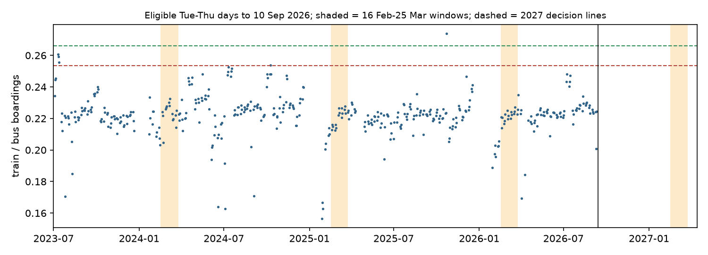

# Is the City Rail Link's ridership jump here to stay?

*A preregistered prospective evaluation of Auckland's City Rail Link: interim status, written before the outcome data exist*

Run directory: `research-lab/runs/auckland-nz-crl-structural-uplift-prereg` · Preregistration: [`plan.md`](plan.md) ·
Every departure from it: [`deviations.md`](deviations.md) · 3 October 2026, after independent review of the calibration

## In plain terms

Auckland's City Rail Link (CRL) opened on 13 September 2026: NZ$5.5 billion of underground rail and three new
stations. In its first full week, trains carried about 37% more passengers relative to buses than usual. Bus use was
up as well.

New rail lines often get a burst of curious riders that fades. We want to know whether this jump will last. The test
is written down now, before the answer exists, so nobody can move the goalposts later in either direction.

**The test.** For three years before opening, Auckland's train-to-bus ratio barely moved: about 0.22 on ordinary
Tuesdays to Thursdays in mid-February to late March. We will measure the same weeks in 2027, from 16 February to 25
March:

- **Lasting gain:** the ratio reaches 0.266 or more, at least 20% above normal. That would mean more than half of the
  opening-week jump has stuck.
- **Mostly faded:** the ratio is below 0.253.
- **Too close to call:** anything in between.

The lines allow for how much this ratio wobbles in normal years. We checked that using 507 "fake opening dates" before
the real one.

We will also check whether riders left buses that run near the new stations. More than half of Auckland's bus trips
are on such routes.

The answer arrives around April 2027, when Auckland Transport publishes those weeks' counts. Until then this page
records what has been fixed and what has been seen.

## What is fixed now

- **Calibration data.** All numbers below come from Auckland Transport's daily boardings, 1 Jul 2023 to 10 Sep 2026.
- **Days used.** Tuesdays to Thursdays only. Public holidays and disrupted days are excluded. A day is disrupted when
  train or bus boardings fall below 60% of the recent normal for that weekday. Normal is the median of the last 8 clean
  same-weekday days; this was fixed after review, see D5.

**Baseline (R_pre).** The 16 Feb-25 Mar ratio was 0.2230 in 2024 (15 eligible days), 0.2206 in 2025 (16) and 0.2217 in
2026 (17). Their mean is **R_pre = 0.2218**.

**No-intervention error.** We ran the same statistic for 507 placebo windows starting between 1 Feb 2025 and 1 Aug 2026,
each with at least 9 eligible days. Each window's ratio was compared with the same calendar window in earlier years. The
5th and 95th percentiles of the resulting placebo uplifts are **-5.7% and +4.4%**.

**Decision lines for 2027** (plan section 4: U = R_post / R_pre - 1):

| Verdict | Condition on U | Ratio over 16 Feb-25 Mar 2027 |
|---|---|---|
| Supported (lasting structural gain) | U ≥ 0.20 and U − q95 > 0.10 | **≥ 0.2661** |
| Contradicted (gain below +20% even allowing for placebo error) | U − q05 < 0.20 | **< 0.2534** |
| Inconclusive | otherwise | 0.2534–0.2661 |
| Not evaluable | fewer than 9 eligible days in the window | — |

Train and bus boardings are also tracked separately against their own baselines, as descriptive results with no
decision rule. Train averaged 64,000 boardings per eligible day and bus 288,400. Their placebo bands are −2.7% to
+15.2% for train and −1.6% to +11.7% for bus. Both modes were growing before opening, so a per-mode gain has to clear
that drift.

## The opening week

U_open is the plan's persistence denominator. It compares the Tue–Thu of opening week (15–17 Sep 2026) with the
Tue–Thu of the same ISO week in 2023–2025:

| | 2023–2025 mean | 15–17 Sep 2026 | Change |
|---|---|---|---|
| Train/bus ratio | 0.2246 | 0.3065 | **+36.5%** |
| Train boardings per day | 55,400 | 85,100 | +53.7% |
| Bus boardings per day | 246,600 | 277,600 | +12.6% |

The lead predicted that at least 55% of the opening-week uplift persists. Persistence of 55% means U ≥ 0.20, the same
line as Supported. Bus boardings also rose in opening week, so the ratio jump understates the rail gain. This is
partly why the per-mode series are tracked.

## Bus substitution (H2): exposure classes

- **Exposed routes.** A bus route counts as exposed if any of its current GTFS shapes passes within 800 m of Te
  Waihorotiu, Karanga-a-Hape or Maungawhau train station.
- **Counts.**
    - 177 routes are in both the feed and AT's monthly route file, with all six pre-period months (Oct 2025–Mar 2026).
    - 54 of them are exposed, carrying 59% of pre-period boardings (19.7 of 33.3 million).
    - At 400 m, 37 routes (39%) are exposed.
- **Sensitivity radii.** No route's nearest point falls between 800 and 1,200 m, so the 800 m and 1,200 m classes are
  identical.
- **Where the details are.** The route list is in `results/tables/route_exposure.csv`.
- **Test timing.** The H2 test runs when AT's monthly route file reaches March 2027.

**H3 (job accessibility)** needs a timetable feed from before opening. None is archived openly. The Mobility Database
has one but requires an account, which has not been created, so H3 is currently not run.

## What has been seen, and what has not

The scout saw daily boardings up to 20 Sep 2026 (the opening-week ratio of about 0.307). This interim used only 15–17
Sep from after opening. No one has seen any day after 20 Sep 2026, and the 2027 window does not yet exist. The full
log is in [`viewing_log.md`](viewing_log.md).

## Independent review

An independent reviewer re-ran every script against the frozen plan and returned **fix first**. All fixes were applied
before any outcome data exist. Each is logged in deviations.md with its effect:

- **Disruption reference (D5).** The reference median was being dragged down by the summer rail shutdown, so real
  disruptions slipped through in February.
- **Minimum eligible days (D2).** Windows with only one or two eligible days were lowering the Contradicted line.
- **Disclosures (D6–D8).** The placebo distribution's composition (about 13 independent blocks), caveats for H2, and
  pinned raw inputs (`data/SHA256SUMS`).
- **Net effect.** The Contradicted line moved from 0.2515 to 0.2534, and the Supported line is unchanged.

## Limitations

- **Counting artefact.** Train boardings include line-to-line transfers. Through-running under the city changes how
  often people transfer, so part of any change in the ratio may be a counting change. The per-mode series is only a
  partial check.
- **One city, one intervention.** The placebo error comes from about 13 independent blocks of pre-opening data. It is
  an honest but coarse yardstick.
- **H2 control group.** Feeder routes in the control group may gain riders from the CRL, which would mimic
  substitution. The exposure map comes from a feed published after opening.

## Next steps

- **About 6 weeks after opening.** An optional descriptive update, with no hypothesis test.
- **April 2027.** The confirmatory test, once AT's daily file covers 25 Mar 2027.
- **April–May 2027.** H2, once the monthly route file covers March 2027.
