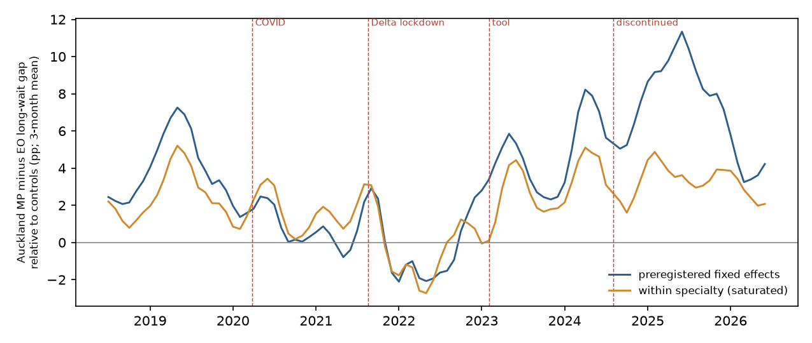

# Did ending Auckland's equity score change who waits longest for surgery?

*A preregistered comparison of Health NZ waitlist data: Te Toka Tumai Auckland against 15 districts that never used an ethnicity-weighted prioritisation tool, July 2021 to June 2026*

Run directory: `research-lab/runs/auckland-nz-equity-adjustor-waitlist-did` · Preregistration: [`plan.md`](plan.md) ·
Every departure from it: [`deviations.md`](deviations.md) · 3 October 2026, revised after independent review

## In plain terms

From February 2023 Auckland's hospitals ranked their planned-surgery waitlists with a score that combined clinical
need, time waiting, rurality, deprivation, and Māori and Pacific ethnicity. After political controversy the score was
dropped in August 2024. We asked whether Māori and Pacific patients in Auckland then ended up waiting longer, compared
with European patients, than in the rest of the country.

**What we found.** After the score was dropped, the share of Māori and Pacific patients waiting more than four months
rose about 7 percentage points more than for European patients, compared with other districts. That is the largest
change among the 16 districts we compared.

**But the evidence does not show that dropping the score caused it.**

- Waits lengthened for everyone in Auckland, and the gap for Asian patients widened by a similar amount, although the
  score never applied to them.
- About half the change comes from Auckland's dental-surgery list, which serves the whole region and on which waits
  lengthened for every ethnicity.
- Within each type of surgery the change was about 3 points, and not the largest of the 16 districts.
- The gap had already widened while the score was still in use.
- By mid-2026 it was back to about where it was in 2019.

**Bottom line.** The data cannot separate the effect of dropping the score from an Auckland-wide backlog that hit the
specialties where Māori and Pacific patients are most concentrated. The study neither shows that ending the score
harmed Māori and Pacific patients nor shows that it made no difference.

## Engagement

The lead critic advised seeking input from Māori and Pacific health-equity researchers on framing before
preregistration. The lab owner decided to proceed without it. The design and this wording are therefore the
analyst's alone.

The study uses only Health NZ's published aggregate counts. Any effect is a property of how the health system ordered
its waitlists, not of the communities concerned. Before any wider use, the report should be reviewed by Māori and
Pacific health researchers and the Tāmaki Makaurau Iwi-Māori Partnership Board.

## What was done

**Plan.** The plan was committed (5d7ef7d) before any waiting count was tabulated. During feasibility checks, the
lead scout had seen raw gap series for six districts. That is disclosed in the plan, and is why the critic required
a permutation test and a negative control.

**Data.** Health NZ's waitlist detailed extract (Q4 2025/26 vintage, extracted 2 Sep 2026): monthly counts by district,
specialty and ethnicity of patients waiting under 120 days, and in total. Counts of 1–4 are suppressed.

**Outcome.** The share waiting more than 120 days, compared between Māori+Pacific and European/Other patients.

**Comparison.**

- Auckland against the 15 districts that never used an ethnicity-weighted tool.
- Periods:
    - pre: Jul 2021 – Jan 2023;
    - tool era: Feb 2023 – Jul 2024;
    - post: Sep 2024 – Jun 2026.
- The model is a weighted triple difference with district × specialty × group, specialty × month, district × month
  and group × month fixed effects.

**Inference.** The model is re-run treating each of the 16 districts as if it had been Auckland. A negative control
replaces Māori+Pacific with Asian patients.

**Decision rule.**

- **Supported:** the change is at least 4 points, Auckland ranks first, and the Asian control is within ±2 points.
- **Contradicted:** the change minus the placebo noise falls below 4 points.
- **Inconclusive:** anything else.

## Preregistered result

| | Estimate | Auckland's rank of 16 |
|---|---|---|
| **Primary: change in the Māori+Pacific minus European/Other long-wait gap, post vs pre** | **+7.2 pp** | **1st (p = 1/16 = 0.0625, the smallest the design allows); also 1st by t-statistic** |
| Negative control: Asian minus European/Other | +5.5 pp | 3rd (fails the ±2 pp rule) |
| Tool era vs pre (τ) | +4.8 pp | 1st (rank computed post hoc) |
| Placebo range across the other 15 districts | −4.7 to +4.8 pp | — |

**Verdict: Inconclusive.** The change is large and ranks first, but the negative control fails.

**Preregistered robustness checks:**

- Suppressed counts set to 1 or 4: +7.3 and +7.1 pp.
- Including the Waitematā and Counties Manukau districts: +7.6 pp.
- Unweighted: +3.1 pp (see below).
- Earlier data vintages, which change about 5% of pre-period cells, almost all suppressed small cells, by 0.06 pp on average: +7.6 to +8.2 pp.

## What the 7 points are made of

These analyses were requested by the independent reviewer after the results were known, and are labelled as
post hoc.

**One specialty carries half of it.**

- Decomposing the estimate by specialty attributes **3.5 of the 7.2 points to Dental Surgery**. No other specialty
  contributes more than 0.6.
- Auckland holds the regional dental-surgery list. Between 2021 and 2024 it grew between two-and-a-half-fold and
  four-fold for every ethnicity, most for Pacific patients. The share waiting more than four months rose in parallel for
  every ethnicity, from about 12–15% to about 65–70%.
- Māori and Pacific patients are over-represented on that list, so a region-wide dental backlog shows up as a wider
  ethnic gap.
- A prioritisation score reorders patients within a list. It cannot move patients between specialties. So this part
  cannot be an effect of reordering within lists.

**Within specialties the change is about 3 points.**

| Post-hoc analysis | Estimate | Rank of 16 |
|---|---|---|
| Within specialty (district × specialty × month fixed effects) | +3.3 pp | 3rd |
| Fully saturated fixed effects | +3.2 pp | 2nd |
| Māori+Pacific vs Asian (quadruple difference) | +1.8 pp | 5th |
| Māori+Pacific vs Asian, saturated | +1.0 pp | 8th |
| Against a pre-COVID baseline (Jul 2018 – Jan 2020) | +3.2 pp | 3rd |
| Against a pre-COVID baseline, saturated | +0.7 pp | 5th |
| Post vs tool era as the baseline | +2.5 pp | 2nd |
| Post, Jan – Jun 2026 only | +4.0 pp | 3rd |
| Within specialty: Māori only / Pacific only | +0.4 / +5.4 pp | 7th / 4th |

**Timing.**

- The gap was already as large in 2019 as during the tool era.
- It fell after Auckland's Delta lockdown (Aug–Dec 2021) to a low point in mid-2022. Both are inside the
  preregistered pre-period.
- It rose during the tool era, which is the opposite of what a score favouring Māori and Pacific patients would be expected to do if it were the
  dominant influence on the gap.
- It peaked in 2025 and fell back by 2026.
- Within specialties, there is a single step up in the second quarter of 2023, the quarter in which the score was
  rolled out and halted, and no break when the score was dropped.

**Mechanism.** The outcome counts everyone currently waiting, so it reflects who is being added to the list, not only
the order in which patients are treated. In Auckland the number of Pacific patients waiting rose 1.7-fold between the
pre and post periods. Māori and Asian numbers rose about 1.5-fold and European/Other 1.3-fold. The comparison
districts grew less: Māori ×1.15, Pacific ×1.17, Asian ×1.33, European/Other ×1.09.

| Group | Auckland: number waiting | Auckland: number waiting > 4 months | Other districts: number waiting | Other districts: number waiting > 4 months |
|---|---|---|---|---|
| Māori | ×1.54 | ×2.09 | ×1.15 | ×0.99 |
| Pacific | ×1.73 | ×2.70 | ×1.17 | ×1.03 |
| Asian | ×1.52 | ×2.01 | ×1.33 | ×1.11 |
| European/Other | ×1.32 | ×1.55 | ×1.09 | ×0.98 |

Auckland's long-wait share rose for every group, while it fell for every group elsewhere. A fast-growing group on a
list with limited capacity ages into long waits and is then cleared under longest-waiting-first. That can produce
this rise and fall without any change in prioritisation.

## Limitations

- **One treated district.** With only Auckland treated, p cannot go below 1/16. The placebo districts are much
  smaller, so their estimates are noisier than Auckland's.
- **Undocumented tool use.** Which specialties used the score, and how heavily, is not documented in open sources.
  Auckland also weighted ethnicity in some form before 2023.
- **The outcome is a stock.** The long-wait share moves with referrals, additions and list validation, not only with
  scheduling order.
- **Suppressed small counts** make unweighted estimates noisy. The unweighted +3.1 pp is pulled down by small cells, whose shares the suppression rule
  forces to 0 or 100: it is +3.0 with cells of 5 or fewer removed, +4.7 with cells of 20 or fewer removed, and +5.5 with
  cells of 50 or fewer removed.
- **Māori and Pacific differ.** Māori and Pacific patients differ sharply: within specialties, almost all the change is among
  Pacific patients.

## Hold-out (pending)

The plan reserves July–December 2026 as an unseen test, using the next two Health NZ releases (about December 2026
and March 2027). The same model will be re-run with that period as "post".

## Independent review

The reviewer reproduced every preregistered number, confirmed the verdict and judged the study "fix first". The
review:

- found that dental surgery drives half the estimate;
- found the trough in the pre-period baseline and the effect visible during the tool era;
- found a district-spelling bug in two older data vintages (D2);
- required the post-hoc analyses above, with their permutation ranks, and neutral wording.

All are included here and logged in deviations D2–D5. The code is in `code/review_checks.py`.
