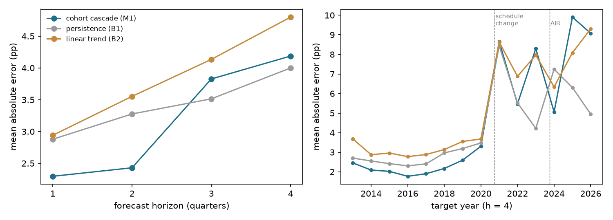
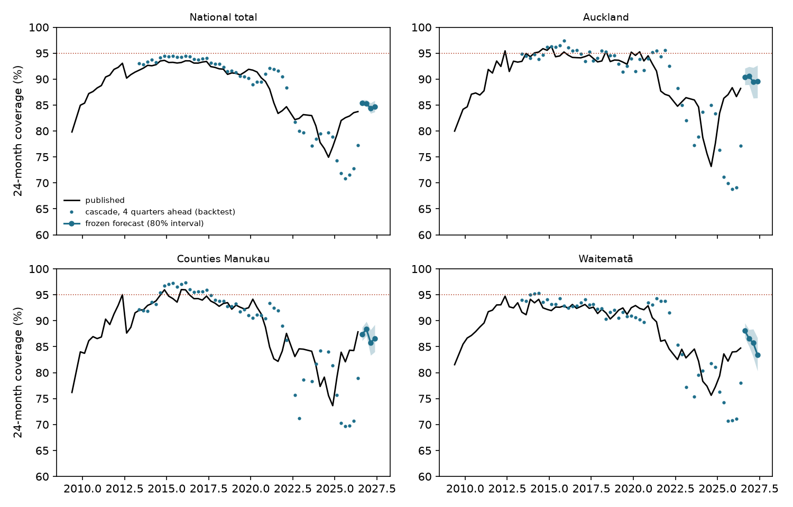
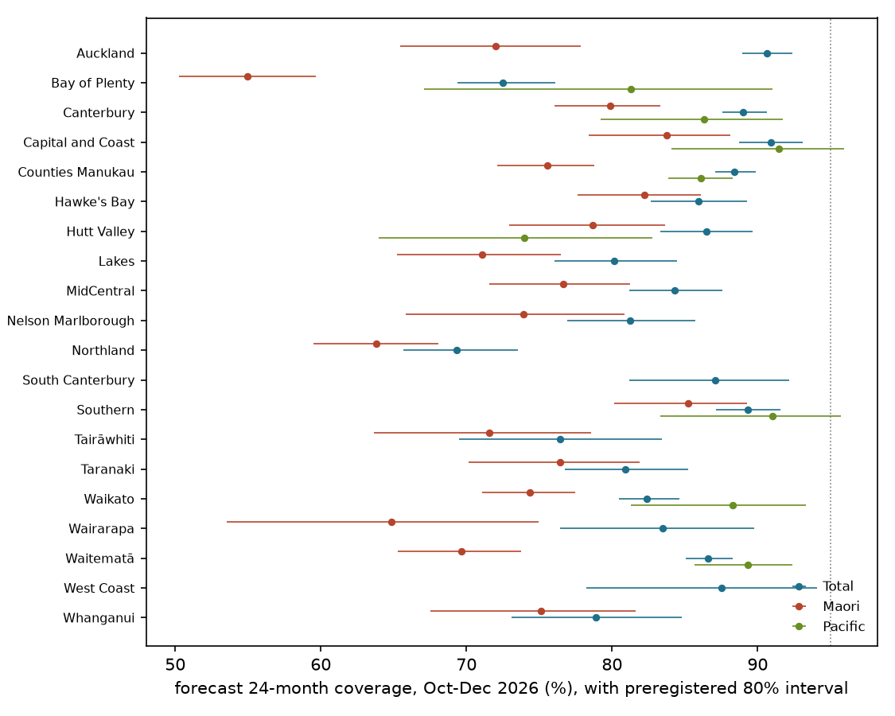

# Can earlier milestones forecast New Zealand's 24-month immunisation coverage?

*A preregistered rolling-origin backtest of a cohort-cascade forecast of Health NZ's 24-month coverage measure,
2012-2026, for 20 districts and Māori and Pacific children, with forecasts for the next releases frozen and hashed
before publication.*

Run directory: `research-lab/runs/auckland-nz-immunisation-cascade-forecast` · Preregistration: [`plan.md`](plan.md)
(commit 691a47e) · Departures from it: [`deviations.md`](deviations.md) (D1-D2) · Frozen forecasts:
[`results/forecasts_frozen.csv`](results/forecasts_frozen.csv) (commit eb53bc6, sha256 e19d0d63…) · Independent
review: [`review/review.md`](review/review.md) · 7 October 2026, revised after independent review

## In plain terms

Health NZ reports every quarter how many children are fully immunised at 6, 8, 12, 18 and 24 months. The 24-month
figure is the official health target, and it trails the others: the children who will be counted at 24 months next
year were already counted at 12 months this year. We asked whether linking the same children across milestones gives
a better year-ahead forecast than simple rules.

**A year ahead, it does not.** Across 50 quarters of history (2012-2026), forecasts for each district, and for Māori
and Pacific children, built from the same children's 12-month coverage were no better than assuming nothing changes.
Before 2020 they were better, cutting the error by about a fifth, which was close to the best any method could do
given the random noise in small districts. Since then the 24-month measure itself has changed twice: the 2020
schedule change added vaccines to it, and the 2023-24 move to a new register counted more children. Catch-up between
12 and 24 months has also been unusually strong.

**A quarter or two ahead, it has helped over the record, but less lately.** Using the same children's 18-month
coverage cut errors by 20-32% on average. Since 2020, though, the one-quarter forecast for district totals has been no
better than the latest published figure, and the two-quarter forecast about 15% better.

We have frozen and published forecasts for the next two releases, July-September and October-December 2026. Nationally
they put 24-month coverage at about 85%. No district reaches 95%, and services are forecast to reach about 73% of
Māori children. On recent form these forecasts will probably miss the error bar we set, so the test is a demanding
one. They will be scored when Health NZ publishes the figures, expected around December 2026 and March 2027.

## What was done

**Data.** We collected every quarterly coverage file that could be recovered since April 2009:

- 54 archived Ministry of Health and Te Whatu Ora files, from the Internet Archive;
- 12 current Health NZ quarterly files, to June 2026. Twelve annual files were also downloaded but not used.

Three quarters have no recoverable file: 2009Q3, 2022Q2 and 2023Q2.

They were parsed into one table of quarter × milestone × district × ethnic group, with eligible and fully immunised
counts (66 quarters).

- **Headline check.** The parse reproduces the published figures for January-March 2026: 6-month coverage of 66.6%
  nationally and 48.5% for Māori.
- **District check.** District counts sum to 99.6-100% of the national total at 24 months. Health NZ's national total also counts
  children whose address has no district.

**Suppression.** Health NZ suppresses counts below 10 and applies secondary suppression, so some cells with over 200
children are also hidden, such as Waitematā Pacific in 2024Q3-Q4. Suppressed cells were left missing and never
back-calculated, so the Māori and Pacific evaluations cover an irregular subset of districts.

**The cascade (M1).** The children who reach 24 months in a quarter reached 12 months four quarters earlier, and 18
months two quarters earlier.

- **Year-ahead forecasts (3-4 quarters):** start from the cohort's 12-month coverage on the logit scale and add the
  average 12-to-24-month change of the latest four cohorts in the same district and group.
- **Short-horizon forecasts (1-2 quarters):** the same, from 18-month coverage.

Intervals come from past errors, standardised by cell size.

**Baselines.**

- **Persistence (B1):** the latest published 24-month value.
- **Linear trend (B2):** a line through the last eight published values, on the coverage scale.

**Test (H1, preregistered).** At a 4-quarter horizon, over the 20 districts × Total, Māori and Pacific, M1's mean
absolute error must be at least 30% below each baseline's, with a one-sided Diebold-Mariano p < 0.05 against each.
The backtest uses 50 origins from 2012Q2 to 2025Q2. It is Refuted if, against either baseline, the upper end of the
block-bootstrap 95% CI for the error reduction is below 30%.

**Timing.** The plan, the backtest code, the results with D1, the scoring script and the draft were committed and
pushed within six minutes of each other (08:43-08:49, 7 October). The data had been parsed just before the plan,
which the plan discloses. Commits show the order in which files were saved, not proof of when computations ran. The
reviewer confirmed that the code diff between them is confined to D1.

## Results

**H1: Refuted.** 4-quarter horizon, 2,471 district-group-quarter cells:

| | Mean absolute error | Error reduction by the cascade (95% CI) | Diebold-Mariano p |
|---|---|---|---|
| Cohort cascade (M1) | 4.19 pp | | |
| Persistence (B1) | 4.00 pp | −4.7% (−20.4% to +13.4%) | 0.76 |
| Linear trend (B2) | 4.80 pp | +12.8% (+4.6% to +22.6%) | 0.0009 |

- **Against the baselines.** The cascade is significantly better than a linear trend, by far less than 30%, and no
  better than persistence.
- **Weighted by children.** Weighting cells by the number of eligible children, the cascade is 16% *worse* than
  persistence. It does worst in the largest districts.
- **Intervals.** Its preregistered 80% intervals covered 61% of the 1,904 cells that have one. The first eight
  origins have none.

**The cascade worked before 2020 and failed after.** Mean absolute error at a 4-quarter horizon:

| Target years | Cascade | Persistence | Linear trend | Reduction against persistence |
|---|---|---|---|---|
| 2013-2016 | 2.06 pp | 2.48 pp | 3.03 pp | 17% |
| 2017-2019 | 2.22 pp | 2.85 pp | 3.19 pp | 22% |
| 2020-2022 | 5.83 pp | 5.83 pp | 6.34 pp | 0% |
| 2023-2026 | 8.07 pp | 5.70 pp | 7.79 pp | −42% |

**The 30% bar was close to unreachable even before 2020.** Binomial sampling noise in the target cell alone averages
1.7 pp. A 30% cut needed an error of 1.85 pp, and for Pacific cells (median 55 children) the bar sat below the noise
floor. The pre-2020 cut of 17-22% was close to the best any method could achieve on these cells.

**Three changes are consistent with the failure.** The backtest cannot apportion the failure among them.

- **The 2020 schedule change redefined the target.** From 1 October 2020, MMR1 and the pneumococcal booster moved to
  a new 12-month event, and MMR2 moved from 4 years to 15 months. That adds vaccines to what "fully immunised" means at
  the 18- and 24-month milestones. The 12-month milestone itself barely changed.
  - National 12-month coverage moved by less than 1.2 pp a quarter in 2020Q3-2021Q3.
  - 18-month coverage fell 6.6 and 4.4 pp in 2020Q4 and 2021Q1.
  - 24-month coverage fell 2.6 and 2.0 pp in 2021Q2 and 2021Q3.

  A cascade that learns the 12-to-24-month change from earlier cohorts takes four cohorts to re-anchor after the
  target's definition changes.
- **The new register counted more children.** Health NZ notes that the Aotearoa Immunisation Register captures more
  eligible children than the old register, so a drop in measured coverage was expected.
  - For targets in 2024Q1-2024Q4, whose 12-month input came from the old register, the 24-month denominator was 2.7-4.3%
    larger than the same cohort's 12-month denominator, against 98-102% otherwise.
  - The national gap between a cohort's 24-month and its 12-month coverage widened to −12.5 pp in 2024Q3.
- **Catch-up outran earlier cohorts.** The 12-to-24-month gap then closed to about 0 by 2025Q2. Low 12-month coverage
  in 2024 implied 24-month coverage near 70% in 2025, but the published figure recovered to about 83%.

Excluding the target quarters most affected (2020Q3-2022Q2 and 2023Q3-2024Q2) still leaves the cascade 5% worse than
persistence.

**Short horizons (secondary).** Over the whole record, forecasts from 18-month coverage beat both baselines: at 1
quarter, 2.30 pp against 2.88 and 2.94 pp (20% and 22% better); at 2 quarters, 2.43 pp against 3.28 and 3.55 pp (26%
and 32%). But the gain has shrunk, especially for the district Totals that H2 scores:

| District Totals | 1 quarter: cascade / persistence / reduction | 2 quarters: cascade / persistence / reduction |
|---|---|---|
| 2013-2019 | 1.15 / 1.68 pp / 31% | 1.19 / 1.72 pp / 31% |
| 2020-2022 | 2.16 / 2.17 pp / 0% | 2.43 / 2.80 pp / 13% |
| 2023-2026 | 3.18 / 3.20 pp / 1% | 3.16 / 3.87 pp / 18% |

At 3 quarters, the cascade is again no better than persistence.

**Other secondary results.**

- **Groups (4 quarters):**

  | Group | Cascade | Persistence |
  |---|---|---|
  | Total | 3.18 pp | 2.97 pp |
  | Māori | 4.83 pp | 4.76 pp |
  | Pacific | 4.94 pp | 4.58 pp |

- **Regression cascade (M2).** It adds 6-month coverage and fits intercepts by district and group. On the 2,351 cells
  where M1, M2 and persistence all forecast, it reaches 3.78 pp, against 4.11 pp for M1 and 3.92 pp for persistence: a
  3.5% improvement on persistence.
- **National total.** At 4 quarters the cascade (3.20 pp) is worse than persistence (2.38 pp).
- **The intervals are mis-specified by cell size.** They scale with sampling noise, but most error is systematic.
  - District Totals at 1-2 quarters: 85% coverage in the smallest third of districts, 71% in the middle third and 67%
    in the largest.
  - National total: 33-39%.

## Frozen forecasts (H2, pending)

The cascade was refitted on data to June 2026, and forecasts for July 2026 to June 2027 were frozen on 7 October 2026:
279 district-group-quarter cells, sha256 e19d0d63…, committed in eb53bc6 and pushed.

The July-September 2026 forecast was frozen a week after that quarter ended. It is a nowcast, about two months ahead
of publication, rather than a forecast of behaviour.

**National, 24-month coverage:**

| Quarter | Total (80% interval) | Māori | Pacific | Asian | European or Other |
|---|---|---|---|---|---|
| Jul-Sep 2026 | 85.4% (84.9-86.0) | 73.4% | 86.2% | 96.4% | 86.9% |
| Oct-Dec 2026 | 85.3% (84.8-86.0) | 73.4% | 86.8% | 96.0% | 86.4% |

The latest published value (April-June 2026) is 83.7%. The national interval is implausibly narrow, for the
cell-size reason above. No district is forecast to reach 95% in October-December 2026, and two reach 90% (Capital
and Coast, and Auckland). Northland's forecast is the lowest: services there are forecast to reach 69% of children.

**Scoring (preregistered).** When Health NZ publishes the two files, `code/score.py` checks the frozen file's hash and
that the historical data are unchanged, then scores the 40 district-Total cells. H2 is Supported if both of these
hold:

- the mean absolute error is at most 2.5 pp;
- 70-90% of cells fall inside the preregistered 80% intervals.

**What the backtest implies.** H2 is more likely to be Refuted than Supported.

- **Error.** For district Totals since 2023, the error at 1-2 quarters has been 3.2-3.6 pp, above the 2.5 pp bar.
- **Interval coverage.** It has been about 60%, below the 70% floor, and lowest in the largest districts.
- **Weak test.** H2 is also a weak test: 40 cells from two releases, with errors correlated within a release. A
  perfectly calibrated interval could fall outside 70-90% by chance.

**A second interval (D1, D2).** It is calibrated on the latest eight quarters and frozen alongside, as a secondary.

- On the half of 2023-2026 cells where it could be computed (none from 2024), it covered 76% and 72%, against 65% and
  64% for the preregistered interval on the same cells.
- At 1 quarter it was calibrated on only 5 quarters, below its own minimum of 6.
- H2 is scored on the preregistered interval.

The forecasts for 2027Q1 and 2027Q2 use 12-month inputs, which the backtest shows are unreliable at present. They are
reported for completeness only.

## Caveats

- **A forecasting method, not an explanation.** The failure after 2020 coincides with a redefinition of the target, a
  change of register and a catch-up surge. The backtest cannot apportion it among them.
- **The measure moves.** "Fully immunised for age" follows the schedule, and the denominator follows the register. A
  cohort-linked model must be re-anchored whenever either changes.
- **Published files only.** Health NZ holds individual-level register data and could project coverage far more
  precisely. The value of this work is an independent, open check, not a replacement.
- **Small and suppressed cells.** Pacific and Asian forecasts exist only where Health NZ publishes the inputs: 7-10
  districts for Pacific children. Secondary suppression makes the Māori and Pacific panels irregular.
- **Interval construction.** Intervals standardised by sampling noise are too narrow for large cells. An error model
  on the percentage-point scale per district would be the natural replacement in future work. The frozen intervals
  also omit the latest 2-3 short-horizon errors (D2).

## Data and Māori data sovereignty

The study uses only aggregate counts that Health NZ publishes, under the Te Mana Raraunga principles:

- suppressed cells are never reverse-engineered;
- results for Māori and Pacific children describe how far immunisation services are reaching them, not
  characteristics of their families;
- the district forecasts, shown alphabetically, are offered as a tool for Health NZ, Iwi-Māori Partnership Boards and
  Pacific providers to plan catch-up and measles readiness, not as a ranking of communities.

## Deviations (summary)

- **D1, logged before freezing:** a second, recent-window 80% interval was added to the frozen forecasts as a
  labelled secondary. H2 remains scored on the preregistered interval.
- **D2, after the review:**
  - corrections to D1's evidence;
  - the national total in the interval pool, and B2 on the coverage scale;
  - scoring safeguards: the frozen file cannot be overwritten, the historical data must be unchanged, and 40 cells
    are required;
  - traceable tables for every number.

Nothing else departs from the plan.
