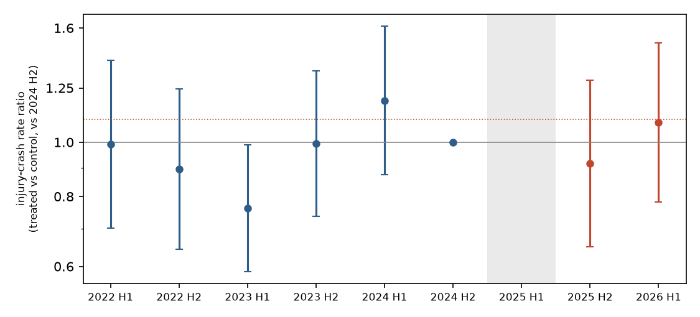

# Did raising speed limits back up in 2025 cost crashes?

*A preregistered national difference-in-differences of injury crashes on New Zealand roads whose speed limits were reversed under the 2024 Setting of Speed Limits Rule. Stage 1: the first year after the reversals*

Run directory: `research-lab/runs/auckland-nz-speed-limit-reversal-crashes` · Preregistration: [`plan.md`](plan.md) ·
Every departure from it: [`deviations.md`](deviations.md) · 3 October 2026, revised after independent review

## In plain terms

Between 2020 and 2024, many New Zealand roads had their speed limits lowered. A 2024 government rule made councils and
NZTA put many of them back up, mostly by July 2025. The government expected little safety cost; safety advocates
expected more deaths and injuries.

We compared crashes on the roads whose limit went back up with similar roads whose limit stayed the same. The raised
roads are about 830 km, mostly in Auckland and on state highways. The method was written down before we looked at
any crash from after the change.

**What we found.** In the first year after the reversals (July 2025 to June 2026), injury crashes on the raised roads
were 3% higher than expected from the comparison roads. That is well within chance: the data fit anything from 16%
fewer to 27% more injury crashes. Serious and fatal crashes, and each kind of road (urban streets, rural roads, state
highways), told the same uncertain story.

**Why we cannot say more yet.** One year on 830 km of road gives only about 250 injury crashes. That is enough to
detect an increase of about a third, but not the roughly 10–20% rise that speed research would predict. So this result
was the most likely outcome whether or not the reversals made roads less safe.

**What this means.** Nobody, on either side of the argument, should cite this first year as showing the reversals were
safe, or that they were harmful. We will repeat the identical analysis in late 2027, with two years of data.

## What was done

**Planned before seeing the outcome.**

- The plan was committed in e74eaea before any 2025/26 crash was tabulated.
- The post-period crash file was downloaded sealed, with its SHA-256 recorded, and opened only after that commit.
- All design numbers, including power and the placebo calibration, came from pre-period crashes only.

**Roads and limits.**

- OpenStreetMap's public roads were cut into 1,184,764 segments of 100 m or less.
- Each segment took the limit in force at its midpoint from the National Speed Limit Register (NSLR), on fixed dates
  from June 2022 to July 2026.
- **Treated roads:** one permanent raise of 10–40 km/h between 29 Oct 2024 (the day before the Rule came into force)
  and 1 Nov 2025, and no other change through July 2026. This gives 10,983 segments, about 860 km:
    - urban 30/40→50: 397 km;
    - rural 80/90→90–100: 349 km;
    - urban 50→60–80: 74 km;
    - peri-urban 60/70→70–100: 40 km.
- Almost all treated roads are Auckland Transport roads or state highways, and nearly all were raised between March
  and June 2025.
- **Control roads:** the same limit throughout.
- **Matching (strata):** road controlling authority × prior limit × timing of any 2022–2024 reduction × road class.
  This keeps 10,629 treated segments (828 km) that have controls in their stratum.

**Crashes.**

- NZTA's Crash Analysis System, with crash points snapped to the nearest segment within 30 m and a preference for
  segments with a matching road name.
- 99.3% of crashes were snapped, and 89.6% of those matched the road name.
- Crash timing is known only to the half-year, from the calendar and financial year.

**Model.**

- Poisson regression of injury crashes per segment and half-year, 2022H1–2026H1.
- Segment fixed effects, and stratum × half-year fixed effects.
- The half-year in which a road's limit changed is dropped for that road.
- Standard errors are clustered on 2,888 road corridors.
- Each stage is tested at one-sided α = 0.025, because there are two looks.
- **Supported** needs a rate ratio ≥ 1.10 with the lower bound above 1. **Contradicted** needs the upper bound below
  1.10.

## Result

| Analysis | Rate ratio | 95% CI | Treated injury crashes after |
|---|---|---|---|
| **Primary: injury crashes** | **1.03** | **0.84–1.27** | 252 |
| Fatal and serious crashes | 1.02 | 0.69–1.50 | 55 |
| All crashes, including non-injury (exploratory, see below) | 1.13 | 1.02–1.26 | 787 |
| Urban 30/40→50 | 1.07 | 0.65–1.76 | 54 |
| Urban 50→60–80 | 1.03 | 0.69–1.55 | 83 |
| Peri-urban 60/70→70–100 | 1.02 | 0.61–1.72 | 23 |
| Rural 80/90→90–100 | 1.02 | 0.75–1.39 | 92 |
| State highways only | 0.98 | 0.76–1.25 | 118 |
| Local roads only | 1.12 | 0.79–1.58 | 134 |
| Auckland only | 1.11 | 0.77–1.59 | 126 |
| July–Dec 2025 only | 0.95 | 0.73–1.24 | 128 |
| Jan–Jun 2026 only | 1.12 | 0.86–1.47 | 124 |

**Stage-1 verdict: Inconclusive.** The confidence interval rules out neither no change nor the hypothesised rise of 10%
or more.

**Robustness.** Every injury-crash variant lands between 0.91 and 1.03, with CIs spanning 1:

- snap tolerance 15 m: 1.03;
- snap tolerance 50 m: 1.02;
- name-matched snaps only: 0.99;
- cohort-specific indicators: 1.03;
- corrected dating of reductions and cohorts: 1.02 (D8);
- without roads near school zones: 1.01 (D7);
- full 2017–2026 window: 0.91, which has known pre-trends.

**Pre-trends.**

- Within the window, the pre-reversal half-years scatter between 0.76 (2023H1) and 1.19 (2024H1) relative to 2024H2
  (joint test p = 0.044).
- Over the full history the pre-trend test fails clearly. This is consistent with Auckland's 2020–21 reductions,
  which predate the register's history, and is why the plan starts the window in 2022.
- The 2023H1 dip is a reminder that half-year noise on a few hundred
  crashes is large.

## How much could this study see?

- **Power, from pre-period data.** The treated roads had about 135 injury crashes per half-year, so one post-year
  gives about 250–270. The study could detect a rise of about a third (rate ratio 1.33) with 80% power. The realised
  standard error, 0.105, matches the plan.
- **Power at plausible effect sizes.**
    - A rise of +10% would be detected with only about 15% probability.
    - The rise predicted by the speed–crash power model is about +19%. That prediction assumes mean speeds rise by a
      quarter of the posted change and injury crashes scale with speed squared. It would be detected with about 38%
      probability.
- **"Supported" would have needed an observed rate ratio above about 1.23.**
- **Calibration.** The clustered standard errors were checked against 200 placebo "reversals" assigned to unchanged
  roads in the pre-period. The ratio of placebo spread to standard error was 1.00 in the planned check, and 1.05 in
  a corrected version where every stratum keeps its controls (D9).

## The all-crash result is not robust

All police-reported crashes, including non-injury crashes, were an estimated 13% higher (1.13, 95% CI 1.02–1.26) in
the preregistered window. This is one of about fifteen secondary estimates with no verdict attached. It does not
survive scrutiny:

- **Window choice.** Starting the pre-period in 2020H2 gives 1.08 (0.98–1.20); 2023H2 gives 1.09 (0.97–1.22); 2024H1
  gives 1.05 (0.92–1.20); and the full history gives 1.07 (0.96–1.19).
- **Non-injury crashes carry it** (1.18). These are the least completely reported crashes, and the severity mix on
  treated roads moved toward minor crashes, not the direction a speed effect predicts.
- **The earlier window flatters it.** A dip on treated roads in 2023H1, before the reversals, pulls the pre-period
  average down. Against the last pre-period half alone, post-period crashes were 7% and 11% higher, and neither is
  significant.

We treat it as a hypothesis for Stage 2, not as evidence.

## Can we tell whether the signs actually changed?

The register defines treatment; crash records cannot confirm it.

- **The crash records' speed-limit field lags.** Police crash reports record a speed limit, but that field follows
  the register with a lag of about 18 months on treated and control roads alike. The 2023 Auckland reductions appeared
  in crash records only from late 2024. So the field cannot yet show the 2025 raises.
- **Roads near schools.** Of the urban 30→50 segments, 72% were 30 km/h zones that the register listed as being there
  because of a school. Some of these sit near the variable school-time zones the government introduced at the same
  time (7.7% of treated segments lie within 50 m of a live school zone). Dropping roads near school zones, or all
  school-reason roads, leaves the estimate at 1.01.

## Limitations

- **Thin comparisons in some strata.** The two largest Auckland treated strata have few control crashes. For example,
  Auckland local roads at 30 km/h reduced in 2023H1 have 184 treated injury crashes against 19 for controls. Much of
  the comparison comes from strata with plenty of controls: state-highway 80 km/h and 50 km/h roads, and Auckland
  arterials (`results/tables/review_strata.csv`).
- **Selection.** Which reductions were reversed depended on consultation and the Rule's criteria. Matching on
  authority, prior limit, reduction timing and road class cannot remove all differences.
- **No traffic volumes.** Traffic volumes and enforcement are not observed.
- **Register gaps.** From May 2026 the public register has gaps: records end without replacements. These were
  balanced between groups in Stage 1 (D10) but need re-checking for Stage 2.
- **Crash reporting.** Recent minor-injury and non-injury crashes are reported late. Treated and control roads are
  affected equally, but the most recent half-year is noisier.

## Independent review

An independent reviewer reproduced the primary estimate exactly and judged the study "publish with edits". The
review:

- found that the all-crash secondary was fragile and corrected how the manipulation check was read (D7);
- showed that the placebo calibration skipped the strata where most treated roads sit, and the corrected re-run
  confirmed the standard errors (D9);
- found dating artefacts from register re-certifications, which do not move the estimate (D8);
- asked for the low power to be stated plainly.

All edits are in this report and logged in deviations D6–D10.

## Stage 2

- **When.** About October 2027, once the crash system holds the full 2026/27 financial year.
- **What.** The identical code with the post-period extended to June 2027, which roughly doubles the post-period
  crashes. Its minimum detectable rate ratio falls to about 1.2.
- **Speed-limit data.** Daily register snapshots, kept since 3 Oct 2026, will establish any further changes through
  June 2027.
