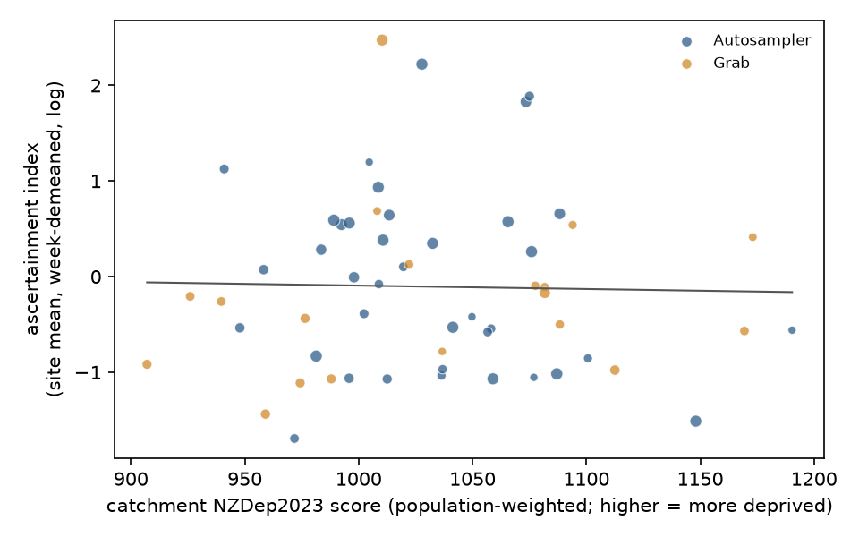

# Did deprived towns go less tested for COVID-19?

*A preregistered test of whether reported COVID-19 cases per unit of wastewater signal fall with catchment deprivation, across 57 New Zealand towns and small cities, March 2022 to June 2024*

Run directory: `research-lab/runs/auckland-nz-wastewater-testing-gap-deprivation` · Preregistration: [`plan.md`](plan.md) ·
Every departure from it: [`deviations.md`](deviations.md) · 3 October 2026, revised after independent review

## In plain terms

Wastewater shows how much COVID-19 is circulating in a town, whether or not people get tested. Reported cases show
only the people who tested and reported a positive result. If testing and reporting were harder in poorer areas,
deprived towns would show fewer reported cases for the same amount of virus in their wastewater.

We tested this in 57 towns and small cities with good wastewater records from March 2022 to June 2024. Auckland and
other cities with several treatment plants could not be included, because their sewer areas cannot be matched to
neighbourhoods. The test was written down before we looked at the data.

**What we found.** In the more deprived towns, reported cases per unit of wastewater virus were an estimated 14%
lower for each step up in deprivation. One step is one standard deviation, about 61 points on the NZDep2023 scale.
But the uncertainty is wide: the data fit anything from a 35% lower to a 17% higher rate. Without adjusting for region
and age, there was no difference at all. So the study neither shows a testing gap nor rules out a sizeable one.

We also asked whether the gap widened after mandatory isolation ended in August 2023. Too few towns were still being
sampled to tell.

**Why it matters.** Wastewater testing is now the main way New Zealand tracks COVID-19. Knowing whether case
counts undercount some communities matters for planning. This study shows that a careful answer needs the city
sewer catchments, which councils hold but do not publish.

## What was done

**Data.**

- **Wastewater and cases.** ESR/PHF Science's open repository gives, for each site and week, SARS-CoV-2 copies per
  person per day and reported cases in the catchment. The repository is at commit 9891318.
- **Deprivation and population.** The NZDep2023 deprivation index and 2023 Census populations, by small area (SA1).
- **Boundaries.** Stats NZ's open boundary layers.

**Catchments.**

- A site's catchment is the urban area with the site's name. It was accepted only if that area's census population
  was within ±25% of ESR's catchment population.
- 80 of 134 sites qualified, and 57 of them had at least 30 weeks with detectable virus.
- These 57 sites are 38 automatic samplers and 19 grab samples, across 15 regions. Their deprivation ranges from 907
  to 1,190 on the NZDep2023 scale.

**Outcome.** The ascertainment index is the log of reported cases per 100,000 people minus the log of wastewater
copies per person per day.

**Model.**

- Regression on 4,291 site-weeks with week fixed effects.
- Adjusted for sampler type, log population, share aged 65+ and region.
- Standard errors are clustered by site.
- **H1:** Supported if the ratio per 1 SD of deprivation is ≤ 0.85 with its CI excluding 1, and Contradicted if the
  CI's lower bound is above 0.85.

The plan was committed (311bd7e) before any case-to-wastewater ratio was computed. That commit holds only the
catchment-mapping code.

## Results

| | Estimate | 95% CI |
|---|---|---|
| **H1: ratio per 1 SD more deprivation (preregistered, CR1)** | **0.86** | **0.68–1.09** |
| H1 with small-sample-robust errors (CR2, 17 df) | 0.86 | 0.64–1.17 |
| H1 by wild-cluster bootstrap | 0.86 | 0.64–1.13 |
| Mixed model with a random site intercept | 0.90 | 0.67–1.21 |
| Negative binomial on weekly cases | 0.87 | 0.69–1.10 |
| Interval-censored negative binomial (allows for rounded counts) | 0.83–0.89 | upper bounds 1.03–1.12 |
| **H2: change in the gradient after isolation ended (log scale)** | **−0.10** | **−0.56 to 0.37** |

**H1 verdict: Inconclusive. H2 verdict: Inconclusive.**

- **H1.** The small-sample-robust interval runs from a 35% lower to a 17% higher ascertainment per SD, so it covers
  both the preregistered 15% gap and no gap.
- **H2.** It rests on the 26 sites still sampled after August 2023. These are larger towns than the sites that were
  dropped, at the same deprivation. H2 could only have detected a roughly two-fold change in the gradient.

## How fragile is the 0.86?

The direction of the point estimate is consistent, but its size depends on choices the plan could not anticipate:

- **Adjustment.** Before adjustment there is no association: 0.94 with week fixed effects only. Adding log population
  gives 1.03, the share aged 65+ then gives 0.91, and region gives the preregistered 0.86. Site-level two-step
  regressions give 0.85–0.90.
- **Rounded case counts.** ESR publishes cases as a daily average rounded to a whole number. A recorded zero
  therefore means 0–3 cases in the week, and that is true of 19% of site-weeks, mostly in small, more deprived towns.
    - A different pseudo-count, or the bin midpoint, gives 0.83–0.95.
    - A model that treats rounded counts as intervals gives 0.83–0.89.
    - Dropping the zero weeks gives 1.00, but that selects on the outcome and is an upper bound.
- **Low-level detections.** Samples recorded at the 500 copies/L quantification floor are also commoner in small
  deprived towns. Dropping those weeks gives 0.89.
- **Holiday towns.** Visitors shed virus locally but are counted as cases at home, which pushes the estimate toward 1.
  Dropping holiday towns gives 0.79 (0.63–1.00). This was not planned and is not a result.
- **Single sites and regions.** Leaving out one region gives 0.80–0.95, and leaving out one site 0.82–0.94 (the reviewer's check). No
  variant's interval excludes 1.

## How much could this study see?

- **Power at the preregistered gap.** At the realised standard error, the study had about a 27% chance of detecting
  the preregistered 15% gap.
- **Minimum detectable gap.** It would have needed a gap of about 29% per SD (ratio 0.71) to have 80% power.
- **What it can and cannot say.** A real gap of 15% would most likely have produced exactly this result. So the
  finding is not evidence of equal ascertainment. It shows that 57 towns, with this level of week-to-week noise, are
  not enough to measure a gap of the size that matters.

## Limitations

- **Ecological study.** The result describes areas, not people.
- **Approximate catchments.** Urban-area boundaries stand in for sewer catchments, which are council property and not
  public. The ±25% population check limits gross errors, and the reviewer found it did not reject deprived towns more often.
- **No metros.** Auckland, Wellington and other multi-plant cities are excluded, so the result says nothing directly
  about Auckland's own catchments.
- **Cases are counted where people live.** Wastewater reflects where people are, so commuters and tourists blur the
  comparison.
- **Shedding varies.** Viral shedding varies with age, variant and vaccination. The 65+ covariate and week fixed
  effects only partly absorb this.
- **Flow normalisation.** For 11 sites ESR applies an assumed flow per person. Flagging those sites leaves the
  estimate at 0.84.

## Framing

The analysis uses only area-level deprivation. Any gap it found would describe access to testing and reporting in the
health system, not a property of communities. Before wider release, the findings should be shared with Iwi-Māori
Partnership Boards, such as Tāmaki Makaurau, and with Pacific health partners. The lab owner arranges that.

## What would settle it

The sewer catchment boundaries for Auckland, Wellington and Christchurch would add hundreds of neighbourhoods with a
much wider deprivation range, many sites at once. With those boundaries, the same preregistered model could be re-run
with far more power. A data request to Watercare and the other city water services is the obvious next step.

## Independent review

An independent reviewer reproduced the primary estimate to the digit and judged the study "publish with edits". The
review:

- found the rounding of the case series and its concentration in small deprived towns (D3);
- showed that the preregistered interval is the optimistic one, compared with CR2 and wild-cluster intervals (D6);
- found an undeclared simplification of H2 (D4);
- asked for the power and the dependence on adjustment to be stated plainly.

All edits are in this report; checks are in `code/review_checks.py`.
