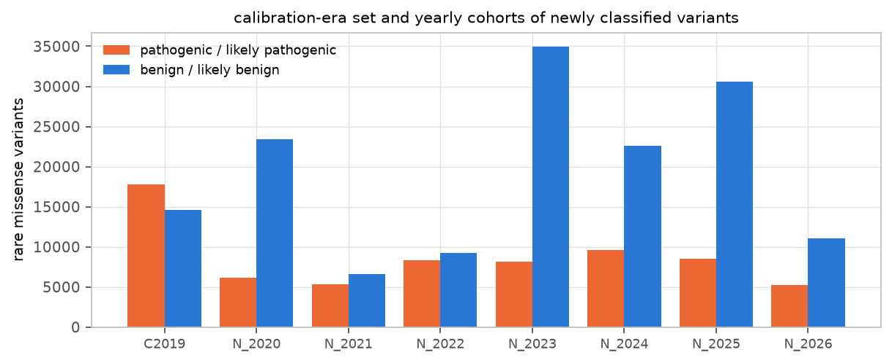
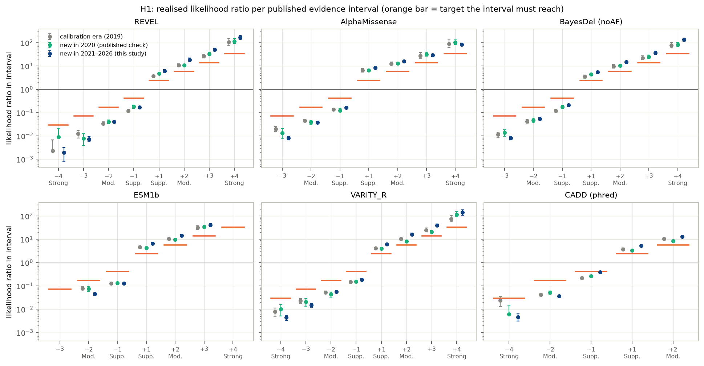
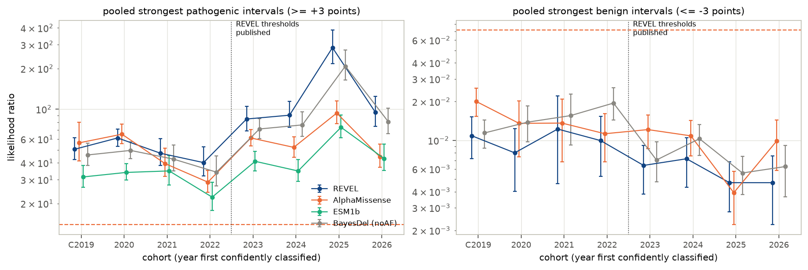
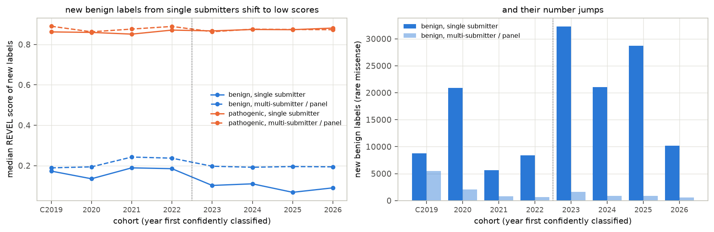
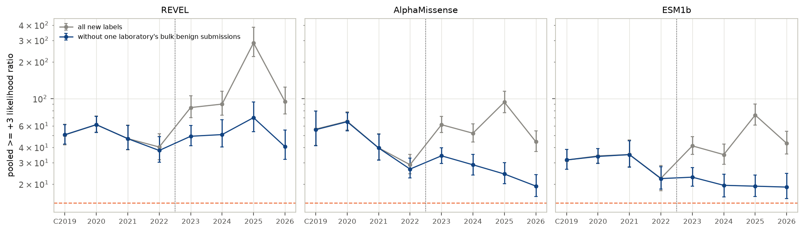
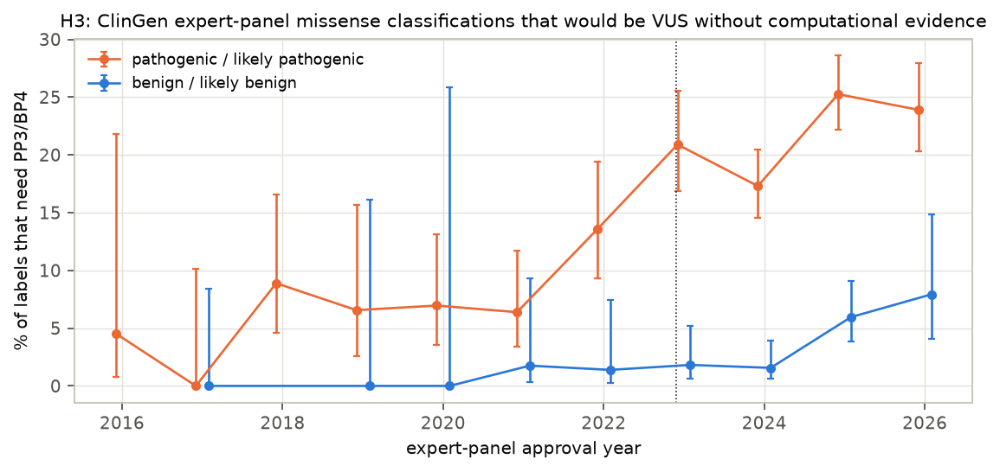

# Do the ClinGen missense-predictor thresholds still hold?

*A preregistered prospective audit of the PP3/BP4 score thresholds on 159,531 variants classified in ClinVar from 2021 to 2026*

Run directory: `research-lab/runs/bioinformatics-vep-acmg-calibration-drift` · Preregistration: [`plan.md`](plan.md) ·
Every departure from it: [`deviations.md`](deviations.md) · Draft of 2026-10-01, revised after independent review

## Abstract

Clinical laboratories classify DNA variants with the ACMG/AMP framework. Its criteria PP3 and BP4 let computational
predictors add evidence for pathogenicity or benignity. In 2022, ClinGen turned predictor scores into evidence
strengths: Supporting, Moderate or Strong. For example, a REVEL score of at least 0.932 counts as Strong evidence of
pathogenicity. The thresholds were calibrated on ClinVar data from 2019 and checked against a single later year.

We tested them on the variants ClinVar classified afterwards: 44,721 pathogenic and 114,810 benign rare missense
variants first confidently classified between 2021 and 2026. We covered six tools: REVEL, AlphaMissense, BayesDel,
ESM1b, VARITY_R and CADD.

- **On ClinVar as a whole, the thresholds hold (H1, preregistered).** No interval of any tool falls short of the
  evidence strength it is meant to carry, and 38 of 42 meet it outright.
  - It also holds at the interval boundaries themselves, on the 2021–2022 variants alone, and without variants that
    re-entered the cohort.
  - The one per-year exception is CADD's weakest benign interval in 2025.
- **Where labels are cleanest, the weaker intervals are not demonstrably met (H3, H4, preregistered).**
  - On ClinGen expert-panel classifications, BayesDel's Supporting and Moderate pathogenic intervals **fall short**
    (likelihood ratio 1.25 [0.96, 1.73] against a target of 2.41, and 3.99 against 5.79). REVEL's are inconclusive.
  - Across all ClinVar variants in expert-panel genes, REVEL's Supporting interval realises 1.8 [1.4, 2.5] against 2.41.
  - Benign variants in these well-studied disease genes score higher. So the genome-wide thresholds look weakest in the
    genes where they matter most.
- **ClinVar's likelihood ratios rose after 2022, but that reflects who submitted what (H2).**
  - REVEL's pooled strongest-interval likelihood ratio among new variants tripled (43 → 135).
  - The rise is explained by one laboratory's bulk submission of about 59,000 likely-benign calls, mostly in genes
    that had no benign labels before (exploratory).
  - Without those submissions REVEL is flat, while AlphaMissense and ESM1b *decline*. In the most recent labels,
    AlphaMissense's two strongest intervals sit at their targets.
- **Expert panels' dependence on PP3/BP4 grew, largely through rule changes (H3).**
  - The share of expert-panel pathogenic missense classifications that would be VUS without PP3 rose from 6–9%
    (2018–2021) to 17–25% (2023–2026).
  - This follows two rule changes rather than more use of PP3: the 2020 downgrade of the rarity criterion PM2 to
    Supporting, and the upgrades of PP3 that the 2022 calibration allowed. Removing these labels changes predictor
    likelihood ratios by under 10%.

In short, the published thresholds are not overconfident on ClinVar as a whole. But ClinVar-wide checks are dominated
by which genes and which laboratories contribute new labels. In the expert-curated disease genes, the weaker
pathogenic intervals do not demonstrably carry their nominal strength.

## 1. Background and the gap

ACMG/AMP variant classification combines evidence criteria of graded strength. Tavtigian et al. (2018, 2020) recast
the grades as likelihood ratios (LR) on a points scale: Supporting = 1 point, Moderate = 2, Strong = 4, and each point
multiplies the odds of pathogenicity by the same factor.

**The calibrations.**

- **Pejaver et al. 2022 (AJHG)** calibrated 13 missense predictors on this scale.
  - Calibration set: 11,834 rare missense ClinVar variants from December 2019.
  - Method: a local posterior probability, with a prior probability of pathogenicity of 0.0441.
  - Result: score intervals with an LR target of 2.406 per point. Supporting is 2.41, Moderate 5.79, +3 13.9 and
    Strong 33.5; the benign targets are the reciprocals.
  - Temporal check: 9,114 variants new in the December 2020 release, on which every interval met its target.
- **Bergquist et al. 2025 (Genet Med)** added AlphaMissense, ESM1b and VARITY_R the same way.

**Why a fresh check is needed.**

- The intervals are ClinGen's recommendation, and laboratories apply them.
- Confident missense classifications in ClinVar have grown more than fivefold since the calibration data were taken:
  36,755 in December 2019, 199,144 in September 2026.
- Two opposite worries follow:
  - **Drift.** The thresholds could be overconfident on the harder variants resolved later.
  - **Circularity.** Labels influenced by predictors make predictors look better (Grimm et al. 2015). Shang, Badonyi
    and Marsh (bioRxiv, March 2026) call this an increasing concern they could not quantify.

We found no multi-year prospective audit of the thresholds, and no direct measurement of how much labels depend on
PP3/BP4.

## 2. Data

- **ClinVar.** Monthly `variant_summary` releases for December 2019 to December 2025 (one per year) and September
  2026, GRCh38. Submitter-level data come from `submission_summary`, released 28 September 2026.
- **Variants.** Single-nucleotide variants with one amino-acid substitution.
  - Confident label: pathogenic or likely pathogenic ("P") versus benign or likely benign ("B"), with at least one
    review star and no conflict.
  - Rare: gnomAD v2.1.1 allele frequency below 1%.
- **Predictor scores.** dbNSFP 4.8a via MyVariant.info: REVEL, BayesDel (noAF), ESM1b, VARITY_R (leave-one-out) and
  CADD. AlphaMissense comes from its official hg38 release.
  - Coverage is about 90–100% by tool.
  - Where a tool reports several transcripts, the most pathogenic score is used. For REVEL the median gives the same
    LRs to three decimals.
- **Expert-panel criteria.** The ClinGen Evidence Repository export: 13,286 expert-panel (VCEP) classifications, each
  with the criteria applied.
- **Thresholds.** The published interval tables, used verbatim: Bergquist 2025 Table 1, and Pejaver 2022 for CADD.

**Cohorts** (rare missense, by the release in which a variant is first confidently classified):

| Cohort | Pathogenic | Benign | Genes |
|---|---|---|---|
| Calibration era, confident in December 2019 | 17,822 | 14,582 | 3,181 |
| New in 2020 (replicates the published one-year check) | 6,156 | 23,459 | 7,023 |
| New in 2021 | 5,302 | 6,612 | 2,512 |
| New in 2022 | 8,338 | 9,282 | 2,859 |
| New in 2023 | 8,123 | 34,959 | 10,446 |
| New in 2024 | 9,565 | 22,584 | 7,723 |
| New in 2025 | 8,510 | 30,591 | 10,456 |
| New in 2026 (to September) | 5,272 | 11,097 | 5,714 |
| **Prospective cohort 2021–2026 (primary)** | **44,721** | **114,810** | **15,011** |

Two details of the prospective cohort:

- 17 of its variants later flipped between pathogenic and benign.
- 1,937 (1.2%) had been confident in 2019–2020, lost that status, and regained it. Excluding them changes no result.

## 3. Methods

Everything below was preregistered (`plan.md`, committed before any score was joined to a label), except where it is
marked exploratory.

- **Interval likelihood ratio.** For a tool, a cohort and one published interval:
  LR = (share of pathogenic variants in the interval) / (share of benign variants in it).
  - Uncertainty comes from 2,000 bootstrap resamples of genes, because variants cluster within genes.
  - Scores are rounded to the precision of the published tables before intervals are assigned.
- **H1 verdicts.** Each interval is judged against its target (2.406 per point):
  - **meets:** the one-sided 95% bound is on the right side of the target;
  - **falls short:** the opposite bound is on the wrong side;
  - **inconclusive:** otherwise;
  - **insufficient:** fewer than 10 variants of the minority class.
- **H2.** The strongest intervals are pooled (pathogenic +3 and +4 points; benign −3 and −4), and their LR is compared
  before and after the thresholds became available:
  - REVEL: 2021–2022 against 2024–2026;
  - AlphaMissense: 2021–2023 against 2025–2026.
- **H3.** Each expert-panel classification's own criteria are recounted on the points scale, and interval LRs are
  computed on expert-panel labels.
  - A label is tool-dependent if removing its PP3/BP4 points moves it into VUS.
  - The recount reproduces the panels' published assertions for 99.3% of confident classifications.
- **H4.** Interval LRs by stratum: single-submitter (1-star) against multi-submitter or panel (≥ 2-star); genes with a
  ClinGen expert panel against other genes.
- **Reproduction gate.** Re-deriving the thresholds on the calibration-era cohort with Pejaver's method stays within
  the preregistered 0.1 tolerance for the two gate thresholds:
  - REVEL PP3 Strong: 0.992 against 0.932;
  - BP4 Moderate: 0.197 against 0.183.

  The pathogenic side re-derives stricter throughout. My windows omit Pejaver's gnomAD term, and REVEL's training
  variants could not be removed (`deviations.md` D7).

## 4. Results

### 4.1 H1: on ClinVar as a whole, every published interval holds

Table 1. REVEL and AlphaMissense on the prospective cohort (2021–2026). LR with its 5th–95th bootstrap percentiles.

| Tool | Interval (points) | Pathogenic | Benign | LR [90% interval] | Target | Verdict |
|---|---|---|---|---|---|---|
| REVEL | Strong (+4), ≥ 0.932 | 13,618 | 205 | 168 [139, 206] | 33.5 | meets |
| REVEL | +3, 0.879–0.931 | 7,555 | 380 | 50 [43, 59] | 13.9 | meets |
| REVEL | Moderate (+2), 0.773–0.878 | 8,363 | 1,129 | 18.7 [16.1, 22.0] | 5.79 | meets |
| REVEL | Supporting (+1), 0.644–0.772 | 5,760 | 2,354 | 6.2 [5.5, 7.0] | 2.41 | meets |
| REVEL | Supporting (−1), 0.184–0.290 | 1,029 | 15,524 | 0.17 [0.15, 0.19] | 0.42 | meets |
| REVEL | Moderate (−2), 0.053–0.183 | 622 | 39,153 | 0.040 [0.036, 0.045] | 0.17 | meets |
| REVEL | −3, 0.017–0.052 | 74 | 25,711 | 0.007 [0.006, 0.009] | 0.072 | meets |
| AlphaMissense | Strong (+4), ≥ 0.990 | 13,698 | 425 | 85 [74, 97] | 33.5 | meets |
| AlphaMissense | +3, 0.972–0.989 | 5,164 | 464 | 29 [26, 33] | 13.9 | meets |
| AlphaMissense | Moderate (+2), 0.906–0.971 | 6,988 | 1,151 | 15.9 [14.5, 17.6] | 5.79 | meets |
| AlphaMissense | Supporting (+1), 0.792–0.905 | 4,941 | 1,564 | 8.3 [7.5, 9.2] | 2.41 | meets |
| AlphaMissense | Supporting (−1), 0.100–0.169 | 1,271 | 20,166 | 0.17 [0.15, 0.18] | 0.42 | meets |
| AlphaMissense | Moderate (−2), 0.071–0.099 | 468 | 32,271 | 0.038 [0.034, 0.042] | 0.17 | meets |
| AlphaMissense | −3, ≤ 0.070 | 118 | 37,838 | 0.008 [0.007, 0.010] | 0.072 | meets |

**Across all six tools, none of 42 intervals falls short.**

- 38 meet their target.
- 3 have too few variants to judge: REVEL −4, and ESM1b −3 and +4.
- 1 is inconclusive: CADD −1, at 0.38 [0.35, 0.42] against 0.42.

The same holds on the calibration-era cohort and on the 2020 cohort, which reproduces the published one-year check.
Within single years, three cells fall below a clean "meets":

- CADD −1 falls short in 2025 (0.54 [0.47, 0.62]);
- AlphaMissense +3 and +4 are inconclusive in 2022;
- BayesDel +3 is inconclusive in 2022.

**Robustness (exploratory).**

- **The margins are not an artefact of averaging.** An interval's LR is an average over its scores, while the target
  applies at its lower boundary. Thin slices just above each boundary also meet: REVEL at [0.644, 0.662) gives 4.0
  [3.4, 4.7] against 2.41, and at [0.932, 0.950) 124 against 33.5. AlphaMissense at [0.990, 0.994) gives 49 [41, 60]
  against 33.5.
- **They hold before the post-2022 wave.** The 2021–2022 cohorts alone also meet everywhere, with smaller margins:
  REVEL +1 3.3 [2.9, 3.7], REVEL +4 83 [63, 118], AlphaMissense +4 48 [40, 61].

### 4.2 H3/H4: in expert-curated disease genes the weaker intervals are not demonstrably met

**On expert-panel labels** (3,820 rare missense ClinGen VCEP classifications; preregistered under H3):

| Tool | +1 Supporting | +2 Moderate | +3 | +4 Strong | Benign intervals |
|---|---|---|---|---|---|
| BayesDel | **1.25 [0.96, 1.73] falls short** | **3.99 [3.01, 5.66] falls short** | 9.3 [6.0, 17.8] inconclusive | 26 [17, 49] inconclusive | meet |
| REVEL | 1.84 [1.39, 2.58] inconclusive | 6.3 [4.6, 9.7] inconclusive | 27 (8 benign: insufficient) | 32.5 [19.7, 67.1] inconclusive | meet |
| AlphaMissense | 5.7 [4.1, 9.0] meets | 7.9 [5.2, 14.9] inconclusive | insufficient | insufficient | meet |
| ESM1b | 2.9 [2.0, 4.3] inconclusive | 13.5 [8.4, 29.1] meets | 12.5 [8.5, 21.6] inconclusive | – | meet |
| Target | 2.41 | 5.79 | 13.9 | 33.5 | |

Removing the labels that would be VUS without PP3/BP4 barely changes these numbers. BayesDel +1 becomes 1.26 [0.95,
1.77] and still falls short.

**Across all ClinVar variants, by stratum** (prospective cohort; preregistered H4). REVEL:

| Stratum | +1 | +2 | +3 | +4 | −1 | −2 |
|---|---|---|---|---|---|---|
| Genes with a ClinGen expert panel | **1.8 [1.4, 2.5]** | 6.3 [3.9, 11.0] | 18 [12, 30] | 60 | 0.05 | 0.02 |
| Other genes | 7.1 | 20.6 | 54 | 181 | 0.20 | 0.05 |
| Single submitter (1-star) | 6.4 | 19.4 | 51 | 175 | 0.18 | 0.04 |
| Multi-submitter / expert panel (≥ 2-star) | 3.3 | 9.4 | 33 | 90 | 0.08 | 0.03 |
| Target | 2.41 | 5.79 | 13.9 | 33.5 | 0.42 | 0.17 |

What the strata show:

- **Expert-panel genes are the weak spot.** REVEL's Supporting, Moderate and +3 intervals are all inconclusive there,
  with Supporting's point estimate below target. AlphaMissense's +3 and +4 are inconclusive too.
- **The weakness is not one gene.** Leaving out any single gene moves REVEL +1 only within 1.70–2.14.
- **Benign variants in these genes score higher**: median REVEL 0.29, against 0.10 elsewhere.
- **H4's preregistered direction is reversed.** It expected *lower* LRs in single-submitter data. On the pathogenic
  side they are higher.

These are the most-studied disease genes, where expert panels curate the labels, and where computational evidence is
applied most consequentially. There, the genome-wide thresholds for Supporting and Moderate evidence are not shown to
carry their nominal strength. This fits the move towards gene-specific calibration.

### 4.3 H2: ClinVar's LRs rose after 2022, because of who submitted what

The preregistered comparison shows a large rise among newly classified variants:

| Tool | Pooled ≥ +3 LR, before | after | log ratio [90%] |
|---|---|---|---|
| REVEL (2021–22 → 2024–26) | 43 | 135 | +1.15 [+0.89, +1.41] |
| AlphaMissense (2021–23 → 2025–26) | 48 | 73 | +0.41 [+0.22, +0.61] |
| ESM1b (2021–22 → 2024–26; exploratory) | 26 | 49 | +0.62 [+0.39, +0.85] |

H2 is supported as stated, but its cause is not the one it was designed to detect. Three exploratory analyses locate
it (`deviations.md` D8–D9).

**1. The rise is in the denominator, not the numerator.**

- The pathogenic side does not move: the median REVEL score of new pathogenic labels is 0.85–0.89 in every year and
  stratum.
- Benign labels with REVEL ≥ 0.879 stay flat in number (171 before, 225 after), while benign labels overall quadruple
  (15,532 → 62,034).
- 54% of the post-2022 benign labels are in genes that had no benign label before. These are large, missense-tolerant
  genes such as WNK2, SPTBN5, ABCA13, FSIP2 and MUC17, where none of them score in the strongest pathogenic intervals.

**2. Within genes, the rise is small or absent.** Standardised to the earlier gene composition:

| Tool | Raw change | Standardised to the earlier gene mix |
|---|---|---|
| REVEL | ×3.2 | ×1.3 [1.0, 1.7] |
| AlphaMissense | ×1.5 | ×0.81 [0.66, 0.99] |
| ESM1b | ×1.9 | ×0.88 |

**3. One laboratory's bulk submission produces the wave.**

- Of 98,906 single-submitter benign submissions for these variants in 2023–2026:
  - Ambry Genetics made 60% (59,178, almost all likely benign);
  - Labcorp/Invitae 26%;
  - CeGaT 7%.
- Ambry's have a median REVEL of 0.057, and 74% fall in genes without earlier benign labels. Their evaluation dates run
  from 2021 to 2026.
- Every one uses a fixed rationale listing all evidence types together: population frequency, in-silico models,
  conservation and so on. So ClinVar does not show whether predictors were decisive.
- Excluding variants whose only ClinVar submitter is this laboratory removes the post-2022 rise (Figure F6):

| Pooled ≥ +3 LR, without the bulk | 2019–2022 | 2023–2026 |
|---|---|---|
| REVEL | 38–61 | 40–70 |
| AlphaMissense | 27–65 | 19–34 |
| ESM1b | 22–35 | 19–23 |

Without the bulk submissions, REVEL's LRs are flat while AlphaMissense's and ESM1b's decline. REVEL is the predictor
laboratories most often cite for PP3/BP4, so holding up only for REVEL is *consistent with* a REVEL-specific feedback.
It is not proof of one.

In the 2024–2026 labels outside the bulk submissions, AlphaMissense's +3 interval realises 13.4 [11.4, 16.0] against
13.9, and its +4 interval 38.2 [32.0, 46.1] against 33.5. Both are inconclusive. REVEL still meets throughout.
Nothing here shows the laboratory's classifications are wrong; it shows how much one submitter's volume shapes
ClinVar-wide statistics.

### 4.4 H3: expert-panel labels depend more on PP3/BP4, mostly through rule changes

Share of expert-panel missense classifications whose category needs the computational criteria (Figure F4):

| Approval year | Pathogenic labels that need PP3 | Benign labels that need BP4 |
|---|---|---|
| 2018–2021 | 6–9% (per-year n 61–141) | 0–2% |
| 2022 | 14% | 1% |
| 2023 | 21% | 2% |
| 2024 | 17% | 2% |
| 2025 | 25% | 6% |
| 2026 (to September) | 24% | 8% |

The trend is significant on both sides:

- pathogenic: odds ratio 1.24 per year [1.18, 1.31], p = 5×10⁻¹⁵;
- benign: odds ratio 1.73 per year [1.27, 2.36], p = 5×10⁻⁴.

**What changed was the rules, not how often PP3 is used.**

- **PP3 use is flat.** Among expert-panel pathogenic missense classifications it runs at about 62–86%, with no upward
  trend.
- **The rarity criterion PM2 was downgraded.** Following the 2020 ClinGen recommendation, PM2 at Moderate strength
  fell from 94–100% of its uses before 2020 to 2–3% from 2024; PM2_Supporting replaced it. So PP3 is more often the
  point that tips a classification.
- **PP3 was upgraded.** PP3 at Moderate or Strong strength, which the 2022 calibration permits, rose from at most
  0.3% of expert-panel pathogenic classifications before 2021 to 16% in 2026.

Removing the tool-dependent labels changes the panels' LRs by under 10%:

| Tool | Pooled ≥ +3 LR, all panel labels | tool-independent labels only |
|---|---|---|
| REVEL | 30 [19, 61] | 28 [18, 54] |
| AlphaMissense | 43 [26, 106] | 41 [25, 104] |

## 5. Discussion

**What this study establishes:**

1. **On ClinVar as a whole, the published PP3/BP4 thresholds are not overconfident.** Every testable interval of six
   tools holds on 159,531 variants classified after the calibration data. It holds at the interval boundaries, on the
   2021–2022 cohorts, and without the largest bulk submitter.
2. **In expert-curated disease genes, the weaker pathogenic intervals do not demonstrably carry their strength.**
   On expert-panel labels BayesDel's Supporting and Moderate intervals fall short, and REVEL's pathogenic intervals
   are inconclusive with Supporting below target. Benign variants in these genes score higher. Laboratories applying
   genome-wide thresholds there may overweight PP3; the case for gene-specific calibration is strong.
3. **ClinVar-wide benchmark statistics are dominated by composition.** One laboratory's bulk submission of likely
   benign calls in previously unlabelled, missense-tolerant genes tripled REVEL's apparent strongest-interval LR.
   Any ClinVar-based evaluation of predictors should stratify by gene and submitter.
4. **Expert-panel labels depend more on PP3 than before, mainly because of rule changes.** About a quarter of recent
   expert-panel pathogenic missense calls would be VUS without PP3. The 2020 PM2 downgrade and the 2022 PP3 upgrades
   explain this better than increased use. Within those data, circularity moves LRs by under 10%.

**What it does not establish:**

- **Whether the thresholds are right in absolute terms.** Every label source here is partly shaped by predictors. A
  circularity-free check needs labels that never used them, such as functional assays with independent clinical labels.
- **Whether AlphaMissense's recent decline is a real loss of performance on harder variants or composition.** Outside
  the bulk submissions its strongest intervals sit at target in 2024–2026; this is worth monitoring.
- **What evidence the bulk submitter used.** Its rationale does not say, so we cannot tell whether predictors decided
  those calls.

**Relation to the literature:**

- The results agree with the calibration papers' one-year checks and extend them to six years and 17 times as many
  variants.
- They show that the circularity Shang, Badonyi and Marsh (2026) flagged is real but small within expert-panel data,
  and that composition is the larger distortion in ClinVar-wide statistics.
- They support recording the exact tool, version and score used as evidence (Bergquist et al. 2025).

## 6. Limitations

1. **Approximate calibration-era set.** REVEL's training variants (from HGMD) could not be removed, here or in the
   prospective cohort. Pejaver's gnomAD window term was not reproduced either. Prospective REVEL LRs may therefore be
   inflated by variants that were in REVEL's training data. AlphaMissense and ESM1b are not trained on clinical labels.
2. **Partly circular labels.** ClinVar labels are imperfect and partly tool-derived, which limits every H1 verdict.
3. **The H3 recount uses the generic points scale.** It reproduces 99.3% of panel assertions, but panels' own
   combining rules differ in detail.
4. **Exploratory analyses.** The gene-standardisation and submitter analyses were added after the review, in response
   to it. They explain H2 but were not preregistered.
5. **Scores and allele frequencies.** Multi-transcript tools use the most pathogenic value. The VARITY_R thresholds are
   applied to its leave-one-out scores. Missing gnomAD frequencies count as rare; the benign-score shift appears within
   every frequency bin.

## 7. Reproducibility

The code is in `code/`:

- `fetch_data.sh`, `fetch_am.sh`, `fetch_scores.py`: data;
- `build_cohorts.py`, `join_scores.py`: cohorts;
- `calib.py`, `analyze.py`, `h3_vcep.py`, `h3_lr.py`: preregistered analyses;
- `explore_*.py`: exploratory analyses;
- `make_figures.py`, `build_report_html.py`: presentation.

Tables are in `results/tables/` and figures in `results/figures/`. Raw data (about 4 GB) are open and re-downloadable,
and not committed. Dependencies are pinned in `code/requirements.txt`. An independent adversarial review and the
response to it are in `deviations.md` D8.
