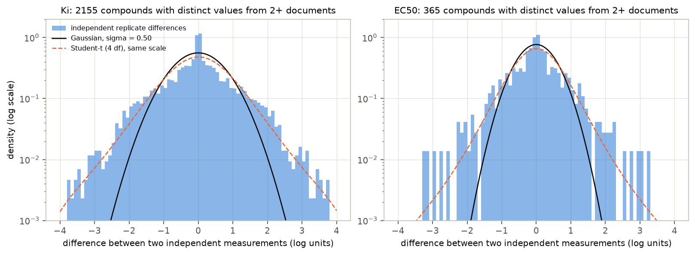
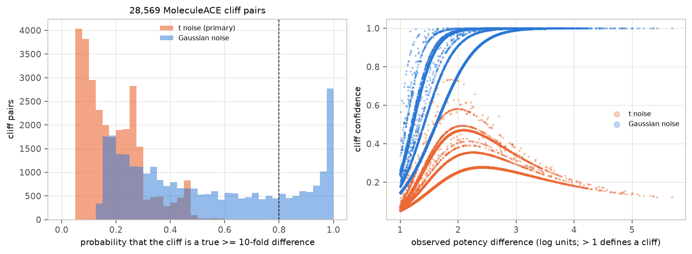
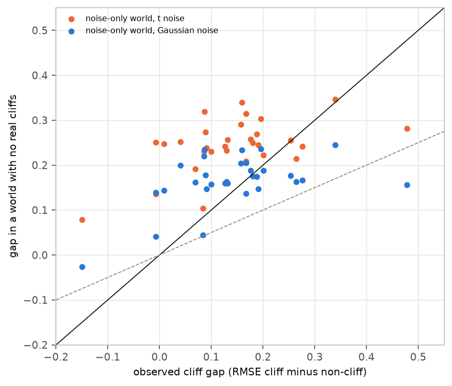
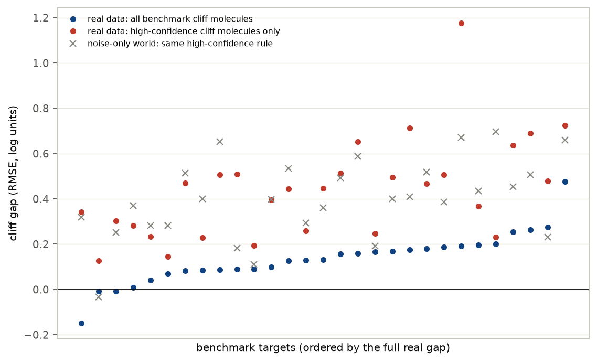

# Are benchmark activity cliffs real?

*A preregistered noise audit of the MoleculeACE activity-cliff benchmark using ChEMBL 37 replicate measurements*

Run directory: `research-lab/runs/cheminformatics-drug-discovery-cliff-noise-ceiling` · Preregistration: [`plan.md`](plan.md) ·
Every departure from it: [`deviations.md`](deviations.md) · 3 October 2026, revised after independent review

## In plain terms

Drug-discovery models are often tested on "activity cliffs": pairs of almost identical molecules where one is said to
be at least ten times more potent than the other. A widely used benchmark (MoleculeACE) finds that models make bigger
errors on these molecules, and a new generation of models is designed to fix that.

But lab measurements are noisy. When the same molecule is measured in independent studies, results typically differ
two- to threefold, and sometimes much more. Most molecules in the benchmark were measured only once. So some "cliffs"
may be accidents of measurement rather than real differences.

We used the newest public database of lab results to estimate how noisy the measurements are. We then asked how likely
each benchmark cliff is to be real, and what a world without any real cliffs, only noise, would look like.

What we found:

- **Most benchmark cliffs are not confidently real.** Under the noise model that fits the benchmark pairs, about three-quarters of the
  28,569 cliffs have at least a 1-in-5 chance of not being a true 10-fold difference.
- **Noise alone reproduces the famous "cliff gap".** In simulated worlds with no real cliffs, models still err more on
  "cliff" molecules, by about as much as on the real benchmark.
- **Even the "confidently real" cliffs don't settle the question.** Models err most on them, but they do so in the
  noise-only worlds too.

So the benchmark's headline gap is not evidence that models fail on cliffs. Showing that would need cliffs with
replicated, trustworthy measurements.

## Abstract

**Question.** How much of MoleculeACE's activity-cliff error gap reflects measurement noise rather than a modelling
failure?

**Design** (preregistered, `plan.md`, committed before any ChEMBL activity data were downloaded).

- **Benchmark.** MoleculeACE's 30 datasets and 28,569 cliff pairs, recomputed with its own definition (at least 99.8%
  agreement with the published labels in every dataset).
- **Noise model.** Replicate measurements from ChEMBL 37.
- **Cliff confidence.** An empirical-Bayes posterior probability that each cliff is a true ≥ 10-fold difference.
- **Model panel.** Random forest, Tanimoto support vector regression, LightGBM and kNN on ECFP4, using the published
  splits.
- **Nulls.** Noise-only synthetic worlds.

**Results.**

| Analysis | Result | Verdict |
|---|---|---|
| Re-reported values | about two-thirds of apparent inter-document replicates are identical copies (D2) | — |
| Noise (independent replicates) | σ = 0.50 log units (Ki), 0.37 (EC50); heavier tails than Gaussian | t model primary by rule (D3) |
| H1: ≥ 25% of cliffs have confidence ≤ 0.8 | Gaussian: 74.8% [69.6, 79.0]; 75–77% in Gaussian arms (71% in the t-noise σ-by-tertile arm); 100% under the primary t model, which can never call a cliff confident (D5) | **supported** |
| H2: high-confidence cliffs shrink the gap ≥ 40% | not testable under t; Gaussian arm: gap rises 0.136 → 0.441, but noise-only worlds show the same rise (0.32–0.56) | **contradicted** (Gaussian arm); a selection effect |
| H3: a noise-only world reproduces ≥ 50% of the gap | 115% [91, 152] (Gaussian), 171% [137, 229] (t, over-dispersed); 96–104% in document-effect worlds | **supported** |

**Conclusion.** The benchmark's cliff gap is reproduced by measurement noise plus the way cliffs are selected, across
every noise model tried. It therefore does not show that models fail on cliffs. The same selection effect makes
"high-confidence" cliffs look even harder, so single-measurement data cannot show whether real cliffs are hard either.
Evaluating cliff-aware models needs replicated, noise-audited cliffs and a noise-only null.

## 1. Background and gap

- **The benchmark.** MoleculeACE (van Tilborg, Alenicheva & Grisoni, JCIM 2022) defines a cliff as two molecules with
  ≥ 0.9 similarity, by ECFP, generic-graph or SMILES similarity, and > 10-fold potency difference. It reports larger
  errors on cliff molecules, and a 2025–2026 literature designs architectures around this.
- **Noise in public data.** Landrum & Riniker (JCIM 2024) showed that values combined from different sources carry
  roughly 0.5–0.6 log units of noise.
- **The gap.** No study was found that propagates replicate noise into the cliff definition, or asks how much of the
  gap a noise-only world produces.

## 2. Data and validation

- **Benchmark.** MoleculeACE (GitHub `molML/MoleculeACE`, commit 7e6de0b): 30 datasets, 615–3,657 molecules each, with
  published splits.
  - The cliff definition, reimplemented in `code/cliffs.py`, reproduces the published `cliff_mol` labels with at least
    99.8% agreement in every dataset (D1).
  - 127,827 similar pairs, of which 28,569 are cliffs.
  - MoleculeACE's own curation (Dixon outlier removal, a high-SD drop) makes it somewhat cleaner than raw ChEMBL.
- **ChEMBL 37.** Downloaded and verified against EBI's SHA-256.
  - For the 30 targets: all Ki or EC50 activities with "=" relations, a pChEMBL value and no validity flag.
  - 99.7% of benchmark molecules match by full InChIKey.
- **Re-reported values** (D2). About two-thirds of inter-document "replicate" pairs (49.6% for EC50; 68.9% across all
  ChEMBL targets) carry identical values. These are values copied into later documents. They are collapsed before
  estimating noise and counting replicates.
- **Noise model** (Figure F1). From non-duplicate inter-document pairs:

  | Type | σ | Gaussian 90% coverage of held-out pairs | t (4 df) coverage |
  |---|---|---|---|
  | Ki | 0.503 (2,155 pairs) | 80% | 88% |
  | EC50 | 0.367 (365 pairs) | 69% | 79% |

  The Gaussian coverage misses the preregistered 85–95% range, so the t model is primary.
- **Few repeats.** 96% of benchmark molecules rest on a single distinct pre-2022 measurement.
- **Shared source papers** (D5). 69% of cliff pairs (79% of similar pairs) have both molecules in a common source
  document, and 90% of cliff-pair molecules come from exactly one document. Lab-to-lab offsets cancel within such pairs.

## 3. Methods

- **Cliff confidence.** For every similar pair, the observed difference d is the true difference Δ plus noise.
  - A nonparametric prior for Δ is fitted to all 127,827 similar pairs by maximum likelihood (EM on a grid).
  - Confidence = P(|Δ| > 1 | d).
  - The method passed a synthetic calibration check (Gaussian noise) before use.
- **Cliff gap.** RMSE on test cliff molecules minus RMSE on test non-cliff molecules, per target, averaged over models and
  seeds.
  - The restricted gap compares high-confidence cliff molecules with all other test molecules.
- **Noise-only worlds.** A smooth activity landscape (out-of-fold kNN predictions) plus noise.
  - Cliffs are re-detected on the noisy labels and models retrained.
  - First run: t and Gaussian noise, 20 draws per target.
  - Second run, after review: Gaussian, t and document-effect worlds, in which pairs from the same paper share an
    offset. Each records calibration statistics and applies the real data's high-confidence rule (5 draws per target).

## 4. Results

### 4.1 Most benchmark cliffs are not confidently real (H1)

Of the 28,569 MoleculeACE cliff pairs (Figure F2):

| Arm | Cliffs with confidence ≤ 0.8 | Cliffs with confidence ≥ 0.9 |
|---|---|---|
| Gaussian noise | 74.8% [69.6, 79.0] | 17.8% |
| Gaussian, within-document noise of 0.3 for shared-document pairs | 77.1% | 15.8% |
| t noise, σ by potency tertile | 71.4% | — |
| Primary t model | 100% | none |

- **H1 is supported in every arm.**
- **The t model's 100% is structural.** Under heavy-tailed noise, confidence can never exceed about 0.74, and it
  *falls* for very large differences, which the model treats as likely data errors (Figure F2, right).
- **The t model does not fit benchmark pairs** (D5). Noise alone would produce 1,287 pairs more than 3 log units apart,
  but only 824 are observed. So the Gaussian arm is the more credible guide to how many cliffs are real.
- **Why.** The median cliff is only 1.45 log units apart, while the difference between two single measurements has an SD
  of about 0.7 log units. Under the Gaussian model, noise accounts for about half the variance of observed differences between similar
  molecules (pair-noise SD 0.67 against an observed SD of 0.91).

### 4.2 Noise alone reproduces the cliff gap (H3)

- **The observed gap.** Averaged over models and targets it is 0.142 log units. By model: random forest 0.138, SVR
  0.151, LightGBM 0.129, kNN 0.152.
- **Worlds with no real cliffs give a gap at least as large** (Figure F3). Sources: the Gaussian and t gaps and their
  intervals come from the first null run (20 draws per target). The document-effect worlds and the calibration columns
  come from the second run (5 draws per target), whose Gaussian and t gaps are 0.163 and 0.235 (115% and 165%).

  | World | Gap | Share of observed | Pair-difference SD | Cliff test molecules |
  |---|---|---|---|---|
  | Real | 0.142 | — | 0.87 | 126 |
  | Gaussian, best calibrated | 0.164 | 115% [91, 152] | 0.81 | 135 |
  | t | 0.244 | 171% [137, 229] | 1.03 | 166 (over-dispersed) |
  | Document effect, σ_w 0.2 | 0.137 | 96% | 0.60 | 67 |
  | Document effect, σ_w 0.3 | 0.148 | 104% | 0.67 | 87 |

  - Even the document-effect worlds, which produce fewer cliffs than reality, reproduce the gap.
- **The mechanism.** A molecule is labelled a cliff because its measured potency is far from its neighbours'. Noise makes
  such molecules more likely to be selected, and models that learn the smooth landscape then "miss" exactly them.
- **The noise-only worlds are easier to predict than reality.** Their non-cliff RMSE is 0.39–0.64, against 0.69 real,
  so the comparison is approximate. Its conclusion holds across all four worlds.
- **The label-shuffle check.** Random cliff labels over the real predictions give a gap of −0.002, which confirms the
  gap statistic itself is unbiased.

### 4.3 "High-confidence" cliffs: harder, but by selection (H2)

- **Under t noise no cliff reaches confidence 0.9.** H2 is not testable under the primary model.
- **In the Gaussian arm** (29 targets), restricting to molecules in at least one high-confidence cliff raises the gap
  from 0.136 to 0.441. That is a "shrinkage" of −2.25 [−3.34, −1.59], so H2 is contradicted. The σ-by-tertile arm (13
  targets, 17 excluded) gives −1.22 [−2.23, −0.24].
- **The noise-only worlds show the same rise** (Figure F4). With the real data's high-confidence rule applied to their
  own cliffs, the restricted gap is 0.32–0.56 against 0.44 in reality.
- **So the larger errors on high-confidence cliffs are a selection effect.** These are the pairs with the most extreme
  observed differences. They say nothing about whether genuinely real cliffs are harder to predict.

### 4.4 Secondary

- **MoleculeACE's own gap measure** (RMSE on cliff molecules minus RMSE on all test molecules) averages 0.091.
- **Do cliffs survive newer data?** This cannot be answered. After removing copied values, only one cliff pair has new
  post-2021 measurements for both molecules.

## 5. Discussion

**What this study establishes:**

1. **The benchmark's cliff gap is not diagnostic.**
   - Worlds with smooth activity landscapes and realistic measurement noise produce a cliff gap as large as the real one,
     for all four standard models and under every noise model tried.
   - A positive RMSE_cliff − RMSE_non-cliff therefore cannot by itself show that a model "fails on cliffs", nor that a
     new architecture fixes them.
2. **Most benchmark cliffs are not confidently real.** With one measurement per molecule and about 0.5 log units of
   noise, a 1.5-log-unit difference between similar molecules is weak evidence of a true 10-fold cliff.
3. **Single-measurement benchmarks cannot answer the question cliff-aware modelling asks.** Even the cliffs that look
   most real are selected on their extremeness, which enlarges model errors by itself.
4. **Public potency data contain massive re-reporting.** About two-thirds of apparent independent replicates are copies.
   Treating them as independent would wildly understate the noise.

**Recommendations for cliff benchmarks:**

- Require replicated potencies, ideally from independent laboratories, for cliff molecules.
- Report a noise-only null alongside RMSE_cliff.
- Evaluate on held-out *re-measurements* rather than on the values used to define the cliffs.

**What it does not establish:**

- **That models are fine on real cliffs, or that cliff-aware improvements are illusory.** The data cannot separate the
  two, and that is the point.
- **The exact noise level of any pair.** Most cliff pairs come from a single paper, where lab offsets cancel. A within-
  paper noise of 0.3 log units still leaves 77% of cliffs not confidently real.

## 6. Limitations

1. **Noise model.**
   - Neither the Gaussian nor the t model is calibrated for EC50 replicates (coverage 69% and 79%).
   - The t model fits replicate differences but over-predicts extreme benchmark differences.
   - The t scale used the MAD-based σ directly, as preregistered; a MAD-consistent t scale would be 9% smaller.
2. **Identifiability.** With single measurements, true large differences and noise tails cannot be fully separated.
   Hence the spread between arms.
3. **Replicate counts.** n_i is reconstructed from ChEMBL 37 documents up to 2021, not from MoleculeACE's own
   (unpublished) counts.
4. **The noise-only worlds** use out-of-fold kNN predictions as the smooth landscape. They are easier to predict than
   reality, and their noise level differs by world; the conclusion holds across all of them.
5. **Models.** Four standard fingerprint models with default settings, not the deep cliff-aware architectures.
6. **Validation scope.** The empirical-Bayes calibration check used Gaussian noise only.

## 7. Reproducibility

The code is in `code/`:

- `fetch_chembl.sh`, `extract_chembl.py`: data;
- `cliffs.py`: cliff definition and validation;
- `models.py`: model panel;
- `noise_eb.py`, `validate_eb.py`: noise model and empirical Bayes;
- `analysis.py`: hypotheses and sensitivity arms;
- `null.py`, `null_v2.py`: noise-only worlds;
- `control.py`: shuffle check and summaries;
- `review_checks.py`: model check, shared documents and Gaussian confidences;
- `make_figures.py`, `build_report_html.py`: presentation.

Tables are in `results/tables/`. The raw ChEMBL database (30 GB) is public and not committed.
