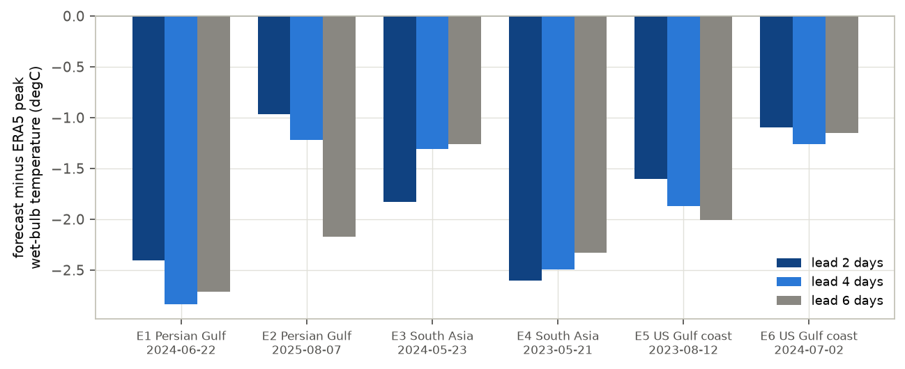
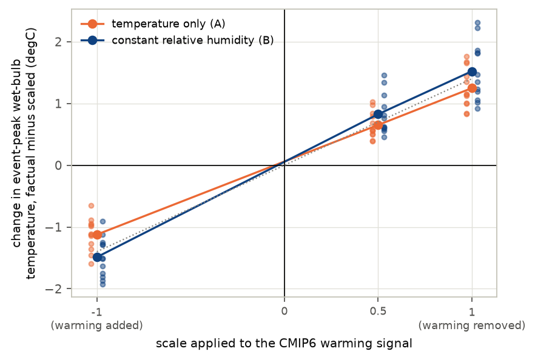
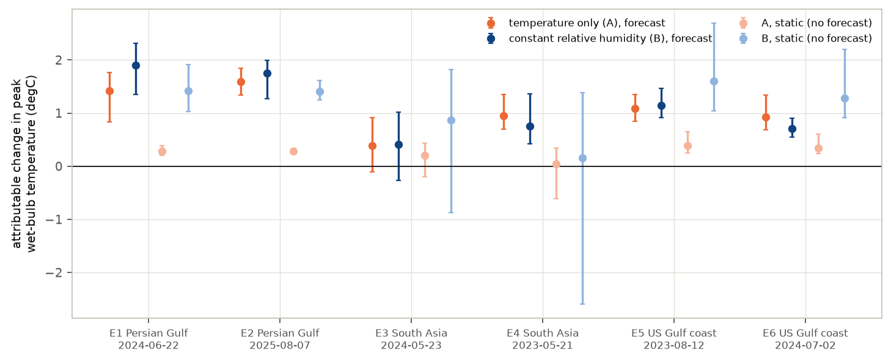
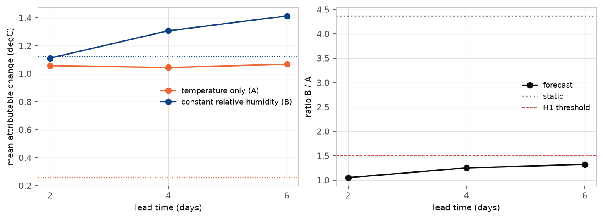
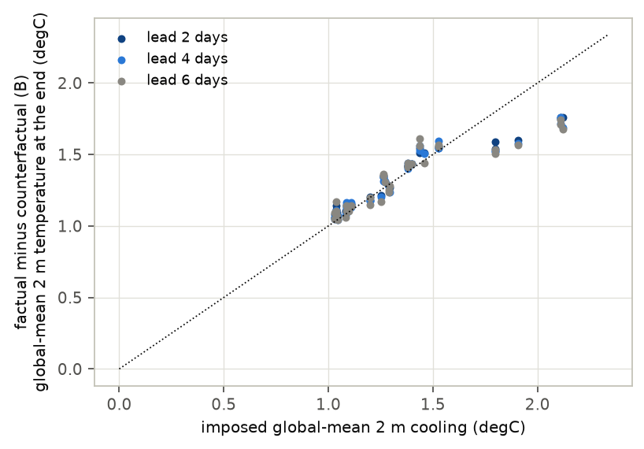

# Does the humidity assumption matter when AI attributes humid heat?

*Preregistered AI-forecast attribution of six 2023–2025 humid-heat extremes with ECMWF's AIFS, under two counterfactual
moisture treatments*

Run directory: `research-lab/runs/climate-earth-ai-humid-heat-attribution` · Preregistration: [`plan.md`](plan.md) ·
Every departure from it: [`deviations.md`](deviations.md) · 1 October 2026, revised after independent review

## In plain terms

Humid heat is the most dangerous kind: when air is both hot and moist, sweat stops cooling the body. Scientists measure
it with the "wet-bulb temperature". A fast way to ask how much climate change worsened a heatwave is to re-run an AI
weather forecast with the warming of the last 150 years removed from the starting weather, and compare.

For humid heat, removing the warming forces a choice about moisture: cool the air but keep its water vapour, or also
remove the extra moisture warmer air can hold. Applied directly to the observed weather, the second choice gives about
four times the climate signal of the first.

We re-forecast six of the most extreme humid-heat days of 2023–2025, in the Persian Gulf, South Asia and the US Gulf
coast, under both choices, using warming estimates from six climate models.

What we found:

- **The forecasts respond to the warming in proportion.** Removing it lowers the peak wet-bulb temperature by about
  1–1.5 °C. Adding it instead raises it by a similar amount, so this is a real response, not an artefact.
- **Inside the forecast, the moisture choice matters much less than on paper.** Two days ahead the two choices give
  almost the same answer. Four to six days ahead, the moisture-removing choice gives about 25–55% more.
- **The forecast responds to the warming of the whole atmosphere, not the local surface.** Even where a climate model
  says the local surface cooled, the forecast shows the same drop.
- **The AI forecasts underestimate the very hottest values**, by about 1.75 °C two days ahead.

So AI-forecast attribution of humid heat is less sensitive to this moisture choice than a direct calculation suggests,
especially at short lead times. Its absolute peaks, and its response to local warming, need care.

## Abstract

**Question.** Counterfactual "storyline" attribution with AI weather models has been shown for dry heatwaves. For humid
heat the counterfactual must also remove moisture. Holding specific humidity fixed (temperature only) and holding
relative humidity fixed (Clausius–Clapeyron) give very different counterfactual wet-bulb temperatures (TW). The lead
predicted that the moisture-scaled treatment yields at least 50% more attributable TW warming in the forecast.

**Design** (preregistered, `plan.md`, committed before any event was selected or forecast run).

- **Events.** Six humid-heat extremes selected by rule from ERA5 (two per region, 2023–2025).
- **Model.** ECMWF's AIFS Single v1.0, the open AI model that forecasts 2 m dewpoint.
- **Forecasts.** Started 2, 4 and 6 days ahead, in a factual world and two counterfactuals:
  - A: temperature only;
  - B: constant relative humidity.
- **Warming signals.** Six CMIP6 models (2014–2033 minus 1850–1900).
- **Total.** 234 forecasts.
- **Control after review.** The signal was also scaled by −1 and 0.5 (48 forecasts).

**Results.**

| Analysis | Result | Verdict |
|---|---|---|
| H1: R = ΔTW_B / ΔTW_A ≥ 1.5, event-peak TW, all leads pooled | 1.21 [1.06, 1.38] | contradicted (preregistered rule) |
| R by lead (2, 4, 6 days) | 1.05 [0.85, 1.22]; 1.25 [1.07, 1.49]; 1.32 [1.01, 1.66] | lead 6 inconclusive |
| R for area-mean TW, pooled | 1.40 [1.05, 1.76] | inconclusive |
| R without a forecast (thermodynamic expectation) | 4.37 | — |
| Control: change when the signal is scaled ×1 / ×0.5 / ×−1 (B) | +1.52 / +0.83 / −1.49 °C | real, roughly linear |
| Member-level tracking: corr(forecast ΔTW_B, local static ΔTW_B) | 0.01 | not local |
| H2: forecast / static ΔTW_B at 2 days | 0.99 [0.63, 1.68]; per member median 0.80 | inconclusive |
| V1: factual peak-TW error at 2 days | −1.75 °C mean (all six low) | not limited by skill under the rule |

**Conclusion.** AIFS responds in proportion to an imposed warming signal: removing it gives about 1–1.5 °C less
peak TW, and adding it about as much more. The contested moisture treatment changes the answer by about 5% at a
2-day lead and 25–30% at 4–6 days (up to 55% for area means), far less than its fourfold static effect. Two caveats:

- AIFS responds to the column-wide signal rather than the local surface change.
- The temperature-only counterfactual starts partly saturated, which the model then sheds.

## 1. Background and the gap

- **Forecast-based attribution.** Physics-based forecast attribution of heatwaves (Leach et al. 2021, PNAS; 2024,
  Nature Communications) has been extended to AI weather models (Jiménez-Esteve et al. 2025, "AI-driven weather
  forecasts to accelerate climate change attribution of heatwaves", Earth's Future). Those studies treat dry-bulb
  temperature.
- **Why humid heat is different.** Wet-bulb temperature sets the physiological limit of heat stress (Sherwood & Huber
  2010, PNAS; Raymond et al. 2020, Science Advances; Vecellio et al. 2022). Statistical rapid attribution of humid heat
  exists ("Multi-method rapid attribution shows climate change is worsening humid heat", Environmental Research Letters
  2026).
  - Most AI weather models have no surface humidity variable; AIFS Single v1.0 has one.
  - The counterfactual moisture treatment is contested. Warming has raised atmospheric moisture roughly at constant
    relative humidity over oceans, and less than that over many land regions.
- **The gap.** No AI-forecast attribution of wet-bulb extremes, and no test of how the moisture treatment changes it,
  was found.

## 2. Data and events

- **ERA5.** The ARCO-ERA5 public archive, 0.25°.
- **Events.** Selected by the preregistered rule: the regional maximum of 2 m TW at 06, 12 and 18 UTC
  (`results/tables/events.csv`).

| Event | Region | Date | ERA5 peak TW |
|---|---|---|---|
| E1 | Persian Gulf | 2024-06-22 | 33.8 °C (over the Gulf) |
| E2 | Persian Gulf | 2025-08-07 | 33.2 °C (over the Gulf) |
| E3 | South Asia | 2024-05-23 | 32.9 °C (see note) |
| E4 | South Asia | 2023-05-21 | 31.8 °C |
| E5 | US Gulf coast | 2023-08-12 | 30.2 °C |
| E6 | US Gulf coast | 2024-07-02 | 29.3 °C |

E3's peak (22.3°N, 76.7°E) is a two-point dewpoint anomaly at the Indira Sagar reservoir: 29.4 °C against 21.7 °C at
its neighbours. It is likely an ERA5 inland-water artefact. The rule selected it, so it is kept and flagged. Leaving it
out gives R = 1.17.

- **CMIP6.** Six models, the first six alphabetically with the needed variables: ACCESS-CM2, AWI-CM-1-1-MR, BCC-CSM2-MR,
  CAS-ESM2-0, CESM2-WACCM and CIESM. Signals come from the Pangeo public archive.
  - The signals warm the free troposphere by 1.5–2.3 K, so the counterfactual is cooler there. They cool the
    stratosphere at 50 hPa by 1.5–2.2 K, as expected, so the counterfactual is warmer there.
  - For May in South Asia, CESM2-WACCM's local surface signal is negative (aerosol cooling), and so is AWI-CM-1-1-MR's
    for some events. Their counterfactual is warmer and moister at the surface there.

## 3. Methods

**Forecasts.**

- AIFS Single v1.0 (CC BY 4.0), through anemoi-inference 0.4.9 on an A100.
- Initial conditions: ERA5 on event day − 2, 4 or 6 days, regridded to the model's N320 grid. Each forecast runs to
  18 UTC on the event day.

**Counterfactuals.** Warming signal ΔT per CMIP6 model, for the event month, 2014–2033 minus 1850–1900.

- **A, temperature only:** ΔT subtracted from air temperature at all 13 levels, 2 m, skin and soil temperatures, with
  specific humidity and 2 m dewpoint unchanged.
  - Where cooling would push the air past saturation, humidity is capped at saturation.
  - That happens often: in the starting states, 11–17% of points at 850–925 hPa end up saturated, against about 1% in
    ERA5.
  - In E3 it also affects 8% of 2 m points in the region.
  - World A therefore starts with patches of saturated, cloud-free air.
- **B, constant relative humidity:** as A, but humidity at every level and the 2 m dewpoint are reduced to keep
  relative humidity unchanged.
- **Both:** geopotential is adjusted hydrostatically.

**Quantities.**

- 2 m TW, from the psychrometric equation.
- **Event-peak TW:** the regional maximum on the event day.
- **Attributable change:** factual minus counterfactual.
- **Static change:** the surface part of the same changes applied to ERA5 event-day fields, with no forecast. Its
  ratio (4.37) is simply the thermodynamic expectation: TW rises 0.21 K per K of warming at fixed vapour pressure,
  and 0.93 K per K at fixed relative humidity.

**Statistics and validation.**

- **H1 interval:** a two-level bootstrap, over events then members. Resampling the six climate models as clusters
  instead gives a narrower interval.
- **V1:** forecast skill.
- **V2:** whether the signal survives the forecast; this uses a cos-latitude-weighted global mean.
- **V3:** a zero-change counterfactual reproduces the factual initial state exactly. Repeated forecasts differ by at
  most 0.02 °C, because GPU inference is not bit-reproducible.

**Control after review** (`deviations.md` D4). The warming signal was scaled by −1 (warming added) and 0.5, for E1 and
E5 at a 2-day lead.

**GPU windows.** The shared language-model server was stopped for three windows (75, 4.5 and 11 minutes) and
restarted each time.

## 4. Results

### 4.1 The forecasts capture the events but miss the very top

At two days ahead, the factual forecasts underestimate event-peak TW in all six events: by 1.0–2.6 °C, 1.75 °C on
average (Figure F1). Two events (E1, E4) miss by more than 2 °C. Regional land-mean TW is close (−0.3 °C on average).

E3's miss partly reflects the ERA5 artefact, which AIFS does not reproduce.

### 4.2 The response is real and roughly linear

Scaling the warming signal changes the event-peak TW in proportion (Figure F5):

| | ×1 (removed) | ×0.5 | ×−1 (added) |
|---|---|---|---|
| Temperature only (A) | +1.25 °C | +0.65 °C | −1.12 °C |
| Constant relative humidity (B) | +1.52 °C | +0.83 °C | −1.49 °C |

The change flips sign when the signal does. Only a small part (0.02–0.07 °C) keeps its sign regardless, so the ~1 °C
attributable change is a response to the imposed warming, not to the act of disturbing the starting state.

### 4.3 The moisture assumption matters much less inside the forecast (H1)

| | Temperature only (A) | Constant RH (B) | Ratio B / A |
|---|---|---|---|
| Static (no forecast) | 0.26 °C | 1.12 °C | 4.37 |
| Forecast, 2 days ahead | 1.06 °C | 1.11 °C | 1.05 [0.85, 1.22] |
| Forecast, 4 days ahead | 1.05 °C | 1.31 °C | 1.25 [1.07, 1.49] |
| Forecast, 6 days ahead | 1.07 °C | 1.41 °C | 1.32 [1.01, 1.66] |
| All leads pooled (H1) | | | **1.21 [1.06, 1.38]** |

- **H1 is contradicted under the preregistered pooled rule** (upper bound below 1.5).
  - The difference grows with lead time: the lead-6 result alone is inconclusive.
  - For area-mean TW the ratios are larger: 1.40 [1.05, 1.76] pooled, and 1.55 [1.30, 1.84] at 6 days.
- **Robustness.** Leaving out any one event gives 1.16–1.27.

### 4.4 What drives the forecast response

- **It is not the local surface signal.** Across members, the forecast change is uncorrelated with the static change
  computed from each model's local surface warming (r = 0.01).
  - In 9 members whose local surface signal is negative (CESM2-WACCM and AWI-CM-1-1-MR over South Asia in May), the
    forecast still gives +0.5 to +2.6 °C.
  - Per member, the forecast/static ratio at 2 days has a median of 0.80, with an interquartile range of 0.55–1.25.
  - The aggregate H2 ratio of 0.99 hides this scatter.
  - AIFS evidently responds to the column-wide, regional-scale warming, which is similar across models, more than to
    the local surface change.
- **World A is not a stable state.** By the event day, land 2 m dewpoint in world A has fallen relative to the factual
  forecast. The fall varies by event, 0.8–2.3 °C against a temperature drop of 0.8–1.4 °C. Part of that is the model
  shedding the moisture the cap left at saturation.
- **World B over-dries.** Dewpoint mostly falls more than temperature in B, so the model ends drier than
  constant-relative-humidity scaling would imply.
- **The signal persists.** About 99.5% of the imposed global-mean cooling survives to the end of the forecasts
  (Figure F4).

## 5. Discussion

**What this study establishes:**

1. **AIFS gives a real, roughly linear attribution response for humid heat.** About 1–1.5 °C of event-peak wet-bulb
   temperature is attributable to warming since 1850–1900 for these six events, and the response flips sign with the
   signal.
2. **The moisture treatment matters much less in the forecast than statically.**
   - At a 2-day lead the two treatments agree to within about 5%.
   - At 4–6 days they differ by 25–32% for peaks and up to 55% for area means.
   - Statically they differ fourfold.
   - So the choice matters most at longer leads and for regional means, and the lead's ≥50% prediction is contradicted
     only for the pooled peak metric.
3. **A static (no-forecast) temperature-only calculation would understate attributable humid heat about fourfold.**

**What it does not establish:**

- **That AIFS's response is physically right.** It does not follow each climate model's local surface signal. It
  over-dries the constant-RH world. Its temperature-only world starts partly saturated. Whether a physics-based model
  responds the same way was not tested.
- **Generality.** Six events, one of them probably a reanalysis artefact; one AI model; six CMIP6 models.
- **Probabilities.** This is a storyline (conditional) attribution of intensity, not of likelihood.

## 6. Limitations

1. **Forecast skill.** Peaks are underestimated by 1.75 °C on average at 2 days.
2. **Deterministic model.** Members are CMIP6 signals and lead times, not initial-condition ensembles.
3. **Counterfactual construction.**
   - Monthly-mean CMIP6 signals.
   - No change in circulation, soil moisture, or surface and sea-level pressure.
   - World A capped at saturation.
4. **E3.** Likely an ERA5 inland-water artefact.
5. **Linearity control.** Only two events at one lead.
6. **Nondeterminism.** Quantified and negligible.

## 7. Reproducibility

The code is in `code/`:

- `select_events.py`: event selection;
- `cmip6_deltas.py`: warming signals;
- `build_ic.py`: initial conditions;
- `perturb.py`: counterfactuals;
- `run_forecasts.py`, `gpu_window.sh`: the forecasts;
- `noise_check.py`: the nondeterminism check;
- `control_scale.py`: the linearity control;
- `analyze.py`: the analysis;
- `review_checks.py`: checks requested by the independent review;
- `wetbulb.py`: wet-bulb temperature;
- `make_figures.py`, `build_report_html.py`: presentation.

Tables are in `results/tables/` and figures in `results/figures/`. Data are open; initial conditions and forecasts (about
8 GB) are not committed.
