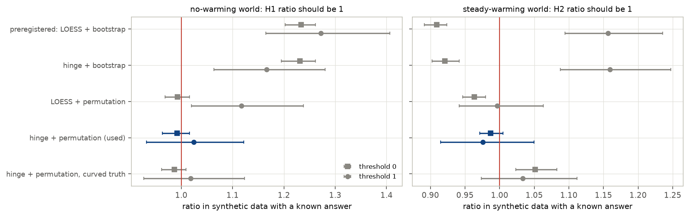
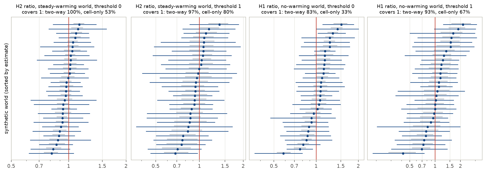
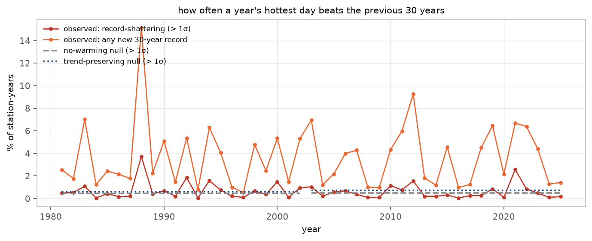
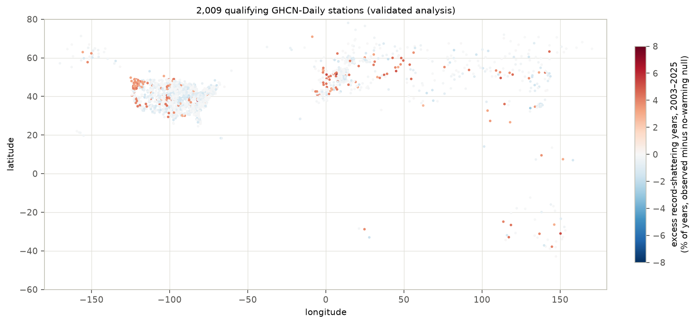
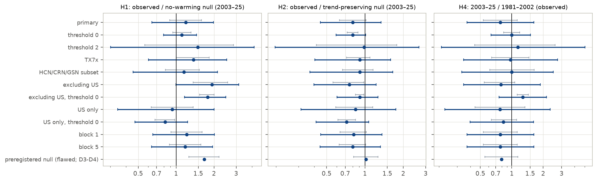
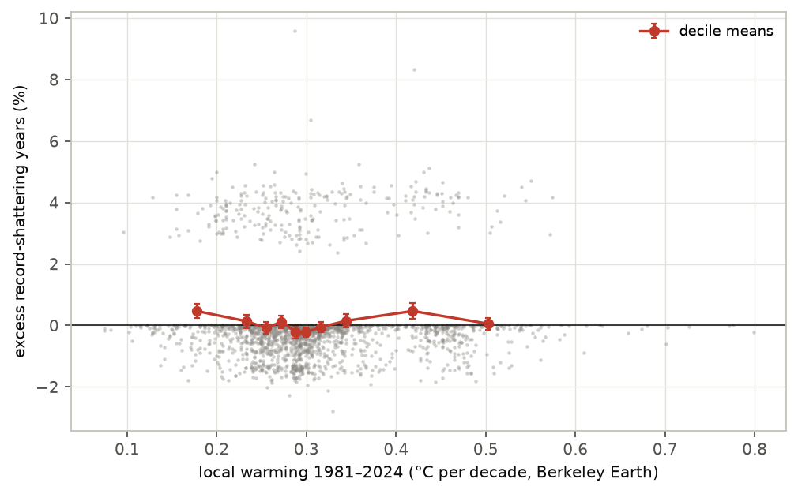
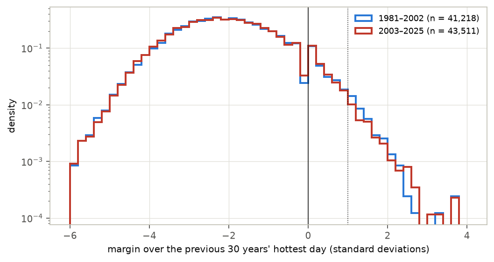

# Are heat records being broken by growing margins?

*A preregistered test of "record-shattering" heat in 2,009 long-running weather stations, 1951–2025*

Run directory: `research-lab/runs/climate-earth-record-margin-obs` · Preregistration: [`plan.md`](plan.md) ·
Every departure from it: [`deviations.md`](deviations.md) · 1 October 2026, revised after independent review

## In plain terms

As the climate warms, heat records fall more often; that is well established. Climate models predict more: records
will increasingly be *smashed*, by margins far larger than the usual fraction of a degree, as in the 2021 Pacific
Northwest heatwave. This study checked whether real weather-station records already show that.

For 2,009 stations with records back to 1951, we asked how often each summer's hottest day beat the previous 30
years' hottest, and by how much. We compared that with simulated climates:

- one with no warming at all;
- one with each station's own steady warming but unchanged year-to-year variability.

The tests were written down before any data were downloaded.

What we found:

- **Outside the United States, new heat records are clearly more common than without warming**, about 1.8 times as
  common. Whether records there are also being *smashed* more often is borderline.
- **Across all stations, smashed records are not clearly more common than chance.** Most stations are in the US,
  where the hottest summer day has barely warmed since 1980.
- **Nothing exceeds what steady warming explains.** New records are, if anything, about 20% rarer than steady warming
  predicts, but that is within what chance allows.
- **No acceleration.** Smashed records were not more frequent in 2003–2025 than in 1981–2002, or where the region
  warmed faster.

So the model-predicted rise of record-shattering heat is not yet visible in these station records.

Two corrections along the way:

- **The planned "chance" simulation undercounted records.** Testing it on simulated data with a known answer caught
  this.
- **The first error bars were too narrow.** An independent review noted that one heatwave sets records at hundreds of
  stations at once, which the first estimate treated as independent. The corrected error bars were tested the same
  way.

## Abstract

Fischer, Sippel and Knutti (2021) showed in climate-model ensembles that warming makes record-shattering extremes more
likely: records that beat the previous one by a large margin, at a rate that grows with the speed of warming.
Observational work has so far measured how often records fall, not by how much.

We tested the prediction in NOAA GHCN-Daily station data:

- 2,009 stations with near-complete warm-season maximum-temperature records for 1951–2025, in 270 grid cells of 5°;
- 69% of the stations are in the United States;
- the statistic is the 30-year record margin: a year's hottest day minus the hottest of the previous 30 years, in
  units of the station's year-to-year standard deviation.

**A methods finding came first.** The preregistered null models failed validation on synthetic station series with a
known answer.

- They were biased by 10–25%, comparable to the effects under test.
- The cause: resampling residuals *with replacement* duplicates extreme values, which can then never be strictly beaten,
  so surrogate climates under-produce records.
- Block permutation replaces the resampling, and a two-parameter hinge trend replaces the smooth trend. Together they
  give calibrated nulls: they return a ratio of 1 where the answer is 1.

**A second one followed from independent review.** Heatwaves set records at many stations in the same year, so
uncertainty must be resampled over years as well as places.

- The preregistered interval resampled grid cells only. In synthetic worlds whose stations are correlated like the
  real ones, it covered the truth in only 33–83% of cases.
- A two-way bootstrap (grid cells × 3-year blocks) covered it in 83–100%.

**With validated nulls and two-way intervals:**

| Hypothesis | Ratio [95%] | Verdict |
|---|---|---|
| H1: record-shattering (margin > 1 SD) in 2003–2025 vs a no-warming climate | 1.19 [0.64, 1.98] | not distinguishable from 1 |
| H1 for week-long heat (TX7x) | 1.38 [0.60, 2.53] | not distinguishable from 1 |
| H1 outside the United States | 1.92 [1.00, 3.15] | borderline |
| Any new 30-year record, outside the United States, vs no warming | 1.78 [1.17, 2.48] | more records than without warming |
| H2: vs steady warming with unchanged variability | 0.80 [0.45, 1.34] | not distinguishable from 1 |
| H2, any new 30-year record (margin > 0) | 0.80 [0.59, 1.02] | below 1, but not distinguishable from 1 |
| H3: dependence on local warming rate (Berkeley Earth) | slope +0.002 [−0.041, +0.036] | not supported; underpowered |
| H4: 2003–2025 vs 1981–2002 | 0.77 [0.37, 1.63] | not distinguishable from 1 |

The station records show no sign that heat records are being broken by margins growing beyond what the stations' mean
warming implies. New 30-year records are about 20% fewer than a trend-plus-stationary-noise null predicts. That
shortfall is broad across years and strongest at US stations, and it is not statistically distinguishable from 1 once
year-to-year dependence is included.

The preregistered analysis, with its flawed nulls and cell-only intervals, had reported H1 as supported (1.67 [1.27,
2.20]). That number is kept in the record, but it reflects the bias.

## 1. Background and the gap

- **The prediction.** In large model ensembles, the probability of breaking the previous record by several standard
  deviations rises steeply with the rate of warming (Fischer, Sippel & Knutti 2021, Nature Climate Change).
  Record-shattering events such as the 2021 Pacific Northwest heatwave are the observational motivation.
- **What observations have shown.** Record *frequency* (a 2025 Nature Reviews Earth & Environment review reports
  300–350% more daily hot records in 2016–2024 than a stationary climate would give), return times of individual
  events, and regional record statistics.
- **The gap.** We found no global station-based test of record *margins* against explicit null models that separates:
  - the effect of any warming;
  - the effect of the local mean warming;
  - any excess beyond both, which is the part the rate-dependence mechanism adds.

## 2. Data

- **Temperatures.** GHCN-Daily per-station files from NCEI (current release, downloaded 1 October 2026); daily TMAX,
  with quality-flagged values dropped. Candidates: the 4,020 stations whose TMAX coverage spans 1951 to 2025.
- **Warm season.** May–September in the northern hemisphere, November–March in the southern.
  - A season is valid when at least 90% of its days are present.
  - TXx is the season's hottest day; TX7x is its hottest 7-day mean.
- **Qualifying stations.** At least 60 valid seasons in 1951–2025, and at least 80% valid seasons in each era.
- **Plausibility screen** (added after review). A station is dropped if any value lies more than 8 robust standard
  deviations from its median, or its hottest day is below 10 °C outside the polar regions. This removed 4 qualifying
  stations, one with values off by a factor of 10. Ratios moved by less than 0.015.
- **The final network:**
  - 2,009 stations in 270 grid cells;
  - by country: US 1,394, Russia 159, Germany 148, Sweden 38, Australia 33, France 33, Spain 33, Japan 18, others;
  - 36 in the southern hemisphere.
- **External warming rate.** The Berkeley Earth 1° gridded land temperature trend, 1981–2024.

## 3. Methods

**Preregistered design** (`plan.md`, committed before any station data were downloaded).

- **The statistic.** The 30-year record margin m_t = (TXx_t − max TXx over the previous 30 years) / σ_s, computed for
  1981–2025 where at least 25 of the 30 look-back years are valid.
  - The look-back is fixed, so under a stationary climate the distribution of m_t does not depend on the year. This
    avoids the "older records are harder to beat" artefact of all-time records.
  - σ_s is the standard deviation of the station's residuals about its fitted trend. Record-shattering means m_t > 1:
    beating the previous 30-year maximum by more than one residual standard deviation.
  - Secondary thresholds are 0 and 2. Threshold 0 (any new 30-year record) does not depend on σ_s and is the most
    robust statistic.
- **Comparisons.**
  - **H1:** observed frequency in 2003–2025 against a no-warming (stationary) null.
  - **H2:** against a trend-preserving null (station trend plus residuals).
  - **H3:** station excess against the local warming rate.
  - **H4:** 2003–2025 against 1981–2002.
- **Uncertainty.** Frequencies are pooled over station-years. The plan used a spatial block bootstrap over 5°×5° grid
  cells; this was replaced after review (below).

**Validation and correction of the nulls** (`deviations.md` D3–D4). We ran every station's pipeline on synthetic series
with a known answer: the station's own trend (or none) plus stationary noise with its variability and
autocorrelation, three replicates. The preregistered nulls (30-year LOESS trend, residuals resampled with replacement)
failed:

- in the no-warming world, H1's ratio came out 1.23–1.27 instead of 1;
- in the steady-warming world, H2's came out 0.91–1.16.

The main cause is resampling with replacement. The fix is **block permutation**: consecutive blocks of residuals are
shuffled, and every value is used once. A **hinge trend** replaces the 30-year LOESS, which absorbs part of the
variability. The hinge is flat to 1980 and linear after, with two parameters; the knot is fixed at 1980, not tuned.

The corrected nulls pass (Figure F6):

- no-warming world: H1 ratio 0.99 [0.96, 1.02] and 1.02 [0.93, 1.12];
- steady-warming world: H2 ratio 0.99 [0.97, 1.01] and 0.98 [0.91, 1.05];
- with a curved true trend analysed by the hinge: H2 ratio 1.05 [1.02, 1.08] and 1.03 [0.97, 1.11].

(In each pair, the first value is for threshold 0 and the second for threshold 1.)

**Independent review and the two-way bootstrap** (`deviations.md` D6). A separate reviewer agent, given the plan, the
log, the code and the draft, found that the grid-cell bootstrap treats stations in different cells as independent.
Heatwaves are not: in 2012, one in eight US stations set a new 30-year record in the same summer.

We therefore resample grid cells and, independently, 3-year blocks of years within each era. Before adopting it, we
checked both intervals on 30 synthetic worlds per case in which the true ratio is exactly 1. The worlds' year-to-year
noise is correlated between stations as in the data: a correlation of 0.56 within 500 km, 0.33 at 500–1,000 km, 0.18
at 1,000–1,500 km and near 0 beyond 2,000 km (Figure F7).

- **The cell-only intervals are too narrow.** They contained the truth in 33–80% of worlds.
- **The two-way intervals contained it in 97–100% of worlds for H2.** They are conservative there: about 1.5 times
  wider than the true spread.
- **For H1 they contained it in 83% (threshold 0) and 93% (threshold 1).** They are slightly narrow for H1.
- **Chance alone produces H1 ratios of about 1.1.** In the no-warming worlds, H1 averaged 1.06 (threshold 0) and 1.13
  (threshold 1).

A simpler dependence model (regional plus grid-cell year effects) gave the same picture. The analysis is the same
before and after this change; only the intervals, and therefore the verdicts, changed.

## 4. Results

### 4.1 How often records are set and shattered

Across the qualifying stations, the hottest day of the warm season beat the previous 30 years':

- in 3.65% of station-years in 2003–2025;
- by more than one standard deviation in 0.57%.

The yearly series is dominated by large regional heatwaves (Figure F2):

- 1988, 2011, 2012 and 2021 in the United States, which set 80–91% of those years' new records;
- 2003 in western Europe (Germany and France);
- 2010 in Russia.

### 4.2 H1 and H2: against a no-warming climate and against steady warming

Table 1. Observed frequency against the validated nulls, 2003–2025. Ratios with two-way 95% intervals.

| Analysis | Observed | No-warming null | Steady-warming null | H1 ratio | H2 ratio |
|---|---|---|---|---|---|
| Hottest day, margin > 1 SD (primary) | 0.57% | 0.48% | 0.71% | 1.19 [0.64, 1.98] | 0.80 [0.45, 1.34] |
| Hottest day, any new record (> 0) | 3.65% | 3.28% | 4.55% | 1.11 [0.80, 1.46] | 0.80 [0.59, 1.02] |
| Hottest day, margin > 2 SD | 0.07% | 0.04% | 0.07% | 1.49 [0.30, 4.17] | 0.98 [0.20, 2.65] |
| Hottest week (TX7x), > 1 SD | 0.63% | 0.45% | 0.69% | 1.38 [0.60, 2.53] | 0.91 [0.40, 1.59] |
| High-quality stations (HCN/CRN/GSN) | 0.57% | 0.49% | 0.63% | 1.16 [0.46, 2.14] | 0.91 [0.37, 1.65] |
| Excluding the United States, > 1 SD | 0.78% | 0.40% | 1.03% | 1.92 [1.00, 3.15] | 0.75 [0.40, 1.22] |
| Excluding the United States, any new record | 5.80% | 3.26% | 6.36% | **1.78 [1.17, 2.48]** | 0.91 [0.60, 1.26] |
| United States only, > 1 SD | 0.48% | 0.51% | 0.57% | 0.93 [0.34, 2.01] | 0.84 [0.31, 1.75] |
| United States only, any new record | 2.69% | 3.29% | 3.75% | 0.82 [0.47, 1.23] | 0.72 [0.41, 1.07] |

The results are the same with block lengths 1 and 5, and with a three-parameter trend that also slopes before 1980
(§4.5). Figure F3 shows each ratio with both the two-way and the cell-only interval.

**Readings.**

- **Outside the United States, new 30-year records are clearly more frequent than without warming.** The ratio is
  1.78 [1.17, 2.48], well above the ~1.06 that correlated chance produces. For record-*shattering* there (margin > 1 SD)
  the ratio is similar, 1.92, but the interval reaches 1.00.
  - Outside the US, the median station's hottest day warmed 0.47 °C per decade since 1980; in the US, −0.01.
- **Pooled over all stations, record-shattering is not distinguishable from a no-warming climate.** This holds for
  single hottest days (1.19), week-long heat (1.38) and the high-quality subset (1.16). All three intervals include 1,
  and chance alone gives about 1.1.
- **Nowhere does the observed frequency exceed the steady-warming null.** New 30-year records are about 20% fewer than
  it predicts (0.80 [0.59, 1.02]).
  - The two-way interval just includes 1, and the coverage check shows it is conservative for this ratio.
  - A three-parameter trend gives 0.77 [0.57, 0.98] (§4.5).
  - So the shortfall is suggestive, not established.

The preregistered analysis had given H1 = 1.67 [1.27, 2.20] and H2 = 1.02 [0.82, 1.26]. The validation (§3) shows those
nulls under-produce records, which inflated H1.

### 4.3 Where the shortfall against steady warming comes from

At the "any new record" threshold (`results/tables/h2_breakdown.csv`, `h2_by_year.csv`):

- **By region.** The ratio is 0.72 [0.41, 1.07] at US stations and 0.91 [0.60, 1.26] elsewhere.
- **By year.** In 17 of the 23 years of 2003–2025, fewer new records were set than the steady-warming null expects.
  - Three heatwave years (2012, 2003, 2021) hold 28% of the observed new records, against 13% of the expected ones.
  - Without those three years the ratio falls to 0.67. Without the three years with the largest deficits it rises to
    0.89.

So the shortfall is spread across most years. A few very large regional heatwaves partly offset it rather than cause
it. The pattern fits a null that spreads records evenly across years while the real climate concentrates them in
heatwave years. It also fits the stalled warming of US summer maxima. It does not by itself say which.

### 4.4 H3: no detectable dependence on the local warming rate

Stations whose grid cell warmed faster in Berkeley Earth (1981–2024) do not show more excess shattering: slope +0.002
[−0.041, +0.036] per °C per decade, 1,985 stations (Figure F4).

This test has little power. The interval spans ±0.04, more than ten times the roughly 0.003 slope the reviewer
estimated a model-like rate dependence would give at these warming rates. H3 is therefore "not supported", not
"refuted".

Using each station's own fitted trend instead gives a positive slope (+0.010 [0.007, 0.014]), but that version is
circular. A station that happens to end on hot years gets both a steeper trend and more records from the same data.

### 4.5 H4 and the early baseline

The record-shattering frequency was 0.74% in 1981–2002 and 0.57% in 2003–2025: ratio 0.77 [0.37, 1.63]. At the "any
new record" threshold it is 1.00 [0.63, 1.51]. Neither shows acceleration.

The hinge assumes a flat climate before 1980, but US stations were unusually hot in the early 1950s. Their mean
residual in 1951–55 is +0.78 °C, against +0.24 °C elsewhere (`results/tables/baseline_residuals.csv`).

- **Direction of the effect.** A hot 1950s makes the previous-30-year maximum harder to beat in the early 1980s. It
  therefore lowers the 1981–2002 frequency and, if anything, raises H4.
- **Sensitivity check.** A three-parameter trend with its own 1951–80 slope passes the same synthetic validation. It
  gives essentially the same results:
  - H1 1.27, H2 0.79 and H4 0.79;
  - H2 at threshold 0: 0.77 [0.57, 0.98];
  - outside the US at threshold 0: H1 1.77 [1.16, 2.46].

## 5. Discussion

**What this study establishes:**

1. **No observational signal yet of heat records broken by margins beyond mean warming.** Against a validated null of
   each station's own warming with unchanged variability, record-shattering is no more frequent than expected. New
   30-year records are, if anything, rarer.
2. **Outside the United States, warming has made new 30-year heat records clearly more common**, about 1.8 times the
   no-warming rate. Record-shattering there points the same way, but the interval is borderline. Pooled over a
   US-dominated network, record-shattering is not distinguishable from a no-warming climate.
3. **Neither across eras nor across stations does the frequency rise with warming.** That is the observational
   signature of Fischer et al.'s rate dependence, and it is not seen. The cross-station test (H3) has little power,
   so its absence is weak evidence.
4. **Record statistics need validated nulls and validated intervals.**
   - Resampling with replacement biases record counts by 10–25%.
   - Resampling places but not years makes intervals 1.6 to 3.6 times too narrow, because heatwaves are shared.
   - Each of these would have turned an inconclusive result into an apparently clear one.

**What it does not establish:**

- **That record-shattering is not increasing anywhere.** The station network is 69% US and has few tropical or
  southern-hemisphere stations.
  - The hottest summer day at the median US station has not warmed since 1980 (−0.01 °C per decade), the US "warming
    hole" for summer maxima. Outside the US it warmed 0.47 °C per decade, and that is where new records are clearly more
    frequent than without warming.
  - Pooled, the median station trend in the hottest day is 0.13 °C per decade, against 0.31 °C per decade in Berkeley
    Earth mean temperature.
- **The long-run prediction.** Fischer et al. predict a strong rise mainly at high warming rates in coming decades. One
  observed realisation of 2003–2025 has limited power to see it.
- **Why new records may be rarer than steady warming predicts.** The shortfall is not established (§4.2). If it is
  real, candidates include:
  - the clustering of records into heatwave years;
  - slower warming of summer maxima late in the record;
  - long-range memory that the null does not keep.

## 6. Limitations

1. **Homogeneity.** GHCN-Daily is not homogenised. Station changes can create spurious steps; the high-quality subset
   gives the same answers.
2. **Coverage.** Stations are concentrated in the US and Europe.
3. **Spatial dependence.** The two-way intervals were checked on synthetic worlds that match the measured
   distance-dependence of the data but not every feature of it. Examples are opposite-signed swings between distant
   regions, and multi-year heat episodes like the US 1950s.
   - Coverage was 83–100%.
   - The intervals are conservative for H2 and slightly narrow for H1.
4. **Units of the threshold.** The threshold is in units of each station's residual standard deviation, which depends on
   the detrending. That is why observed frequencies differ between the preregistered and corrected analyses. Threshold 0
   has no such dependence.
5. **Early baseline.** The hinge's flat pre-1980 segment does not fit the hot US 1950s. A three-parameter alternative
   gives the same answers (§4.5).
6. **Exploratory analyses.** The corrected nulls, the plausibility screen and the two-way intervals were adopted after
   the preregistration, because validation or review showed the planned versions to be wrong. Both sets of numbers are
   reported, with the reasons in `deviations.md`.
7. **External covariate.** The external warming rate is for mean temperature, not for summer maxima (correlation with
   the station trends in the hottest day: 0.50).

## 7. Reproducibility

The code is in `code/`:

- `fetch_stations.sh`: data;
- `build_series.py`: warm-season extremes;
- `analyze.py`:
  - margins, nulls, the plausibility screen, and the cell-only and two-way pooling;
  - `analyze.py hinge permute` is the corrected analysis, and `analyze.py pw permute` the three-parameter sensitivity;
- `validate_nulls.py`: synthetic validation of the nulls;
- `validate_coverage.py`: synthetic validation of the intervals (`30 nested`, `30 kernel`);
- `h3_external.py`: the H3 covariate;
- `explore_h2.py`, `explore_baseline.py`: the §4.3 and §4.5 breakdowns;
- `make_figures.py`, `build_report_html.py`: presentation.

Tables are in `results/tables/` and figures in `results/figures/`. Raw data (about 5 GB) are open and re-downloadable,
and not committed.
