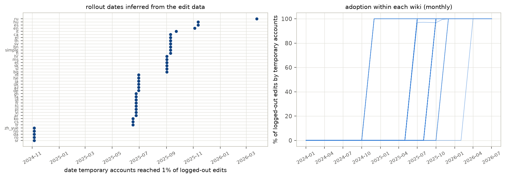
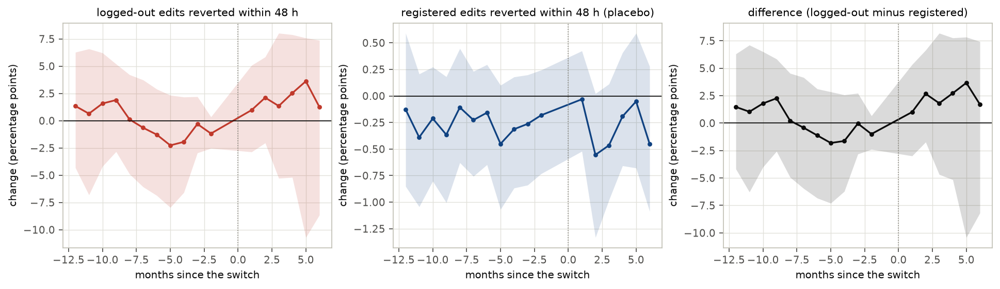
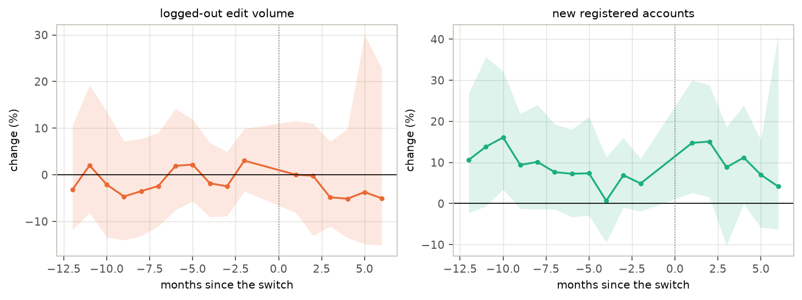

# Did hiding IP addresses change Wikipedia vandalism?

*A preregistered staggered difference-in-differences study of the switch to temporary accounts on 40 Wikipedias, 2024–2026*

Run directory: `research-lab/runs/comp-social-science-temp-accounts-vandalism` · Preregistration: [`plan.md`](plan.md) ·
Every departure from it: [`deviations.md`](deviations.md) · 1 October 2026, revised after independent review

## In plain terms

Anyone can edit Wikipedia without an account. Until recently, such edits were publicly signed with the editor's IP
address, which can reveal roughly where they are. Between November 2024 and March 2026, Wikipedia replaced this with
"temporary accounts": an automatic name, with the IP visible only to trusted volunteers. Critics worried that more
anonymity would invite more vandalism.

The switch happened on different wikis at different times, which makes a natural experiment. We compared how often
logged-out edits were undone within 48 hours (a common sign of vandalism) before and after each wiki switched, against
wikis that had not switched yet. We used 35 million logged-out edits on 40 large Wikipedias, and wrote down the plan
before looking at any data.

What we found:

- **No detectable change in vandalism.** The raw comparison suggests a rise of 2 percentage points (from about 28%).
  But running the same comparison on a year when nobody switched gives a similar "rise" of almost 3 points. Vandalism
  dips every summer when schools are out, and that pattern fools the comparison.
- **Once that summer pattern is removed, the change is essentially zero.** Changes of more than about 10–20% either way
  remain possible.
- **Registered editors showed no clear change, and the amount of logged-out editing did not detectably fall.**

So the switch to temporary accounts did not cause a detectable wave of vandalism on these Wikipedias. A precise answer
needs more time after the switch.

## Abstract

**Question.** Does reducing the public exposure of anonymous editors' identities increase vandalism? Wikimedia's
replacement of IP-address attribution with temporary accounts, rolled out in waves, is a staggered natural
experiment. Wikimedia's monitoring reported no concerning trend; no causal estimate was found.

**Design** (preregistered, `plan.md`, committed before any edit data were downloaded).

- **Wikis.** The 40 Wikipedias with the most anonymous content edits in 2024.
- **Data.** `mediawiki_history` dumps: 35.4 M logged-out and 184 M registered content edits, January 2024 to July
  2026.
- **Switch dates.** Inferred from the data; English Wikipedia's matches its documented date.
- **Primary outcome.** The share of logged-out content edits identity-reverted within 48 hours.
- **Estimator.** Callaway–Sant'Anna difference-in-differences with not-yet-treated controls, months +1 to +6, with a
  cluster bootstrap over wikis.
- **After independent review:**
  - an in-time placebo;
  - a size check of the pre-trend tests;
  - a corrected seasonal adjustment;
  - a fix that excludes cross-wiki imported revisions.

**Results.**

| Analysis | Estimate [95%] | Note |
|---|---|---|
| H1: logged-out 48 h revert rate (≥ +10% predicted) | +2.0 points [−2.9, +5.3]; +7.2% [−10.3%, +18.9%] | **inconclusive** |
| In-time placebo: same design, a year with no switch | +2.7 points [−0.2, +5.7]; +9.4% | the design's own bias |
| Exploratory: seasonally adjusted (year over year) | +0.04 points [−4.8, +3.0]; +0.1% [−17.8%, +11.0%] | essentially zero |
| Placebo: registered editors | −0.28 points [−0.73, +0.16]; −10.9% [−27.9%, +6.4%] | no change |
| Logged-out edit volume | −3.0% [−9.3%, +7.3%] | no change |
| New self-created accounts | +10.6% [+1.3%, +20.7%] | pre-switch months equally high: no evidence of change |
| Robustness (windows, weights, waves left out, without enwiki) | +2.1% to +9.9% | all inconclusive |
| Two-way fixed effects | +1.3 points [−1.2, +4.1] | — |

**Conclusion.** The switch to temporary accounts produced no detectable change in vandalism as measured by fast
reverts. The primary estimate is about the size of the design's seasonal bias, and the seasonally adjusted estimate is
essentially zero. Changes of about 10–20% in either direction cannot be ruled out.

## 1. Background and the gap

- **The policy.** Logged-out edits were attributed publicly to their IP address until Wikimedia introduced temporary
  accounts. The IP is now visible only to administrators and approved viewers.
- **The debate.** Whether exposure deters vandalism is a long-running question in peer-production research. Examples:
  - contributions to Wikipedia through Tor (Tran et al. 2020);
  - the Portuguese Wikipedia's 2020 restriction of IP editing (Wikimedia Research).
- **The gap.** Wikimedia's Trust and Safety team reported "no concerning trends like relatively more reverted edits"
  in December 2025. That is monitoring, not a causal estimate. No study using the staggered rollout was found.

## 2. Data

- **Edits.** Wikimedia `mediawiki_history` dumps, snapshot 2026-08, 128 files from the ftp.acc.umu.se mirror, each
  integrity-checked (`deviations.md` D3).
- **Extraction** (`code/extract.awk`). Content-namespace revision-create events from 2024 onward, excluding:
  - revisions deleted with their page;
  - cross-wiki imported revisions, which the dumps mark as anonymous (D5).
- **Groups:**
  - **Logged-out:** IP or temporary account.
  - **Registered:** a permanent account with no bot flag.
  - **Reverts:** identity reverts within 24 and 48 hours.
- **Check.** Before cross-wiki imports were excluded, enwiki's January 2024 logged-out content edits (608,902)
  matched Wikimedia's Analytics figure exactly. After the exclusion the count is 608,878.
- **Wikis.** The 40 with the most anonymous content edits in 2024, from the Wikimedia Analytics API (D2). They run from
  English (6.8 M) to Croatian (17,000). Portuguese Wikipedia is absent: it has restricted IP editing since 2020.
- **Switch dates** (Figure F1). The first day temporary accounts made up at least 1% of logged-out edits. Adoption is
  sharp: no temporary-account edits the day before, and 100% within a day or two. Five waves:

| Wave | Wikis |
|---|---|
| 5 November 2024 | 5 wikis |
| 17–30 June 2025 | 17 wikis |
| 2–23 September 2025 | 14 wikis |
| 4–12 November 2025 | English, Spanish, Hungarian |
| 25 March 2026 | Russian |

## 3. Methods

- **Panel.** Wiki × calendar month, January 2024 to July 2026, the last month with a complete 48-hour revert window
  (D5). The switch month is dropped.
- **Estimator** (Callaway & Sant'Anna 2021).
  - For each wave and month: the change since the month before the switch, minus the same change in wikis that had not
    yet switched.
  - These are averaged over waves (weighted by number of wikis) at months −12 to +6.
  - The headline averages months +1 to +6.
- **Intervals.** 2,000 cluster-bootstrap draws over wikis.
- **Decision rule (H1).** Supported if the relative effect is at least +10% with lower bound > 0. Contradicted if the
  upper bound < +10%. Otherwise inconclusive.
- **Validation of the estimator** (`code/validate_estimator.py`). On synthetic data with a known +2-point effect and
  staggered waves, it recovers +2.00 [1.82, 2.20] with leads near zero.
- **Checks added after review** (D5).
  - **In-time placebo:** the 2025–26 waves' dates moved back a year, on data from before any of them switched.
  - **Size check:** how often each pre-trend test rejects when there is no treatment.

## 4. Results

### 4.1 The revert rate of logged-out edits

Before switching, 27.7% of logged-out content edits were reverted within 48 hours (registered: 2.6%). After the
switch, the estimated change is **+2.0 percentage points [−2.9, +5.3]**: a relative change of +7.2% [−10.3%, +18.9%]
(Figure F2). By wave:

| Wave | Change |
|---|---|
| November 2024 | −2.3 points |
| June 2025 | +2.2 points |
| September 2025 | +3.5 points |
| November 2025 | +2.1 points |

**H1 is inconclusive under the preregistered rule.**

### 4.2 The design's own bias: seasonality

Logged-out revert rates follow a strong yearly cycle. On wikis that had not yet switched, they run at 28–30% for
most of the year and fall to 20–24% in July and August, in both 2024 and 2025, plausibly when schools are on
holiday. The largest wave switched in late June 2025.

- **In-time placebo.** The same estimator applied to 2024, with every 2025–26 wave's date moved back exactly a year,
  "finds" **+2.7 points [−0.2, +5.7]** (+9.4%). Nothing had changed then. The registered placebo is −0.06 points.
  - The primary estimate (+2.0) is therefore no larger than what the design produces from seasonality alone.
- **Seasonal adjustment** (exploratory). Comparing each month with the same month a year earlier removes each wiki's
  own cycle. It gives **+0.1% [−17.8%, +11.0%]**: no change.
- **Pre-trends.** The preregistered joint test over 11 leads rejects (p < 0.001). But on no-treatment data with
  randomly reassigned dates it rejects 96% of the time at the 5% level, so it carries no information here.
  - A 5-lead test (−6 to −2) rejects 13% of the time under no treatment (nominal 5%), and gives p = 0.21 on the real
    data.
  - The leads themselves (Figure F2) drift by about ±2 points with the seasons.

### 4.3 Robustness, placebo and secondary outcomes

| Variant | Relative change in the logged-out revert rate |
|---|---|
| 24-hour window | +6.8% |
| Edits instead of wikis as weights | +7.0% [−8.7%, +20.6%] |
| Without English Wikipedia | +8.0% |
| Leaving out each of the first four waves in turn | +5.2% to +9.9% |
| Without Russian Wikipedia | +2.1% |
| Two-way fixed effects | +1.3 points [−1.2, +4.1] |

All are inconclusive. A 10% switch threshold is identical to the primary analysis, because every wiki passes 10% on its
first day.

**Dependence on Russian Wikipedia.** It switched last, in March 2026, so after November 2025 it is the only
not-yet-switched control. Cells compared against it alone carry 47% of the post-switch weight. Removing it moves the
estimate to +2.1%. The bootstrap does not capture this dependence well, so the intervals are probably too narrow.

- **Registered-editor placebo.** −0.28 points [−0.73, +0.16], or −10.9% [−27.9%, +6.4%] relative. That is not
  significant, but not negligible in relative terms.
- **Logged-out edit volume.** −3.0% [−9.3%, +7.3%].
- **New self-created accounts.** +10.6% [+1.3%, +20.7%] after the switch. But the months before the switch are just as
  elevated relative to the month before it (Figure F3), so this reflects a dip in the base month, not a change.

## 5. Discussion

**What this study establishes:**

1. **No detectable change in vandalism followed the switch.** Measured by the share of logged-out edits reverted within
   48 hours, the switch produced no change larger than this design's own seasonal bias.
   - Seasonally adjusted, the estimate is essentially zero.
   - This is consistent with Wikimedia's own monitoring, now with a causal design and uncertainty attached.
2. **Staggered designs on platform data need in-time placebos.** A school-holiday cycle that coincides with a rollout
   wave can produce an "effect" of the same size as a plausible real one. Standard joint pre-trend tests can be
   uninformative with few, highly correlated leads.

**What it does not establish:**

- **That anonymity has no effect.** Changes of about 10–20% in either direction cannot be ruled out, and later waves
  are heavily dependent on one control wiki.
- **That editor behaviour is unchanged.** The revert rate mixes behaviour with moderation, and moderation changed at the
  same time:
  - temporary accounts persist through a cookie, so repeat vandals become linkable;
  - abuse filters and IP blocks apply differently to them;
  - patroller tools and machine-learning scoring were updated;
  - Russian Wikipedia's flagged-revisions regime differs from most others.

  Any of these could move revert rates without any change in what logged-out editors do.
- **Long-run effects.** Six months after the switch at most.

## 6. Limitations

1. **Seasonality and timing.** The design is biased by the seasonal cycle: the in-time placebo gives +2.7 points. The
   seasonally adjusted estimate is exploratory.
2. **Few late controls.** After November 2025 only Russian Wikipedia remains not yet treated. Its cells carry 47% of
   the weight, and the intervals are probably too narrow.
3. **Revert rate as a vandalism measure.** Fast identity reverts capture most vandalism, but also good-faith edits that
   were undone. Unreverted vandalism, and vandalism removed by deleting the page, are missed.
4. **Data anomalies.**
   - Persian Wikipedia's logged-out volume fell sharply in January–June 2026.
   - Croatian Wikipedia has a volume spike in November 2025.
5. **Not run.** The weekly aggregation, and the revert rate of first logged-out edits, which cannot be linked in the
   dumps (D4, D5).
6. **Sample.** 40 Wikipedias chosen by logged-out edit volume. Portuguese Wikipedia's earlier IP ban is outside it.

## 7. Reproducibility

The code is in `code/`:

- `select_wikis.py`: sample;
- `fetch_dumps.sh`: downloads;
- `extract.awk`, `extract_all.sh`: aggregation;
- `analysis.py`: the estimator, bootstrap and pre-trend tests;
- `robustness.sh`: robustness variants;
- `extra_models.py`: two-way fixed effects and the year-over-year version;
- `placebo_checks.py`: in-time placebo and test size;
- `validate_estimator.py`: estimator validation;
- `run_all.sh`: runs everything;
- `make_figures.py`, `build_report_html.py`: presentation.

Tables are in `results/tables/` and figures in `results/figures/`. The dumps (about 45 GB) are open and not committed.
