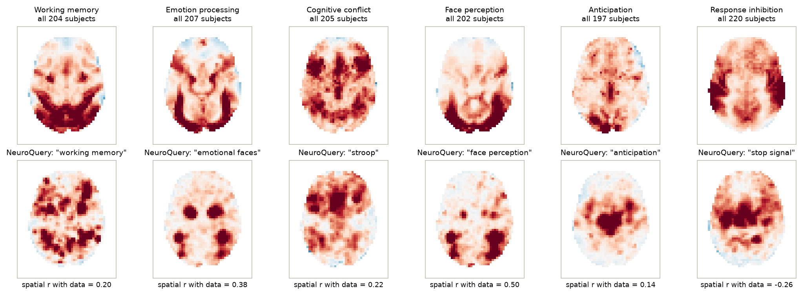
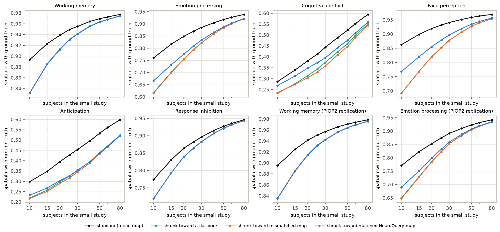
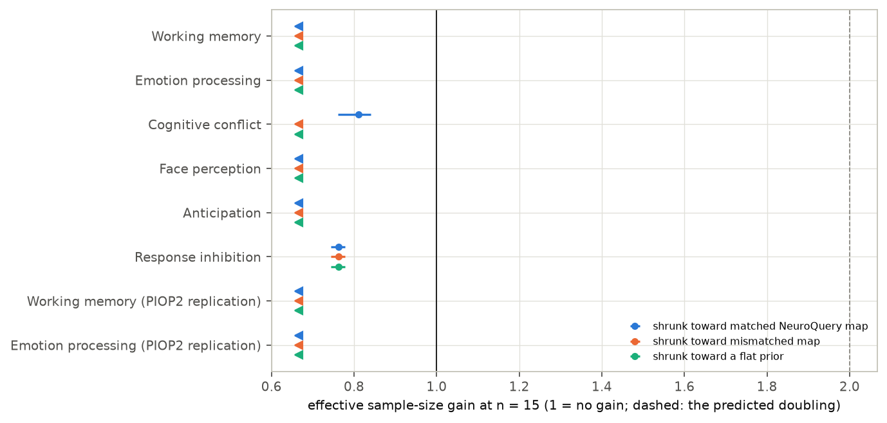
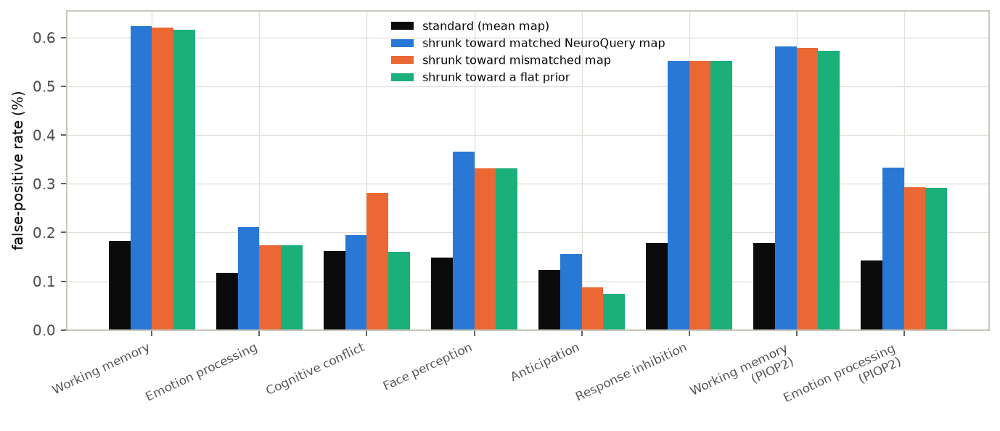
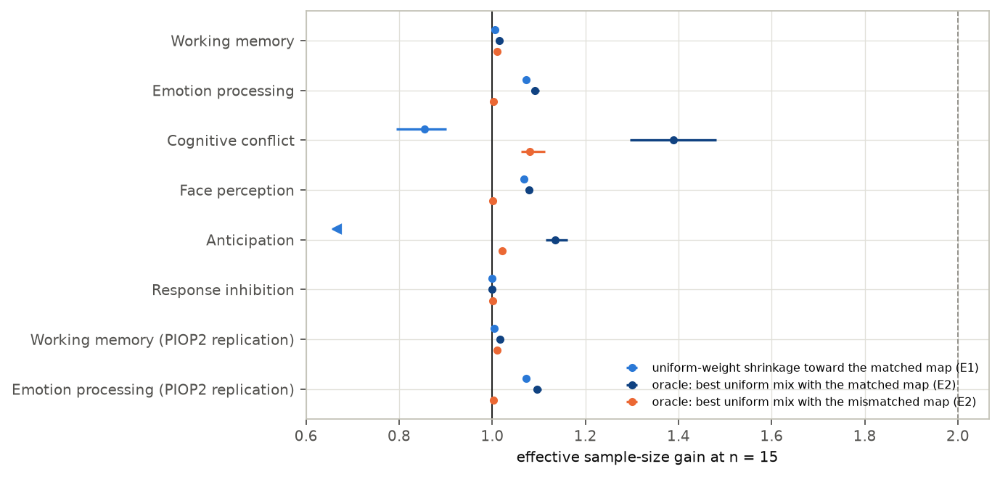

# Is a meta-analytic prior worth extra subjects in a small fMRI study?

*A preregistered test of shrinking 15-subject group maps toward NeuroQuery predictions, against held-out ground truth in six task domains*

Run directory: `research-lab/runs/extra-open-neuroimaging-reanalysis-metaanalytic-prior-shrinkage` · Preregistration: [`plan.md`](plan.md) ·
Every departure from it: [`deviations.md`](deviations.md) · 2 October 2026, revised after independent review

## In plain terms

Brain-imaging (fMRI) studies often scan only 15–30 people, so their maps of which brain areas respond to a task are
noisy. Tools such as NeuroQuery summarise thousands of earlier studies into a predicted map for any task. A tempting
shortcut is to nudge a small study's noisy map toward that prediction, and the hope was that this would be worth at
least doubling the number of people scanned.

We tested this on open data from about 200 people per task, in six kinds of task: memory, emotion, attention conflict,
faces, anticipation and stopping an action. We repeatedly drew 15 people at random, built their map with and without
the nudge, and compared both against the map from a separate group of over 100 other people.

What we found:

- **The nudge made the map's pattern less accurate in every task.** A nudged 15-person map matched the true pattern
  worse than an ordinary map from 12 people, and in four of the six tasks worse than one from 10. It helped get the size
  of effects right mainly in the two tasks with the weakest signals.
- **The main cause is how the method decides what to trust.** It treats variable brain areas as unreliable and pulls
  them hardest toward the prediction. But the areas that respond most strongly to a task are also the ones that vary
  most between people, so the method flattened the very signal that mattered.
- **Even a perfectly tuned nudge would add little.** The predicted maps match the real ones only loosely, so the best
  possible blend was worth at most about 40% more people, usually under 10%.

So for typical tasks, these literature-based predictions are not a substitute for scanning more people.

## Abstract

**Question.** NeuroQuery predicts a brain map for any query from about 13,000 articles. Is shrinking a small study's
group map toward such a prediction worth at least doubling the sample, as the lead hypothesised?

**Design** (preregistered, `plan.md`, committed before any model was fitted).

- **Data.** AOMIC PIOP1 and PIOP2 (CC0), fMRIPrep-preprocessed. 1,695 first-level models; 197–220 included subjects per
  task.
- **Domains.** Six primary contrasts (working memory, emotion processing, cognitive conflict, face perception,
  anticipation, response inhibition) and two replications.
- **Methods compared at n subjects.**
  - S: the standard mean map.
  - EB-Q: empirical-Bayes shrinkage toward the matched NeuroQuery map.
  - EB-W: the same toward a mismatched map.
  - EB-0: the same toward a flat prior.
- **Ground truth.** The mean map of a separate set of N − 80 subjects.
- **Outcome.** Mean spatial correlation with the ground truth over 500 draws, at n from 10 to 80. The gain G is the
  sample size at which S matches a method's accuracy at n = 15, divided by 15.

**Results.**

| Analysis | Result | Verdict |
|---|---|---|
| H1: EB-Q worth ≥ 2× the sample in ≥ 5 of 6 domains | G < 0.67 in four domains; 0.81 [0.76, 0.84] conflict; 0.76 [0.74, 0.78] stop-signal | **contradicted** (0 of 6) |
| H2: mismatched prior does no harm | r lower by 0.04–0.13 in all six domains; false positives ×1.5–3.4 in five. The harm comes from the shrinkage itself: flat shrinkage with no map does the same | **contradicted** |
| H3: matched prior beats flat shrinkage in ≥ 5 domains | yes in 4 (emotion, conflict, faces, anticipation), r +0.01 to +0.05 | not supported |
| Robustness: β unrestricted; other ground truth; Dice overlap | the same verdicts; EB-Q below S on every pattern metric | — |
| After review: mean squared error (effect size, not pattern) | EB-Q / S 0.31 conflict, 0.33 anticipation, 0.96 stop-signal; 1.08–1.63 elsewhere | shrinkage helps magnitude only where the signal is weak |
| Exploratory E1: one shrinkage weight for all voxels | G from below 0.67 to 1.07 | small gains at best |
| Exploratory E2: oracle-tuned uniform mix with the prior | G 1.00–1.39 (four of six below 1.10) | ceiling far below 2 |

**Conclusion.** Preregistered empirical-Bayes shrinkage toward NeuroQuery maps makes the spatial pattern of 15-subject
group maps less accurate, not more; it reduces error in effect sizes mainly in weak-signal tasks. Even an oracle-tuned
blend gains at most 39% in effective sample size.

## 1. Background and gap

- **The problem.** Small task-fMRI studies replicate poorly (Turner et al. 2018).
- **The tools.** Meta-analytic tools encode where tasks usually activate. NeuroQuery (Dockès et al. 2020) predicts a map
  for free-text queries.
- **Closest work.** Han & Park (2019, 2021) used meta-analytic information to set a prior for Bayesian second-level
  tests: a single global prior scale, not a voxelwise map.
- **The gap.** No study was found that validates voxelwise shrinkage toward predicted maps against large-sample ground
  truth, or that asks how many subjects such a prior is worth.

## 2. Data

- **Datasets.** AOMIC PIOP1 (ds002785) and PIOP2 (ds002790) from OpenNeuro's public S3 bucket: fMRIPrep MNI-space
  preprocessed BOLD, confounds, brain masks and events.
- **First-level models** (`code/first_level.py`, nilearn 0.14.1):
  - smoothing 6 mm at native resolution, then resampling to NeuroQuery's 4 mm grid;
  - Glover HRF, cosine drift (1/128 Hz), AR(1) noise, percent-signal scaling;
  - confounds: 12 motion parameters, CSF, white matter, and any non-steady-state volumes;
  - repetition time from each run's header: 2.0 s, except the multiband faces task (0.75 s, 330 volumes);
  - one contrast-estimate map per subject.
- **Fits.** 1,695 of 1,698 runs. For the three stop-signal subjects with no successful stops the contrast is undefined
  (D2).
- **Inclusion.** Coverage ≥ 90% and mean framewise displacement ≤ 0.5 mm. Three PIOP2 runs had masks that do not
  overlap the template at all, a file defect (D4). Group masks have 22,460–24,558 voxels.

| Domain (contrast) | Included | NeuroQuery query | r of prior with full-sample map |
|---|---|---|---|
| Working memory (active − passive) | 204 | "working memory" | 0.20 |
| Emotion processing (emotion − control) | 207 | "emotional faces" | 0.38 |
| Cognitive conflict (incongruent − congruent) | 205 | "stroop" | 0.22 |
| Face perception (faces − baseline) | 202 | "face perception" | 0.50 |
| Anticipation (negative − neutral cue) | 197 | "anticipation" | 0.14 |
| Response inhibition (successful stop − go) | 220 | "stop signal" | −0.26 |
| Replication: working memory (PIOP2) | 220 | "working memory" | 0.21 |
| Replication: emotion processing (PIOP2) | 217 | "emotional faces" | 0.39 |

**Prior quality.** The NeuroQuery maps agree only loosely with the real maps (Figure F1).

- They predict where a task is reported to activate. They do not predict deactivations, or the visual and auditory
  responses specific to one design.
- In the stop-signal task the strongest response is in auditory cortex, because the stop signal is a tone. Successful
  stops also omit the button press, so motor regions are negative in this contrast; the prior points there instead.

## 3. Methods

**Empirical-Bayes shrinkage** (`code/eb.py`).

- With b_v the subsample's mean contrast at voxel v, and s²_v its squared standard error:
  - b_v ~ N(θ_v, s²_v);
  - θ_v ~ N(α + β·m_v, τ²), where m is the z-scored prior map and β ≥ 0.
- α, β and τ² are fitted by marginal maximum likelihood on the subsample alone.
- The estimate is θ̂_v = w_v·b_v + (1 − w_v)·(α + β·m_v), with w_v = τ²/(τ² + s²_v).
- The likelihood is maximised by profiling (D1). The code passed a synthetic check before use: with a good prior it
  gains, and with an unrelated prior it matches flat shrinkage (D1).

**Subsampling.** For each n in {10, 15, 20, 25, 30, 40, 50, 60, 80} there are 500 draws.

- Each draw takes a ground-truth set of N − 80 subjects, then n others, so ground-truth noise does not change with n.
- The false-positive rate is the share of voxels with no ground-truth effect (|z| < 1.96) that a method calls active
  at z > 3.09.
- Intervals come from 2,000 bootstrap resamples of the draws.

## 4. Results

### 4.1 Shrinkage made small-study maps less accurate in pattern (H1, H3)

At n = 15 the standard mean map already correlates 0.82–0.92 with the ground truth in four domains (working memory,
emotion, faces, stop-signal), and 0.34–0.35 in the two weak-signal domains (conflict, anticipation). EB-Q lowered this
in every domain (Figure F2):

| Domain | S | EB-Q | EB-0 (flat) | EB-W (mismatched) |
|---|---|---|---|---|
| Working memory | 0.923 | 0.885 | 0.886 | 0.885 |
| Emotion processing | 0.817 | 0.732 | 0.701 | 0.700 |
| Cognitive conflict | 0.340 | 0.312 | 0.277 | 0.274 |
| Face perception | 0.899 | 0.820 | 0.768 | 0.768 |
| Anticipation | 0.348 | 0.268 | 0.257 | 0.251 |
| Response inhibition | 0.830 | 0.793 | 0.793 | 0.793 |

- **Effective sample size.** At n = 15, EB-Q was worth fewer subjects than the standard analysis at n = 10 in four
  domains (G below 0.67, the floor of the grid). In the other two G was 0.81 [0.76, 0.84] (conflict) and
  0.76 [0.74, 0.78] (stop-signal) (Figure F3). The same holds at n = 20 (G at most 0.81) and n = 30 (0.49–0.84).
- **H1 is contradicted in all six domains.** The two replications agree.
- **H3.** The matched prior did beat flat shrinkage in four domains, by +0.010 (anticipation) to +0.052 (faces) in r.
  So the NeuroQuery maps carry some real information. That fell short of the five domains required, so H3 is not
  supported.
  - It did not beat flat shrinkage in working memory (−0.001) or stop-signal (β = 0).

### 4.2 Why: strong effects vary most between people (exploratory)

- **The mechanism.** The model shrinks each voxel by a weight that depends on its sampling variance. Across voxels, the
  size of the group effect tracks the spread between subjects: r = 0.39–0.70, and the top 10% of voxels by effect have
  1.4–2.0 times the between-subject SD of the rest (`results/tables/variance_effect.csv`). The strongest voxels are
  therefore pulled hardest toward the prior or the global mean, which flattens the map's peaks and lowers its spatial
  correlation.
- **A direct check** (after review, D4). Refitting flat shrinkage with the s²_v values randomly permuted across voxels
  keeps the same spread of weights but breaks their link to effect size. It removes 59–93% of the loss: in faces it
  falls from 0.130 to 0.009, in emotion from 0.116 to 0.018. The effect–variance link is the main cause; the rest comes
  from any voxel-varying weight.
- **Flat shrinkage shows it most clearly.** EB-0 uses no prior information and still costs up to 0.13 in r.
- **Why the validation missed it.** The synthetic check used noise of equal size everywhere, so it could not reveal
  this (D3).

### 4.3 Mismatched priors and false positives (H2)

The harm here comes from the shrinkage machinery, not from the mismatched map.

- **Correlation.** The mismatched prior lowered r by 0.04–0.13 in all six domains. That is no worse than flat shrinkage:
  relative to EB-0 it cost 0 to 0.006.
  - Its fitted β was zero in most draws for emotion and faces, and small elsewhere.
  - In working memory the mismatched "face perception" map fits about as well as the matched one: β 0.019 against
    0.020, and spatial r with the full-sample map 0.18 against 0.20.
- **False positives** (Figure F4; `review_fpr.csv`). The standard analysis declared 0.12–0.18% of null voxels active
  (nominal 0.1%).
  - EB-W raised this 1.5–3.4 times in five domains, to 0.17–0.62%. Anticipation was the exception (0.09%).
  - Flat shrinkage alone does almost the same: 3.38, 1.48, 1.00, 2.24, 0.60 and 3.10 times (working memory, emotion,
    conflict, faces, anticipation, stop-signal).
  - The *matched* prior is highest in every domain: 3.42, 1.80, 1.20, 2.48, 1.28, 3.10.
  - Only in conflict does the mismatched map add false positives of its own (1.74 against 1.00).
  - The cause is the posterior z-scores. They treat the fitted τ² as known and shrink the posterior SD, so they are
    overconfident in the voxels pulled toward the prior mean.
- **H2 is contradicted** under the preregistered rule.
  - Four domains (working memory, conflict, faces, stop-signal) meet its false-positive criterion: lower bound of the
    ratio > 1.5.
  - Emotion (1.49 [1.43, 1.54]) and anticipation are flagged by the correlation criterion alone.

### 4.4 Robustness

- **β unrestricted** (`hypotheses_unconstrained.csv`). The same three verdicts.
- **Other pattern metrics.** EB-Q is worse than S on every one, in every domain (G ≤ 0.81, and at the 0.67 floor in
  most):
  - ground truth from all remaining subjects;
  - top-10% Dice;
  - top-5% Dice.
- **Effect size rather than pattern** (after review, D4; `review_mse_mechanism.csv`). Correlation and Dice ignore
  rescaling of the map; mean squared error against the ground truth does not.
  - EB-Q / S MSE ratio: working memory 1.42, emotion 1.08, conflict 0.31, faces 1.63, anticipation 0.33, stop-signal
    0.96.
  - In the two weak-signal domains, where a 15-subject map is mostly noise, shrinkage cuts the error in effect sizes by
    about 70% while still blurring the pattern.
  - In working memory, emotion and faces it is worse on both counts. In stop-signal it is slightly better on effect
    size (0.96) and worse on pattern.

### 4.5 How much could any uniform use of these priors add? (exploratory, D3)

Two analyses were defined after the primary results (Figure F5).

- **E1: one shrinkage weight for all voxels.** Without voxel-specific weights, flat shrinkage no longer changes the
  map's pattern.
  - Shrinkage toward the matched map then gives small gains where the prior is decent: G = 1.07 [1.06, 1.08] for
    emotion, 1.07 [1.06, 1.07] for faces, 1.01 for working memory.
  - It still hurts in the weak-signal domains: 0.86 [0.79, 0.90] for conflict, below 0.67 for anticipation. There the
    model trusts a weak prior too much.
- **E2: an oracle ceiling.** At each draw, the best non-negative uniform mix of the small-study map and the prior map,
  with the weight chosen using the ground truth.
  - G is 1.02 (working memory), 1.09 (emotion), 1.39 [1.30, 1.48] (conflict), 1.08 (faces), 1.14 (anticipation) and
    1.00 (stop-signal).
  - The oracle's choice can never be worse than the data alone, and choosing with a noisy ground truth flatters it
    slightly, so these are upper bounds.
  - The largest gains come where the small study is weakest (conflict, r = 0.34). There even a poor prior adds a little.

## 5. Discussion

**What this study establishes:**

1. **Naive voxelwise empirical-Bayes shrinkage harms the spatial pattern of fMRI group maps.**
   - The standard normal–normal model with one prior variance shrinks most where effects are largest, because in fMRI
     between-subject variance grows with effect size.
   - It also inflates false positives through overconfident posterior z-scores, with or without a prior map.
   - Where the aim is to recover the pattern of activation, shrinkage should model variance as a function of effect
     size, or use uniform weights.
   - Where the aim is accurate effect sizes in a weak-signal task, the same shrinkage reduced error by about 70%.
2. **NeuroQuery predictions are weak priors for specific task contrasts.** Their spatial correlation with real
   full-sample maps was 0.14–0.50, and negative for one contrast. A 15-subject map is usually far more informative
   (r 0.82–0.92 with the truth in strong-signal tasks), so even an ideal blend adds under 10%. Only in weak-signal
   contrasts does the prior add more, and even there under 40%.

**What it does not establish:**

- **That no prior could help.** These are generic predictions from short queries. A prior built from studies of the
  same task design, or from a different contrast definition, might be stronger. Region-of-interest analyses and
  hypothesis tests were not studied, only whole-brain maps.
- **Uncertainty across populations.** The intervals reflect variation between draws within these two datasets. The
  AOMIC PIOP participants are university students in Amsterdam.

## 6. Limitations

1. **Correlation as the main metric.** It rewards getting the overall pattern right, not the size of effects. Dice
   (also a pattern metric) agrees. Mean squared error agrees in working memory, emotion and faces, is slightly better
   with shrinkage in stop-signal (0.96), and reverses strongly in the two weak-signal domains (§4.4).
2. **Contrast choices.** The faces contrast is against baseline, and stop-signal "successful stop − go" includes
   removal of the motor response. Other contrasts might match NeuroQuery better.
3. **Ground truth.** The mean of 117–140 subjects is itself noisy, which lowers all correlations equally.
4. **Grid floor.** For four domains G is only known to be below 0.67.
5. **Exploratory analyses.** E1 and E2 were defined after seeing the primary results (D3).

## 7. Reproducibility

The code is in `code/`:

- `make_priors.py`: priors and analysis grid;
- `make_manifest.py`: job list;
- `first_level.py`, `run_first_levels.sh`: first-level models;
- `eb.py`, `analysis.py`: the estimator, draws and hypotheses;
- `validate_eb.py`: synthetic check;
- `explore.py`, `diagnostics.py`: exploratory analyses;
- `review_checks.py`: checks added after review;
- `save_maps.py`: released group maps;
- `make_figures.py`, `build_report_html.py`: presentation.

**Where the results are:**

- `results/tables/`: per-draw tables, gains and hypothesis tables.
  - In `gains.csv` the column `flag` marks values at the edge of the grid: "<" means below n = 10, and ">" means above
    n = 80.
  - Rows with n0 = 10 are not evaluable, because the floor equals n0.
- `results/priors/`: the NeuroQuery prior maps.
- `results/maps/`: the full-sample mean and between-subject SD map for each contrast.

The per-subject maps are not committed (D4). The raw data (about 270 GB) are open on OpenNeuro.
