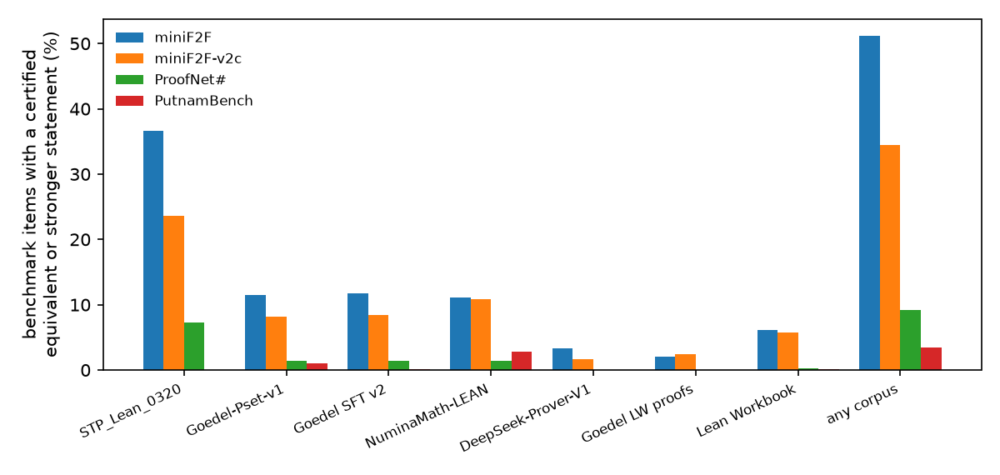
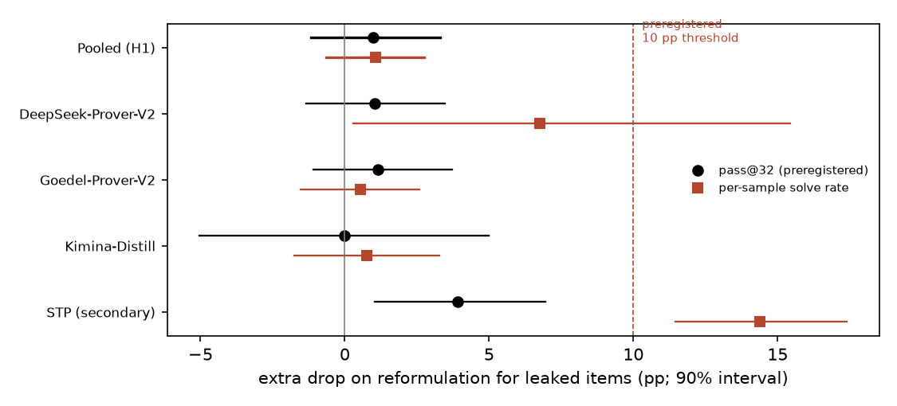
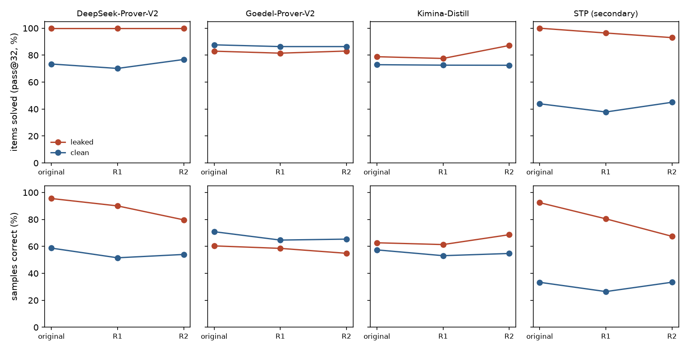

# Do AI provers lose more on reworded leaked miniF2F problems?

*A preregistered study: Lean-certified leakage between seven open prover-training corpora and four benchmarks, and a
difference-in-differences test of whether leaked problems lose more of their solve rate when reworded into
certified-equivalent forms.*

Run directory: `research-lab/runs/formal-math-certified-contamination-did` · Preregistration: [`plan.md`](plan.md)
(commit 6bfdc63) · Departures from it: [`deviations.md`](deviations.md) (D1-D9) · Independent review:
[`review/review.md`](review/review.md) · 11 October 2026, revised after review

**Verdict: Refuted (surface rewording, pass@32).** At the preregistered metric and threshold, leaked problems do not lose
10 points more than clean ones when reworded. Per sample, though, the two provers whose training data hold near-verbatim
copies lose 7 and 14 points more.

## In plain terms

AI systems that write machine-checked proofs are usually compared on miniF2F, a set of 488 competition problems. If the
problems, or versions of them, are in a system's training data, its score may reflect memory rather than skill.

We searched the seven public training sets behind today's open provers for every miniF2F problem. The Lean proof checker
certified each match as identical, logically equivalent, or a stronger claim. **About half of miniF2F (250 of 488
problems) has such a match in at least one open corpus.** For each prover's own public training data, the rate is:

- 18% for Goedel-Prover-V2;
- 11% for Kimina;
- 3% for DeepSeek-Prover-V2.

DeepSeek-Prover-V2 and STP also document training on miniF2F's 244 "validation" problems.

We then reworded each problem without changing its meaning: renamed variables, reordered assumptions, flipped
equations. The preregistered test asked whether leaked problems lose at least 10 points more of their 32-attempt solve
rate than clean ones. They lost about 1 point more. **The prediction is refuted.**

That metric has a blind spot. A problem counts as solved if any of the 32 attempts succeeds, and two provers solve every
leaked problem every time, so the metric cannot fall. Counting individual attempts instead, DeepSeek-Prover-V2 and STP
lose 7 and 14 points more on reworded leaked problems, more with heavier rewording. That is the signature of memorised
wording. Goedel and Kimina, whose leaks are mostly differently worded versions, show no such effect.

So surface memorisation is real for some provers, but at 32 attempts it does not change which problems get solved.
Along the way we found two miniF2F problems that are false as formalised, and one that is vacuous.

## What was done

**Benchmarks.**

- **Primary:** the 488 miniF2F items, being Kimina's revised test set (244) plus DeepSeek-Prover-V1.5's validation
  set (244).
- **Secondary (leak rates only):** miniF2F-v2c (488), ProofNet# (371) and PutnamBench (672).

**Corpora.** Seven public training sets, deduplicated by normalised statement:

| Corpus | Statements |
|---|---|
| Goedel-Pset-v1 | 1.65M |
| Goedel-Prover-V2 SFT | 910k |
| STP_Lean_0320 | 778k |
| Lean Workbook | 105k |
| NuminaMath-LEAN | 100k |
| DeepSeek-Prover-V1 | 27.5k |
| Goedel's Lean-workbook proofs | 21.5k |

**Leak certification.** Candidates were retrieved by:

- MinHash on character 5-grams;
- identical numeral multisets, capped at 20 per item and corpus (D2).

Each candidate pair was checked in the Lean kernel with a bounded tactic portfolio, in the training corpus's Lean
version (4.9 or 4.15):

| Tier | Meaning |
|---|---|
| L0 | Identical text after normalisation |
| L1 | Certified both ways |
| L2 | The training statement certifiably implies the benchmark statement |

**Guards.** An implication counts only if it is informative:

- **The conclusion is not provable alone.** The conclusion must not be provable by a hypothesis-free portfolio (D3a).
- **The premise is not false.** It must not be refuted by the portfolio (D3b) or by small numeral witnesses (D9).
- **No explosion.** The premise must not also imply the negation of the conclusion (D9).

Timeouts count against the leak. The witness and negation conditions were added after the independent review found
false training statements, such as "∀ a : ℝ, a = 0", still counted as leaks. Every rejection they added is a
kernel-checked proof, not a timeout (D9 addendum).

**Reformulations.** Two per item:

- **R1:** fresh names for every variable and hypothesis, with hypotheses reordered.
- **R2:** R1 plus flipped equalities.

Each is kept only if Lean certifies it equivalent to the original in each prover's environment. For 83 items without
binders, R1 is identical to the original; those R1 versions are dropped (D9). 70 of those 83 items keep a genuine R2.

**Provers and sampling.**

| Prover | Own corpora (plan) |
|---|---|
| DeepSeek-Prover-V2-7B | DeepSeek-Prover-V1 data (its public lineage) |
| Goedel-Prover-V2-8B | Goedel-Pset, SFT v2, Lean-workbook proofs |
| Kimina-Prover-Distill-8B | NuminaMath-LEAN (the data of its 72B teacher) |
| STP (pre-specified secondary) | STP_Lean_0320 |

- **Sampling.** 32 samples per version, at most 8,192 new tokens. STP is a completion model and gets 2,048.
- **Prompt.** DeepSeek-Prover-V1.5's miniF2F header with each model's documented instruction and chat template. The
  header sets `maxHeartbeats 400000`, where the model cards use 0.
- **Items.** Every leaked item plus 150 random clean items per prover. STP gets all 488.

**Verification.** Every proof was checked in Lean in its prover's environment. Rejected:

- changed theorem statements, compared ignoring spaces next to brackets (D9);
- `sorry`, `admit` and `native_decide`;
- non-standard axioms.

**Test (H1).** For each (item, prover):

- d = pass@32 on the original − mean pass@32 on its genuine certified reformulations;
- DiD = mean d over leaked pairs − mean d over clean pairs, pooled over the three provers;
- the interval is an item-cluster bootstrap (10,000 draws).

The one vacuous item (below) is excluded.

**Decision rule.**

- **Supported:** DiD ≥ 10 pp and the one-sided 95% lower bound > 0.
- **Refuted:** the one-sided 95% upper bound is below 10 pp and the minimum detectable effect is at most 10 pp.

## Results

**Leak map (H0).** Items with a certified L0, L1 or L2 match:

| Corpus | miniF2F | miniF2F-v2c | ProofNet# | PutnamBench |
|---|---|---|---|---|
| STP_Lean_0320 | 179 (36.7%) | 115 | 27 | 0 |
| Goedel SFT v2 | 57 (11.7%) | 41 | 5 | 1 |
| Goedel-Pset-v1 | 56 (11.5%) | 40 | 5 | 7 |
| NuminaMath-LEAN | 54 (11.1%) | 53 | 5 | 19 |
| Lean Workbook | 30 (6.1%) | 28 | 1 | 1 |
| DeepSeek-Prover-V1 | 16 (3.3%) | 8 | 0 | 0 |
| Goedel's Lean-workbook proofs | 10 (2.0%) | 12 | 0 | 0 |
| **Any corpus** | **250 (51.2%)** | **168 (34.4%)** | **34 (9.2%)** | **23 (3.4%)** |

**Verbatim copies.**

- **STP_Lean_0320** contains 173 miniF2F validation statements verbatim, plus one test statement.
- **NuminaMath-LEAN** (Kimina's lineage) contains 5 miniF2F test statements verbatim: `aime_1990_p15`, `imo_1963_p5`
  and three MATH algebra items. That is despite the Kimina paper's 13-gram decontamination, which was run on the
  informal problems.
- **Lean Workbook** contains 2 verbatim, one of them a test item.

**Best tier per leaked item.** Across all corpora, 185 of the 250 leaked items match at L0, 47 at L1 at best, and 18
only at L2.

**What L2 means here.** Of the 211 L2 pairs:

| Kind of L2 pair | Pairs |
|---|---|
| The benchmark conclusion with extra conjuncts (STP conjectures, Goedel scaffolds) | 114 |
| The same conclusion with fewer or weaker hypotheses | 24 |
| An iff form | 10 |
| More general, or textually different | 63 |

**Benchmark items.**

- **Automation-provable:** 82 miniF2F items are provable by the hypothesis-free portfolio alone, so they can be
  leaked only verbatim.
- **Vacuous:** `valid/mathd_numbertheory_35` has contradictory hypotheses (`∀ n, n ∣ Nat.sqrt 196`).
- **False as formalised:** two items are refuted in Lean.
  - `valid/aime_1988_p3`: at x = 1, Lean's log 0 = 0 makes the hypothesis hold and the conclusion fail.
  - `valid/induction_sum_odd`: Σ 2k + 1 = n² fails at n = 0.

**H1: Refuted.** Pooled over the three provers (156 leaked and 441 clean pairs):

| | Drop from original to reformulation, pass@32 |
|---|---|
| Leaked items | +0.6 pp |
| Clean items | −0.3 pp |
| **Difference-in-differences** | **+1.0 pp (one-sided 95% upper bound +3.3; lower bound −1.2)** |

The upper bound is far below the preregistered 10 pp.

| Minimum detectable effect | pp |
|---|---|
| Design assumption (SD 0.30) | 7.0 |
| Observed spread of d | 3.2 |

**By prover.** Brackets give 90% intervals (the 5th and 95th bootstrap percentiles):

| Prover | Leaked / clean pairs | DiD, pass@32 | DiD, per-sample solve rate |
|---|---|---|---|
| DeepSeek-Prover-V2 | 16 / 143 | +1.0 pp (−1.3, +3.5) | **+6.8 pp (+0.3, +15.4)** |
| Goedel-Prover-V2 | 88 / 154 | +1.1 pp (−1.1, +3.7) | +0.5 pp (−1.5, +2.6) |
| Kimina | 52 / 144 | 0.0 pp (−5.0, +5.0) | +0.8 pp (−1.8, +3.3) |
| STP, secondary | 173 / 296 | **+3.9 pp (+1.0, +7.0)** | **+14.4 pp (+11.5, +17.4)** |
| Pooled, three provers | 156 / 441 | +1.0 pp (−1.2, +3.3) | +1.1 pp (−0.6, +2.8) |

**The ceiling.**

- **pass@32 cannot fall on these leaked items.** For DeepSeek-Prover-V2 and STP, leaked items are solved at 100%
  pass@32 on the original. For DeepSeek-Prover-V2 they stay at 100% on every reformulation, so d is 0 there by
  construction.
- **The share of correct samples does fall, more with heavier rewording.**

| Prover, leaked items | Original | R1 | R2 | Clean items over the same versions |
|---|---|---|---|---|
| DeepSeek-Prover-V2 | 95.5% | 90.0% | 79.7% | about 53-62% → 52-54% |
| STP | 92% | 80% | 68% | 28-36% → 27-33% |

- **The extra drop on R2 (per sample):**
  - DeepSeek-Prover-V2: +8.3 pp (−0.1, +17.9);
  - STP: +22.1 pp (+17.7, +26.7).
- **This is the signature of surface memorisation that H1 posits**, but it lowers how often a leaked problem is solved,
  not whether it is solved in 32 attempts.
- **Goedel-Prover-V2 and Kimina show no such pattern.** Their leaks are mostly autoformalised equivalents or
  scaffolded variants, not verbatim copies.

**Documented training on miniF2F-valid (D9).**

- **What the papers say.** DeepSeek-Prover-V1.5's SFT data and DeepSeek-Prover-V2's curriculum include miniF2F-valid,
  and STP trains on it. The plan's mapping gave DeepSeek-Prover-V2 only its public lineage, so 69 of its 143 "clean"
  pairs are documented training items.
- **The validation split is solved more often everywhere.** Clean-arm pass@32 on valid against test items:
  - DeepSeek-Prover-V2: 77% against 70%;
  - Goedel-Prover-V2: 89% against 86%, despite no documentation.
- **STP shows the selection.** It solves 2% of the 63 validation items not in its corpus. These are the ones it failed
  on during training.

**Robustness (pooled over the three provers unless stated; secondary).** Brackets give 90% intervals:

| Variant | Leaked / clean pairs | DiD |
|---|---|---|
| Documented training: miniF2F-valid counted as leaked for DeepSeek-Prover-V2 | 225 / 372 | +0.1 pp (−1.8, +2.2) |
| Test items only | 73 / 224 | 0.0 pp (−2.1, +2.1) |
| Validation items only | 83 / 217 | +1.8 pp (−1.8, +5.6) |
| L0/L1 leaks only | 114 / 483 | +2.3 pp (0.0, +5.0) |
| Leak defined against all corpora | 364 / 233 | −0.1 pp (−2.1, +1.9) |
| Excluding the 19 items Kimina revised | 153 / 428 | +0.7 pp (−1.5, +2.9) |
| STP, miniF2F-valid counted as leaked | 236 / 233 | +2.3 pp (−0.5, +5.2) |

**The preregistered mixed logistic model.**

- **Specification:** `success ~ reformulated × leaked + (1|item) + (1|prover)`, at sample level, on 51,232 samples.
- **Fit:** variational Bayes, because no Laplace or quadrature GLMM was available.
- **Interaction:** odds ratio 0.97 (95% credible interval 0.90 to 1.03). Reformulation lowers the odds of success
  about equally for leaked and clean items, with an odds ratio of 0.67 for the main effect.
- **The pooled model is dominated by Goedel-Prover-V2's 88 leaked units**, as the pooled per-sample DiD is.

**Levels and selection.**

- **Levels differ by prover.** For DeepSeek-Prover-V2 and STP, leaked items are solved far more often than clean ones
  (100% against 73% and 44% pass@32). For Goedel-Prover-V2 they are solved less often.
- **The level comparison is confounded by construction.** Four of the corpora consist of verified proofs, so an item
  is "leaked" only if the pipeline that built the corpus proved it. That is selection on the outcome.
- **That is why the preregistered test compares changes, not levels.**

## Caveats

- **Surface rewording only.** R1 and R2 change names, order and equation direction. A model that has memorised a
  solution, not its wording, passes both.
  - **What the design cannot answer.** The title's broader question, whether training-set leakage explains the scores,
    is not answered here. Memorised proofs survive renaming, the clean arm is partly trained on, and leaked items are
    selected for solvability.
  - **Related work uses deeper rewrites.** MiniF2F-ALF (arXiv 2606.12594) reports that every prover it tests loses
    accuracy on mutated statements. "What are the right symmetries for formal theorem proving?" (arXiv 2605.22257)
    reports large variation across equivalent formulations. Both rewrite more deeply than R1 and R2, which is the
    natural reading of the null here.
- **The clean arm is not clean.** Two of the four provers document training on miniF2F-valid, and the third shows the
  same pattern. Undetected equivalents also attenuate the DiD toward zero (next point).
- **Leaks are a lower bound.**
  - **Retrieval misses equivalents.** On the study's own certified reformulations as known equivalents, the retrieval
    rule finds only 58% of R1 variants and 44% of R2 variants. The median MinHash Jaccard against the original is
    0.34 for R1. A renamed copy of a miniF2F item in a corpus has roughly a coin-flip chance of being found.
  - **Some pairs stay unchecked.** 5.9% of miniF2F candidate pairs do not elaborate (mostly undeclared variables) and
    count as no leak.
  - **Certification is bounded.** It uses a 20 s portfolio, and the guards are portfolio-relative: "not provable
    alone" means not by this portfolio in 60 s.
- **Some "clean" pairs were sampled as leaked.** D9 removed false leaks after sampling. The 10 items that lost their
  leak status (9 Goedel-Prover-V2, 1 Kimina) now sit in the clean arm alongside the random clean sample. Their
  versions were all sampled.
- **Design changes during the study**, before sampling (D4):
  - only 150 clean items per prover;
  - an 8,192-token cap, because the pilot showed 24-44% of outputs truncated at 4,096.

  Truncation remains, at up to 19% (Goedel-Prover-V2) and 25% (Kimina) of outputs in a cell, and is treated alike
  across versions.
- **Two tokenizer failures were caught and fixed** (D5, D7). The released tokenizer configurations of STP and
  DeepSeek-Prover-V2 garble Lean text under current libraries. Both were resampled in full. A preliminary pooled
  result with the invalid DeepSeek-Prover-V2 rows was seen and is disclosed (D7).
- **The memory watchdog** killed 22 runaway proof checks (18 STP, 4 DeepSeek-Prover-V2). Those outputs count as
  failures.
- **The MDE in `mde.json` is not the one the verdict uses.** `mde.json` gives 6.3 pp, computed from all clean pairs
  before the 150-item subsample. The verdict uses the design MDE over the analysed units: 7.0 pp.

## Independent review and what changed

An independent adversarial review of the first draft ([`review/review.md`](review/review.md), with its Lean re-checks in
`review/reviewer_checks/`) recommended "fix first". It confirmed:

- the primary number to the digit;
- the decision rule;
- the timeline;
- the tokenizer fixes.

Its findings, and what changed (D9):

1. **Lean Workbook was never certified.** An extraction bug left `:= by sorry` in every statement. After the fix it
   contributes 30 leaked miniF2F items.
2. **The explosion guard missed false training statements.** The witness and negation conditions now reject 27 more
   pair-directions, all by kernel proof. Goedel-Prover-V2's own leaked items fall from 99 to 89.
3. **DeepSeek-Prover-V2 and STP document training on miniF2F-valid.** The documented-training and test-only contrasts
   are now reported, with the same conclusion.
4. **The per-sample results contradicted the draft's prose.** The draft said that whatever the models learned
   "survives simple rewording". That sentence is withdrawn. The verdict is now scoped to surface rewording and pass@32.

Smaller fixes:

- identical R1 versions are dropped;
- 37 valid proofs that had been rejected for whitespace are restored;
- the vacuous item is excluded;
- the missing mixed model is added;
- the automation-provable count is now the operative one (82, not 69);
- the L2 composition, retrieval recall and unchecked share are stated;
- the prompt description is corrected.

The pooled pass@32 verdict did not change under any of these fixes.

## Deviations (summary)

| Entry | Change |
|---|---|
| D1 | Certification guards (self-provability, autoImplicit off, `π` as `Real.pi`) |
| D2 | Cap on numeral candidates |
| D3-D3b | Informativeness and explosion guards replacing D1's, after spot-checks found spurious L2 leaks |
| D4 | Final tiers, sampling plan, 8,192-token cap, clean subsample, STP added, MDE recorded |
| D5 | STP tokenizer fix |
| D6 | Memory safety net |
| D7 | DeepSeek-Prover-V2 resampled after a tokenizer failure |
| D8 | Results of the first draft; correction to D6 |
| D9 | Fixes after the independent review; guard audit; vacuity and refutation checks |

The decision rule never changed.
