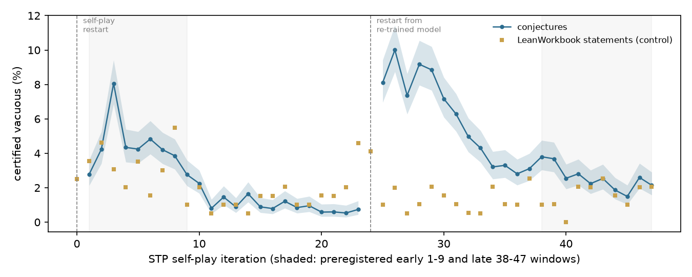

# Do self-play provers drift toward vacuous conjectures?

*A preregistered, kernel-certified measurement of contradictory hypotheses across 46 iterations of the STP self-play
corpus and four other open prover-training corpora*

Run directory: `research-lab/runs/formal-math-selfplay-vacuity-drift` · Preregistration: [`plan.md`](plan.md)
(commit 86f1489) · Departures from it: [`deviations.md`](deviations.md) (D1-D9) · Independent review:
[`review/review.md`](review/review.md) · 8 October 2026, revised after independent review

## In plain terms

Some AI systems learn to prove mathematical theorems by inventing their own practice problems, trying to prove them,
and training on whatever they prove. A practice problem whose assumptions contradict each other is a trap. It can be
"proved" without doing any real mathematics, which the training process might reward. We expected such vacuous
problems to pile up as self-play went on.

We checked 92,000 training proofs from STP, a published self-play prover, using the Lean proof checker to certify each
contradiction. The prediction was wrong. Vacuous problems were *less* common late in training (2.5%) than early
(4.1%).

The shape of the curve is the more interesting part. Vacuous problems peaked early in each of STP's two self-play
phases, at 8% in round 3 and 10% in round 26, and then declined steadily. Several things could explain the decline:

- STP's filter, which keeps only problems the prover usually fails;
- the problem generator learning to write well-formed statements;
- a change in what our checker can see.

The data cannot fully separate them.

Vacuous problems are far from rare in other corpora. In NuminaMath-LEAN, 6.2% of the problems with a machine proof
were vacuous: 7.4% of machine-translated problems against 1.6% of human-written ones. Most vacuous problems read like genuine competition questions.

## What was done

**Corpus and sample.** The STP_Lean_0320 corpus has 3,262,558 rows. Its iteration numbers form two self-play phases:

- rounds 0-23, and rounds 24-47;
- rounds 0 and 24 contain no conjectures;
- STP restarts self-play from a re-trained model between the phases.

We drew 2,000 conjecture rows per iteration: 92,000 proofs of about 80,000 distinct conjectures, some proved more than
once. We also drew 200 statement rows per iteration (9,600 LeanWorkbook proofs) as a control.

**Environment.** Each row was checked in STP's own verifier environment: Lean 4.9.0-rc1, Mathlib at upstream d1d1e4b72 (the version
DeepSeek's fork pins), and `import miniF2F`, STP's curated subset of Mathlib (`lean/stp_env/miniF2F.lean`, from kfdong/STP). The
1,152 rows that did not re-verify there were retried under all of Mathlib. 44 then re-verified, 33 became eligible,
and none of them was vacuous.

**Certificate (v2, after the independent review).** A row counts as vacuous if a proof of False from its hypotheses,
*as the original statement elaborates them*, compiles, contains no `sorry`, and uses only the standard axioms. There
are two routes:

- **(a) Goal swap:** `theorem v B : C := False.elim (by <released proof>)`, that is, the released proof run against
  the goal False.
- **(b) Automation:** `theorem v B : C := by exfalso; <tactic>`, for a fixed portfolio of omega, linarith, norm_num,
  simp_all, nlinarith, aesop and decide.

**Why v2.** The first version elaborated `theorem v B : False` on its own. A variable whose type only the conclusion
fixed then defaulted to ℕ, which turned hypotheses that are satisfiable over ℝ into contradictions over ℕ. The
reviewer found this (D7). On the rows eligible under both versions in the primary windows:

- **v2 removes 18 of v1's 1,207 certificates.**
  - 16 were type flips: hypotheses satisfiable in their own type, refuted over ℕ.
  - 2 were lost to the 100 s time limit in the v2 run.
  - Two further rows that the reviewer flagged turned out to be genuinely vacuous in their own elaboration (over ℤ),
    and v2 confirms them.
- **v2 adds 12 certificates that v1 missed.** In these rows the ℕ default had made the released proof fail.

**Validation.**

| Check | Result |
|---|---|
| Original controls (20 vacuous, 20 satisfiable) | 20 of 20 and 0 of 20 certified |
| Satisfiable statements with undeclared variables | 0 of 4 certified |
| Undeclared-variable statement that is genuinely vacuous over ℕ | 1 of 1 certified |
| Regression on 318 real rows | v2 behaves as designed |

**Exclusions** (primary windows; `results/tables/exclusions.csv`):

| Reason | Early (1-9) | Late (38-47) |
|---|---|---|
| Eligible | 17,272 of 18,000 | 19,064 of 20,000 |
| Truncated prompt, cut by STP at an inner `:=` | 388 | 11 |
| Identifier from a dropped per-row header (e.g. `card`, `Bijective`) | 4 | 495 |
| Binder/conclusion split check failed | 334 | 363 |
| Other re-verification failures | 2 | 67 |

The released corpus contains rows that cannot compile under its own header, and their share depends on the
iteration.

## Results

**Primary test (iterations 38-47 against 1-9; iteration 0 has no conjectures).** Rates are weighted by each
iteration's size in the corpus (population-weighted), with the pooled sample rate in brackets. The one-sided z-test
uses unpooled stratum variances.

| | Late (38-47) | Early (1-9) | Ratio (95% CI) |
|---|---|---|---|
| Certified vacuous | 2.51% (pooled 2.53%; 482 of 19,064) | 4.13% (pooled 4.19%; 724 of 17,272) | **0.61 (0.54-0.68)** |

**Verdict: Refuted.** The hypothesis predicted a ratio of at least 2, and the upper end of the 95% CI is 0.68.

**Sensitivities.** Every one also gives a ratio below 1:

| Variant | Ratio (95% CI) |
|---|---|
| Statement level (sampling is proportional to each statement's number of proofs) | 0.62 (0.55-0.70) |
| Unweighted | 0.60 (0.53-0.67) |
| With the 986 split-repaired rows | 0.61 (0.54-0.68) |
| miniF2F environment only | 0.61 (0.54-0.68) |
| Excluding statements with undeclared variables | 0.72 (0.63-0.81) |
| Rows the certificate can examine (hypotheses in binders) | 0.45 (0.40-0.50) |
| Secondary certificate, also refuting premises inside the conclusion | 0.57 (0.51-0.64) |
| Goal-swap certificates only | 0.65 (0.58-0.73) |
| Automation certificates only | 0.19 (0.13-0.28) |

**Dynamics (secondary).** Vacuity peaks early in each self-play phase and then falls:

| Phase | Start | Peak | Final five iterations | Spearman ρ |
|---|---|---|---|---|
| 1 | 2.9% at iteration 1 | 7.8% at iteration 3 | 0.6% | −0.90 |
| 2 | 8.0% at iteration 25 | 9.8% at iteration 26 | 2.1% | −0.93 |

| Contrast | Rate ratio (95% CI) |
|---|---|
| Phase 1, late (14-23) against early (1-9) | 0.20 (0.17-0.24) |
| Phase 2, late (38-47) against early (25-33) | 0.37 (0.33-0.41) |
| Phase 2 against phase 1, overall | 2.23 (2.06-2.42) |

Across all 46 iterations the trend is flat (ρ = −0.006), because the decline within each phase cancels the restart.

**What else changes over training.** The decline must be read alongside three things that move with it.

- **Coverage.** Statements with no binders, whose hypotheses all sit in the conclusion, cannot be examined by the
  preregistered certificate. They are 25.5% of eligible early rows and 1.0% of late rows, and 41% at iterations 3-4.
  - Among the rows the certificate can examine, the ratio is steeper, 0.45. The iteration-3 peak is 13.2% there.
  - The secondary certificate can also examine binder-less rows, by refuting the premises inside the conclusion, but
    only by automation, because the released proof expects the original goal. Automation alone certifies 0.91% of
    early binder-less rows (40 of 4,403), against 1.35% of early checkable rows, where the full certificate finds
    5.63%. The gap may therefore hide on the order of 150 early certificates. The checkable-row ratio, 0.45, is the
    better-matched comparison.
- **Undeclared variables.** Statements whose variables default to ℕ make up 25.7% of certified rows early (186 of
  724) and 2.3% late (11 of 482). As the generator learned to declare variables, this source of vacuity disappeared.
  Excluding these statements gives a ratio of 0.72.
- **The control also fell.** The LeanWorkbook statement proofs come from a fixed pool of problems, so their true
  vacuity cannot change. Their certified rate still fell from 2.7% (iterations 0-9) to 1.5% (38-47): ratio 0.57
  (0.33-0.97).
  - Goal-swap certificates alone: 0.65 (0.37-1.16). Automation alone: 0.47 (0.18-1.19).
  - Over all iterations: 1.8% (172 of 9,594), ρ = −0.24 (p = 0.10).

  A falling rate on a fixed pool means either that STP proves a different mix of pool problems over time, or that the
  certificate's sensitivity drifts as the prover's proofs change. Either would contribute to the decline in the
  conjectures. The within-phase declines are therefore best read as upper bounds on any real change in what the
  generator proposes.

**Candidate mechanisms for the decline.** None is tested here.

- STP's own filter keeps conjectures the prover usually fails, and easy, vacuous ones drop out.
- The generator learns well-formed Lean: it declares variables and puts hypotheses in binders.
- The checker's sensitivity drifts (see the control).

**How vacuity is certified.** Of the 1,206 certified rows in the primary windows:

| Route | Rows |
|---|---|
| Goal swap only | 1,004 |
| Automation only | 112 |
| Both | 90 |

So in most cases the released proof itself derives the contradiction. Conclusions provable with all hypotheses
discarded fell from 3.8% to 0.1%, a figure also affected by coverage.

**Training weight.** STP's released weight is exactly exp(−0.001 × proof length), the length term of its weighting.
Vacuous rows average 0.776 against 0.637 for other rows, 22% more, because their proofs are shorter. A logistic
regression with iteration fixed effects gives an odds ratio of 1.81 (1.75-1.88) per 0.1 of weight.

**Causes (100 random certified rows from all iterations, coded by a separate agent).**

| Cause | Rows |
|---|---|
| Contradictory numeric constraints | 52 |
| Unsatisfiable functional equations, domain or range confusions, and parsing slips (e.g. `a n+1` read as `(a n)+1`) | 33 |
| A hypothesis that is false on its own | 9 |
| Natural-number subtraction or division | 2 |
| Cast or division-by-zero conventions | 2 |
| An undeclared variable defaulted to ℕ | 2 |

88 of the contradictions are local, visible from one or two hypotheses. 76 of the 100 statements read like genuine competition claims; the rest are visibly garbled. The "real claim" judgement is unstable between codings: the v1 coding of a comparable sample marked 97 of 100 as genuine, this one 76. Nine sampled rows use undeclared variables. In seven of them the contradiction does not depend on the variable's type, so they were coded by their underlying cause. The coder's prompt is in `review/coder_prompt.md`.

**Other corpora (secondary).** Each is a uniform sample, checked in its own Lean version with the v2 certificate.

| Corpus | Re-verified | Certified vacuous, among statements with a proof (95% CI) |
|---|---|---|
| NuminaMath-LEAN, model proofs (Lean 4.15) | 88.7% | **6.2%** (5.7-6.7) |
| Goedel Lean-workbook-proofs | 96.1% | 2.8% (2.4-3.3) |
| DeepSeek-Prover-V1 | 99.9% | 2.0% (1.7-2.5) |
| Goedel-Prover-V2 SFT | 83.1% | 1.0% (0.8-1.2); 1.2% excluding its deliberate negation statements |

In NuminaMath-LEAN:

- **By author.** Autoformalised statements are vacuous 7.4% of the time (of 7,051), and human-formalised ones 1.6%
  (of 1,767).
- **Pass rates.** Kimina-Prover's RL pass rate was higher for vacuous statements (0.73 against 0.67, Mann-Whitney
  p = 2×10⁻⁸), consistent with their being easier. Whether this biased training depends on the RL objective. With
  group-normalised advantages, a prompt solved every time contributes no gradient.

**Related work.**

- **Ammanamanchi, Bhat & Biderman (arXiv 2606.29493)** audit five Lean *benchmarks* with certified checkers, including
  vacuous theorems. This study measures *training* corpora.
- **DeepSeek-Prover-V1's negation filter** cannot remove vacuous statements, because refuting ¬(∀ B, C) needs a
  witness for B. That is consistent with its 2.0%.
- **Goedel-Prover-V2** adds negated statements on purpose, which is why they are separated out above.

## Caveats

- **A lower bound.** Vacuity is certified only if the released proof proves False or one of seven tactics finds the
  contradiction. Hard contradictions are missed.
- **Final training data only.** STP_Lean_0320 is the final, filtered training set, not every conjecture generated. A
  vacuous conjecture that STP's filters removed is invisible here.
- **Measurement drift.** The fixed-pool control declined too, so part of the conjectures' decline may be a change in
  the checker's sensitivity or in which pool problems were proved.
- **Two phases, not one run.** The preregistered contrast spans a restart. The within-phase contrasts, added as
  secondary analyses before any outcome was seen, show the dynamics more clearly.
- **Environment.** STP's per-row headers are missing from the released corpus. That makes 1-3% of late rows
  uncompilable, which is iteration-dependent. The DeepSeek mathlib fork's commit (2f65ba7) is no longer served by
  GitHub, so our equivalence with upstream d1d1e4b72 could not be re-verified.
- **Context sensitivity.** A few certificates succeed or fail depending on what is already in the Lean environment.
  Certificates are therefore built in a fresh environment.
- **Causes from one coder.** The cause categories come from a single coder agent reading the statements, without
  running Lean.

## Deviations (summary)

- **D1:** the REPL's output-flushing fix, validation and timing pilot.
- **D2:** the split-repair sensitivity.
- **D3:** the repair pass run early.
- **D4:** an analysis-code guard.
- **D5:** a bug in the repair check, fixed.
- **D6:** NuminaMath run in parallel.
- **D7, after the independent review:**
  - the certificate elaborated in each statement's own context;
  - STP's miniF2F environment, with an all-of-Mathlib fallback;
  - coverage probes and the secondary certificate;
  - a soundness check on the repair;
  - full rerun.
- **D8:** the v2 results, the re-coded causes and a saved coder prompt.
- **D9:** confirmation-pass edits.

The decision rule never changed.
