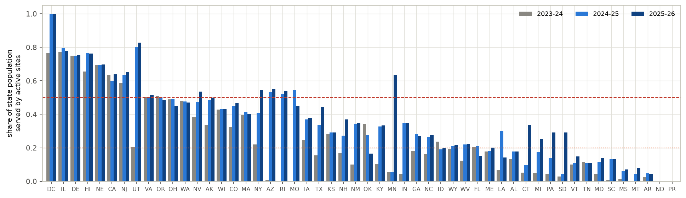
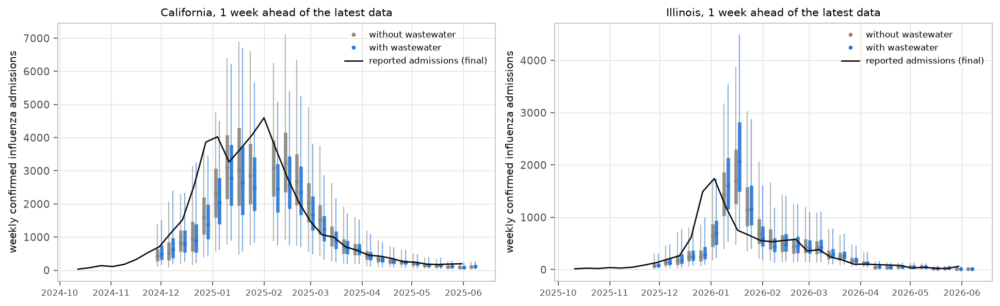
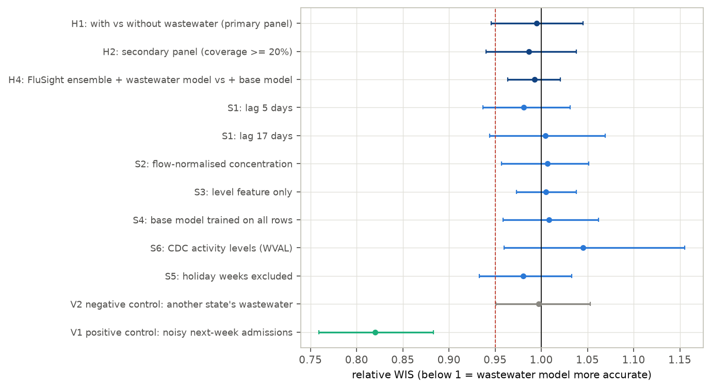
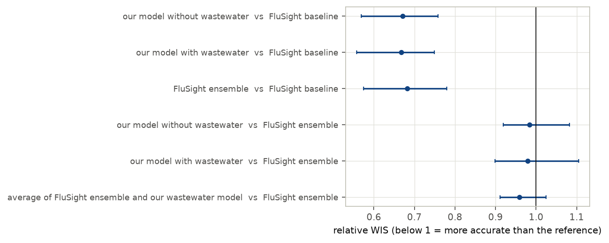
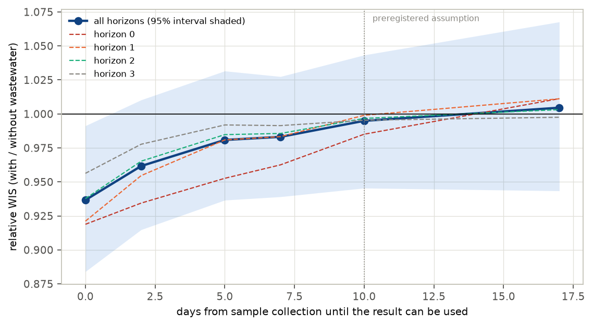
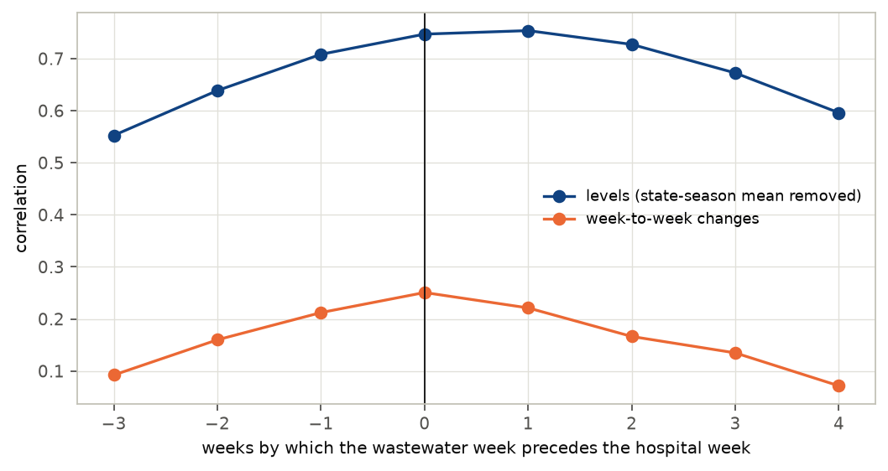

# Does sewage data improve flu hospital forecasts?

*A preregistered, real-time test of influenza wastewater in FluSight-style forecasts, 2023–24 to 2025–26*

Run directory: `research-lab/runs/health-econ-wastewater-flusight-value` · Preregistration: [`plan.md`](plan.md) ·
Every departure from it: [`deviations.md`](deviations.md) · 1 October 2026, revised after independent review

## In plain terms

Flu virus in sewage is now measured at over a thousand US treatment plants. Sewage levels rise and fall with flu in
the community, so they might help predict hospital admissions in the coming weeks. The CDC's public challenge,
FluSight, scores such predictions weekly.

We tested that hope for three flu seasons, focusing on the 16 states whose sewage sites cover at least half the
population. Each week we built two forecasting models that were identical except that one also saw the state's sewage
data. Both used only data that would have been available at the time, and we scored them the way FluSight scores its
entries. We wrote the plan down before looking at any hospital data.

What we found:

- **If sewage results take about ten days to become usable, as we assumed, they add nothing measurable.** Forecast
  accuracy with and without them differed by about 1% or less. If there is a benefit, it is smaller than about 5%.
  Sewage data also did not improve the official FluSight ensemble forecast.
- **Our follow-up analyses point to timing.** Sewage levels move roughly in step with hospital admissions, not two
  weeks ahead of them. By the time a sample has been tested and reported, the hospital numbers already tell much the
  same story.
- **Faster reporting might help.** With results usable within about two days, the follow-up analysis suggests forecasts
  roughly 4% more accurate, though that is not certain. With instant results, which is impossible in practice, the gain
  would be 6–7%. It is mostly for the current and next week.

We found no evidence that more sites help; reporting speed looks important. The timing analyses were not in the
original plan, so they point to what to test next.

## Abstract

**Question.** Does adding state-level influenza A wastewater data to a probabilistic forecasting model improve 1–4-week
forecasts of weekly confirmed influenza hospital admissions? Earlier work shows correlation and lead time, but no
state-level, real-time, hub-benchmarked test of the *marginal* value of flu wastewater was found.

**Design** (preregistered, `plan.md`, committed before any hospital data were downloaded).

- **Paired models.** Two linear quantile-regression models, identical except for three state wastewater features, were
  refit every week for the 85 FluSight rounds from October 2023 to May 2026.
- **Real-time data.** Hospital data came from the FluSight hub's weekly vintages. Wastewater samples counted as usable
  10 days after collection, an assumption: real delays are not published.
- **Scoring.** Weighted interval score (WIS) against final data.
- **Primary panel.** State-seasons with at least 50% of the population covered by wastewater sites: 16 states, 36
  state-seasons, 4,052 forecasts.
- **Uncertainty.** A two-way bootstrap over states and 4-week blocks of forecast dates.
- **Validation.** The pipeline detects a real leading signal (positive control: relative WIS 0.82 [0.76, 0.88]) and
  finds nothing in mismatched wastewater (negative control: 1.00 [0.95, 1.05]).

**Results.**

| Hypothesis | Relative WIS (with / without wastewater) [95%] | Verdict |
|---|---|---|
| H1: at least 5% better, coverage ≥ 50% | 0.995 [0.946, 1.045] | inconclusive (no detectable gain) |
| H2: the same, coverage ≥ 20% (42 locations) | 0.987 [0.940, 1.038] | inconclusive (no detectable gain) |
| H3: gain grows with coverage | slope −0.05 [−0.15, +0.05] per unit coverage | inconclusive |
| H4: adds value to the FluSight ensemble | 0.992 [0.964, 1.020] | contradicted: any gain is under 5% |

- **Sensitivity analyses.** All six give relative WIS between 0.98 and 1.05.
- **Benchmarks.** The base model is as accurate as the FluSight ensemble (0.98 [0.92, 1.08]) and much better than the
  FluSight baseline (0.67), so the test is against a strong comparator.

**Exploratory analyses** (not preregistered) suggest why:

- **No two-week lead.** The state wastewater signal leads admissions by 0–1 weeks, not 2 (bootstrap peak at lead 0 in
  78% of draws, never at 2).
- **Value tracks the reporting delay.** Relative WIS rises steadily with the delay:
  - 0.937 [0.882, 0.991] if samples were usable on the day of collection, an unreachable bound;
  - 0.96 at 2 days, whose interval includes 1;
  - 0.98 at 5–7 days;
  - about 1.00 at 10 days or more (0.995 at 10 days, 1.005 at 17).

For influenza hospital forecasting, wastewater appears to be useful mainly as a fast nowcast. A preregistered test with
measured reporting delays is the natural next step.

## 1. Background and the gap

- **The signal is real.** Influenza A RNA concentrations in wastewater track clinical influenza:
  - WastewaterSCAN (Boehm et al. 2023, JAMA);
  - a 2025 IDWeek analysis of all US states, reporting a two-week lead and r = 0.93;
  - a California comparison of surveillance streams (medRxiv 2025).
- **Forecast value is shown mainly for COVID-19.** Examples are a US retrospective multi-model study (arXiv:2512.01074),
  EpiFlow (arXiv:2608.06671, Virginia) and CDC's wastewater-informed COVID models.
- **For influenza, correlation is not forecast value.** A forecaster already sees last week's hospital admissions. The
  question is whether wastewater adds information beyond them, when the data arrive at their real speed.
  - On the FluSight hub, CDC's own influenza models use hospital and emergency-department data but not wastewater.
  - Two models (MIGHTE) use a national wastewater series, without a published with/without comparison.
- **Why it matters.** Wastewater programmes cost money, and CDC is deciding how to use them in respiratory forecasting.

## 2. Data

- **Hospital admissions.** Weekly confirmed influenza admissions by state (NHSN), from the FluSight hub's
  `target-data/time-series.csv`. It holds 96 weekly vintages from September 2023 to July 2026.
  - **Real-time data.** Each forecast round uses the vintage released by its Wednesday due date, with data through the
    previous Saturday. The preregistered rule misread how the older vintages are labelled; the corrected rule is in
    `deviations.md` D2, verified against the FluSight baseline's own real-time forecasts.
  - **Missing vintages.** Four of the 85 rounds lack that week's vintage and use the one before.
  - **Scoring truth** is the latest vintage.
- **Wastewater.** CDC NWSS influenza A sample data (data.cdc.gov ymmh-divb): 330,015 samples from 1,493 sites,
  September 2021 to September 2026. It covers the state and local health-department, CDC–Verily and WastewaterSCAN
  programmes.
  - **Availability.** Samples count as usable 10 days after collection. Public vintages do not exist, and the file's
    update field holds a single refresh date, so real delays could not be measured; 5 and 17 days are sensitivity
    analyses.
- **Coverage** (Figure F1). The population served by sites that reported in the two weeks before the data cut-off, as a
  share of the state population.
  - At least 50% in 9, 13 and 14 states in 2023–24, 2024–25 and 2025–26: AZ, CA, DC, DE, HI, IL, MN, MO, NE, NJ, NV,
    NY, OR, RI, UT and VA.
  - At least 20% in 23, 35 and 38 states.
- **Comparators.** FluSight-baseline and FluSight-ensemble forecasts from the hub.

## 3. Methods

**Targets.** For each state and round, y = log((admissions + 1) / population × 100,000). The model forecasts its change
from the last observed week to each target week: hub horizons 0–3, one to four weeks beyond the latest data.

**Base features:**

- the current level;
- the last two weekly changes;
- a seasonal sine and cosine.

**Wastewater features:**

- **Site signal.** Each site × programme series gets a weekly mean of log10 concentration, centred on the series' own
  median over the windows available at the time.
- **State signal.** The population-weighted mean of the centred site series.
- **Features:**
  - the latest weekly value;
  - the last two weekly changes.

**Fitting.** Linear quantile regression at FluSight's 23 quantile levels.

- One model per horizon, pooled over states.
- Refit every round on all state-weeks since September 2022 that have wastewater features, with the same lags.
- Both models use the same training rows.

**Evaluation.**

- **Score.** WIS on counts, FluSight's standard.
- **Relative WIS.** Ratio of mean WIS, with / without wastewater, over identical forecast tasks.
- **Intervals.** A two-way bootstrap over states and 4-week blocks of forecast dates, with 5,000 draws. Flu waves are
  shared across states, and the previous deep dive showed that resampling places alone gives intervals that are too
  narrow.

**Decision rule** (preregistered).

| Verdict | Condition |
|---|---|
| Supported | estimate ≤ 0.95 and upper bound < 1 |
| Contradicted | lower bound > 0.95 |
| Inconclusive | otherwise |

**Validation before scoring the hypotheses** (`deviations.md` D3).

- **Positive control.** The wastewater features were replaced by a noisy copy of next week's final admissions. The
  pipeline found the gain: 0.820 [0.759, 0.883].
- **Negative control.** Each state was given another state's wastewater. Nothing: 0.997 [0.951, 1.053].
- **Leakage assertions.** On 12 random rounds, every hospital vintage was released by the due date, and the wastewater
  signal recomputed from only the samples collected by the cut-off is identical to the one used.

## 4. Results

### 4.1 Wastewater does not improve the forecasts (H1, H2)

Table 1. Relative WIS, with / without wastewater, 95% two-way bootstrap intervals.

| Analysis | Locations | Forecasts | Relative WIS | Equal-weight across states |
|---|---|---|---|---|
| Primary panel (coverage ≥ 50%) | 16 | 4,052 | 0.995 [0.946, 1.045] | 1.002 [0.955, 1.055] |
| Secondary panel (coverage ≥ 20%) | 42 | 10,793 | 0.987 [0.940, 1.038] | 0.995 [0.951, 1.042] |

The two models' forecasts are nearly indistinguishable (Figure F2), and so are their interval coverages:

| Model | 50% interval coverage | 95% interval coverage |
|---|---|---|
| With wastewater | 45.6% | 90.9% |
| Without wastewater | 46.0% | 90.7% |

There is no gain at any horizon, in any season, or in holiday-free weeks:

- by horizon, 0.985 (horizon 0), 0.999, 0.997 and 0.995;
- by season, 0.957 in 2023–24, 0.977 in 2024–25 and 1.026 in 2025–26;
- excluding holiday weeks, 0.980.

In rising weeks the estimate is 0.967 [0.898, 1.028], in falling or flat weeks 1.038; neither excludes 1.

More detail (`results/tables/review_checks.csv`):

- **Many small wins, a few larger losses.** The wastewater model has the lower WIS in 55.0% of paired forecasts (56.8%
  at horizon 0, 52.8% at horizon 3), yet the mean ratio is about 1. Its mean WIS differences are −1.5 and −2.2 in
  2023–24 and 2024–25 but +2.1 in 2025–26, the best-covered season.
- **Tasks without wastewater.** 96 of the 4,052 primary forecasts (2.4%; DC in parts of 2023–24 and 2024–25, NE in
  four rounds) had no wastewater features and use the base forecast in both models.
- **The interval does not hinge on one resampling choice.**
  - Resampling only states gives [0.966, 1.021]; only dates gives [0.966, 1.023]; resampling both, as preregistered,
    gives [0.946, 1.045].
  - California carries 22% of the base model's WIS, and the equal-weight version (1.002 [0.955, 1.055]) is not driven
    by it.
- **Pooling is not the cause.** The reviewer trained both models on the 16 primary states only and obtained 1.010
  [0.949, 1.066].

Under the preregistered rule H1 and H2 are "inconclusive", not "contradicted", only because the lower bounds (0.946
and 0.940) fall just below 0.95. If a benefit exists at a 10-day delay, it is smaller than about 5%.

### 4.2 Coverage, the ensemble, and robustness (H3, H4, sensitivity)

- **H3.** Across 141 state-seasons with wastewater features, the log WIS ratio does not fall detectably with coverage:
  slope −0.047 [−0.149, +0.045] per unit coverage.
- **H4.** Averaging the FluSight ensemble with the wastewater model instead of the base model changes WIS by 0.992
  [0.964, 1.020] in the primary panel. The gain is under 5%, so H4 is contradicted.
  - A 50/50 average halves any effect of the wastewater model, so this 5% threshold is stricter than H1's.
  - Averaging with either model improves on the ensemble alone by 3–4%, not significantly: 0.959 [0.912, 1.024] with
    the wastewater model and 0.966 [0.930, 1.018] with the base model.
- **Sensitivity analyses** (Figure F3), primary panel:

  | Analysis | Relative WIS [95%] |
  |---|---|
  | Wastewater usable after 5 days | 0.981 [0.937, 1.031] |
  | Wastewater usable after 17 days | 1.005 [0.944, 1.069] |
  | Flow- and population-normalised concentration | 1.007 |
  | Level feature only | 1.005 |
  | Base model trained on all state-weeks | 1.009 |
  | CDC's wastewater viral activity levels instead of concentrations | 1.045 |

### 4.3 Benchmarks

On the same forecasts, primary panel (Figure F6):

| Model | Against FluSight baseline | Against FluSight ensemble |
|---|---|---|
| Base model | 0.671 [0.569, 0.758] | 0.984 [0.919, 1.082] |
| Wastewater model | 0.668 | 0.979 [0.899, 1.104] |
| FluSight ensemble | 0.682 | — |

The comparison is therefore between two strong forecasters, not a weak model that any extra data would improve.

### 4.4 Exploratory: why no gain, and when there would be one

These analyses were not preregistered; they were run after the results above (`deviations.md` D3).

- **Wastewater leads admissions by 0–1 weeks, not 2** (Figure F5). In final data with no reporting delay, over the
  primary state-seasons:
  - the correlation between the weekly state wastewater signal and log admissions peaks at a lead of 0–1 weeks (0.75);
  - for week-to-week changes it peaks at 0 weeks (0.25).

  A bootstrap over state-seasons (`leadlag_bootstrap.csv`) puts the peak at lead 0 in 78.5% of draws, lead 1 in
  12.9%, lead −1 in 8.6%, and never at lead 2. Correlation at lead 0 exceeds that at lead 2 by 0.086 [0.014, 0.165]. It
  cannot be separated from lead 1 (0.030 [−0.030, 0.091]).

  The two-week lead reported from correlation analyses is not seen at state level with this signal.
- **So timeliness looks decisive** (Figure F4). At the due date, the hospital data run to the previous Saturday, four
  days earlier. A wastewater sample usable 10 days after collection is older than that. Varying the delay:

  | Days from collection until usable | 0 | 2 | 5 | 7 | 10 | 17 |
  |---|---|---|---|---|---|---|
  | Relative WIS, primary panel | 0.937 [0.882, 0.991] | 0.962 | 0.981 | 0.983 | 0.995 | 1.005 |
  | Relative WIS, secondary panel | 0.930 [0.895, 0.971] | 0.943 | 0.970 | 0.977 | 0.987 | 0.997 |

  - Only the 0-day row (both panels) and the secondary panel at 2 days (0.943 [0.913, 0.976]) exclude 1.
  - The gain concentrates at horizon 0, the week in progress: 0.919 [0.851, 1.019] at 0 days.
  - A 0-day delay means samples collected up to the due date itself, partly inside the week being forecast. It is an
    unreachable bound.
  - A 2–5-day turnaround is plausible for rapid programmes; WastewaterSCAN, 29% of samples, publishes within a few
    days.

## 5. Discussion

**What this study establishes:**

1. **No detectable gain under the assumed delay.** With state influenza A wastewater usable 10 days after collection,
   a standard forecasting model gains nothing detectable, even in the best-covered states, and neither does the
   FluSight ensemble. The 95% interval excludes gains larger than about 5%.
2. **Correlation is not forecast value.** A strong correlation, even a lead in correlation analyses, does not by itself
   improve a forecaster that already sees recent hospital data.

**What the exploratory analyses suggest** (not preregistered):

3. **Timeliness is the likely limitation.** At state level the wastewater signal leads confirmed admissions by 0–1
   weeks, not 2, and hospital data arrive within four days. Wastewater can only add information if it arrives about as
   fast.
4. **Fast reporting may have value.**
   - With results usable within about two days, the exploratory estimate is a 4% gain in the primary panel, whose
     interval includes no gain, and 6% in the wider panel.
   - With instant results, which are unreachable, the gain is 6–7%.
   - The gain is mostly for the current and next week.

   This is worth a preregistered test with measured reporting delays. The data cannot rank timeliness against coverage:
   H3 is inconclusive.

**What it does not establish:**

- **The real reporting delays.** NWSS publishes no vintages, so the 10-day assumption could not be checked. Delays
  differ by programme (WastewaterSCAN is faster than many state laboratories). Where they are shorter, the realised
  value is larger.
- **Every use of wastewater.** Other models (non-linear, sub-state, using wastewater to anticipate season onset before
  hospital data rise) might extract more. Wastewater may also be most valuable where hospital reporting is weak or
  delayed, which was not the case in 2023–2026.
- **Other pathogens.** RSV and COVID-19 have different lead structures.

## 6. Limitations

1. **Reporting delay assumed.** The main analysis rests on an assumed 10-day availability lag (§4.4 spans 0–17 days).
2. **One model family.** Linear quantile regression with three wastewater features. It is as accurate as the FluSight
   ensemble without wastewater, but a model designed around wastewater could do better.
3. **Small panel.** 16 states in the primary panel; intervals are about ±5%. With 16 clusters, percentile bootstrap
   intervals may slightly under-cover.
4. **Wastewater heterogeneity and censoring.** Series from different laboratories and methods are combined only after
   centring each on its own median. Method changes within a series are not modelled.
   - 70% of all samples are non-detects, recorded at exactly half the detection limit, and 93% of series are mostly
     non-detects. So each series' median is largely its detection limit, and the "anomaly" measures how far above that
     limit the signal is.
   - In the primary states in December–February, 24% of samples are non-detects: 33% for state and local programmes,
     5% for WastewaterSCAN.
   - A censoring-aware model might extract more signal than this linear one.
5. **Exploratory timeliness analysis.** The lag curve was not preregistered; the preregistered lags (5, 10, 17 days) are
   part of it and follow the same pattern.

## 7. Reproducibility

The code is in `code/`:

- `load_ww.py`, `ww_coverage.py`: wastewater data and coverage;
- `pipeline.py`: real-time paired forecasts, with all variants;
- `score.py`: WIS and relative WIS;
- `analyze.py`: H3, H4, benchmarks, breakdowns;
- `validate_leakage.py`: leakage checks;
- `explore_leadlag.py`, `explore_timeliness.py`: the exploratory analyses;
- `review_checks.py`: checks requested by the independent review;
- `make_figures.py`, `build_report_html.py`: presentation.

Tables are in `results/tables/` and figures in `results/figures/`. All data are open (data.cdc.gov and the FluSight
hub); raw data and forecasts are not committed.
