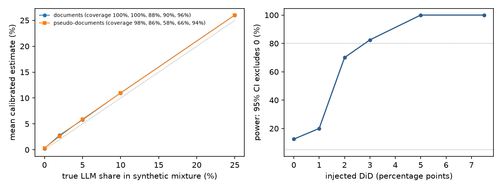
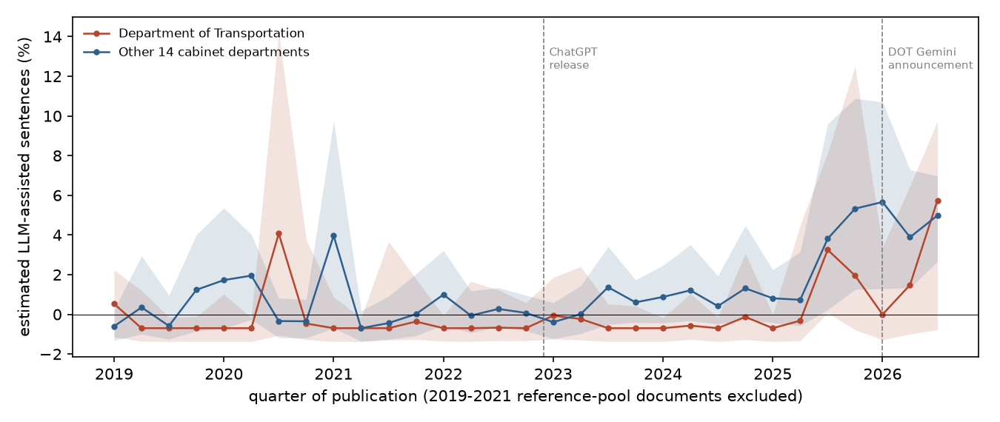
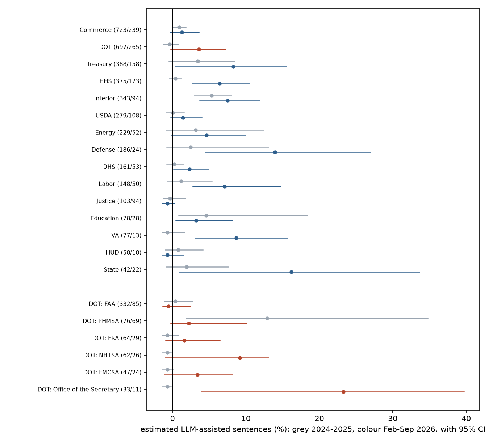

# Did DOT's rules become LLM-written after its Gemini drafting plan?

*A preregistered difference-in-differences of the estimated share of LLM-assisted sentences in Federal Register rule
preambles: the Department of Transportation against the other 14 cabinet departments, February to September 2026.
The outcome issues were sealed until the estimator had been validated.*

Run directory: `research-lab/runs/legal-digital-humanities-federal-register-llm-drafting` · Preregistration:
[`plan.md`](plan.md) (commit 22616bf) · Departures from it: [`deviations.md`](deviations.md) (D1–D9) · Independent
review: [`review/review.md`](review/review.md) · 7 October 2026, revised after independent review

## In plain terms

In January 2026 the US Department of Transportation (DOT) said it would use Google's Gemini to draft most new
regulations. If it did, the share of AI-like sentences in its published rules should rise faster than in other
departments' rules.

We estimated that share with a statistical method that compares word use against human-written rules from 2019-2021
and against rule text rewritten by five open AI models. We checked the method on synthetic text before looking at any
2026 rules, which stayed locked until then.

**We found no DOT-specific rise.** DOT's estimated share went from about 0% to 3.6%, but the other departments' went
from 1.6% to 5.0%. The difference is +0.6 points, with a 95% range of −4.3 to +5.1. The test could not rule out a
DOT-specific rise of up to about 5 points.

The formal verdict is **Inconclusive**. A "no" verdict needed the top of that range below 5 points. Whether it lands
just above or just below 5 depends on the random seed of the resampling, and the seed fixed in advance put it just
above. Either way, the study could only reliably detect a DOT-specific rise of about 7 points.

Most other departments' rules (11 of 14) also became more AI-like between 2024-2025 and 2026, unevenly. The rise
began in mid-2025, months before DOT's announcement. Within DOT, the Secretary's own office published rules in 2026 that read as the most AI-like of any
DOT unit. That is based on 11 documents, and is worth watching.

## What was done

**Documents.** Every proposed and final rule published from January 2019 to September 2026 (38,833 documents), from
Federal Register metadata. Each was assigned to DOT, to the other 14 cabinet departments, or to independent agencies
(excluded).

**Filters.**

- **Templated classes:** removed by a title filter fixed before any text was read. This covers airworthiness
  directives, airspace actions, safety zones, drawbridge operations, pesticide tolerances, state implementation plans
  and similar. It removes 74% of DOT documents.
- **Near-duplicates:** MinHash at Jaccard ≥ 0.8 on the preamble removed 277 more, keeping one per neighbour set per
  quarter. A neighbour set is not a transitive family, so the rule keeps more documents rather than fewer.
- **What remains is not all substantive policy.** Routine FAA-type actions are still 38% of DOT's 2024-2025 documents
  and 25% of its 2026 documents: special conditions, routes and airways, petitions and corrections.

**Edge cases.**

- Joint rules led by OMB, OPM or SBA count in the comparison group.
- Three EPA-led joint rules count as DOT.
- FERC, which the Federal Register lists under Energy, contributes 66 documents to the comparison group.

A sensitivity below drops FERC.

**Text.** Paragraphs of each rule's SUPPLEMENTARY INFORMATION section, from GovInfo's daily XML issues, split into
sentences. Paragraphs under the preregistered procedural headings are excluded from the primary analysis and analysed
separately: Regulatory Flexibility Act, Paperwork Reduction Act, Executive Order reviews and others.

That heading list misses some boilerplate, such as "Regulatory Impact Analysis", "Severability" and good-cause
statements. A broader filter is reported as a sensitivity.

**Estimator.** A distributional maximum-likelihood estimator in the style of Liang et al. (2024, 2025), reimplemented
openly. Each sentence is treated as a vector of occurrences over 859 adjectives and adverbs. The share α maximises
the likelihood of a two-component mixture of human-written and LLM-written sentence distributions. α is
sentence-weighted, so long documents count for more.

- **Human reference:** 60% of the 2019-2021 documents, chosen at random.
- **LLM reference:** 4,000 paragraphs from another 20% of 2019-2021 documents, each polished and redrafted from a
  one-line summary by five open models:
  - Qwen2.5-32B-Instruct;
  - OLMo-2-32B-Instruct;
  - Nemotron-3-Nano-Omni;
  - **Gemma 4 31B-it**, the closest open relative of Gemini;
  - **gpt-oss-120b**, standing in for ChatGPT-style tools.

  The last two were added before any estimate, at the lab owner's suggestion (D2).

**Two fixes found by validation (D5, D6).**

- **Topic leakage.** Generated text carried the topics of the few documents it was rewritten from, so those
  documents' own human text scored 11% "LLM". The LLM reference is now built from paired rates: how much each word's
  frequency changes between a source paragraph and its AI rewrite, applied to the human reference's own word rates.
- **Calibration.** Estimates are calibrated with a two-point line fitted on 2019-2021 data that validation never used:
  0.5% raw on human text and 77.5% raw on generated text map to 0% and 100%. The calibration's uncertainty is carried
  into every interval.

The resulting scale is anchored to these five generators. Text from DOT's actual Gemini deployment could be more or
less detectable.

**Sealing and timing.**

- **Sealed:** the 188 daily issues from 2026 were downloaded and hashed (manifest digest b8a470f9…) when the plan was
  committed.
- **Parsed:** at 03:50:45 on 7 October, by the shell timestamp printed just before the parse command. That is 29
  seconds after the validation results and the minimum detectable effect were committed. All 188 files matched the manifest (D7, D8).
- **Not sealed:** the 2022-2025 text, which includes the pre-period and the placebo windows. It was on disk while the
  estimator changes were made. No estimate was computed on it before unsealing, but only the commit history attests
  that.

**Test.** DiD = (α_DOT,post − α_DOT,pre) − (α_other,post − α_other,pre), with these periods:

- **Pre:** 2024-2025.
- **Post:** February to September 2026. January 2026, the month of the announcement, is excluded.

The 95% interval comes from a document-cluster bootstrap (2,000 draws, seed fixed before unsealing).

**Decision rule** (plan section 5):

- **Supported:** DiD ≥ 5 pp, with a CI that excludes 0.
- **Refuted:** DiD < 2 pp, an upper CI bound below 5 pp, and a minimum detectable effect of at most 5 pp.
- **Inconclusive:** otherwise.

## Validation (before unsealing)

**V1: synthetic mixtures.** Validation-pool human text was mixed with held-out generated text at known shares, 50
replicates per level. Results for 290 real documents per replicate:

| True share | 0 | 2% | 5% | 10% | 25% |
|---|---|---|---|---|---|
| Mean estimate | 0.3% | 2.8% | 5.8% | 11.0% | 26.0% |
| 95% CI coverage | 100% | 100% | 88% | 90% | 96% |

- **Bias criterion (under 1 pp at true shares up to 10%): met,** with 0.02 pp to spare at 10%. It is exceeded at 25%
  (+1.02 pp).
- **Coverage criterion (at least 90%): narrowly missed** at 5% (88%, within one standard error of 90% with 50
  replicates).
- **The estimator overstates by about 4% of the true share.** This comes from the difference in detectability between
  the two held-out halves of generated text. In a DiD it is a common multiplier, so it nearly cancels.
- **A construction that shuffles sentences across 290 equal chunks covers only 58-66% at 5-10%.** Its intervals are
  narrow (about 2 pp) and the same bias fills half their width. The real-document intervals are wider because
  documents differ, and absorb it.

**V2: power.** A DiD was injected into synthetic groups of the real sizes: 732, 290, 3,295 and 1,178 documents drawn
from 2019-2021 text. 40 replicates per level, B = 300.

- **Minimum detectable effect: 3 pp** at 80% power (power 70% at 2 pp, 82% at 3 pp, 100% at 5 pp). A design capped at
  320 documents per group, as first coded, gives 5 pp.
- **False-positive rate at zero effect: 12.5%** (5 of 40; 95% CI roughly 4-27%), against a nominal 5%.

## Results

**Primary test.** Calibrated estimates, documents after filtering:

| | 2024-2025 | Feb-Sep 2026 | Change |
|---|---|---|---|
| DOT | −0.4% (697 documents) | 3.6% (265) | +4.0 pp |
| Other 14 cabinet departments | 1.6% (3,190) | 5.0% (1,126) | +3.4 pp |
| **Difference-in-differences** | | | **+0.6 pp (95% CI −4.3 to +5.1)** |

**Verdict: Inconclusive.** The DiD is below 2 pp and the planned minimum detectable effect (3 pp) is below 5 pp. But
the upper end of the interval, +5.1 pp, is not below 5 pp.

**The verdict sits within Monte Carlo error of the threshold.** The point estimate is +0.56 pp whatever the seed, but
the upper bound moves:

- over 12 seeds at 2,000 draws it ranges from 4.84 to 5.11 pp, and falls below 5 pp in 6 of them, which would give
  Refuted;
- a 10,000-draw run gives +5.01 pp.

The preregistered seed's verdict stands. On substance the result is the same either way: no DOT-specific rise, with
too little precision to exclude one of about 5 pp.

**Placebos.** Both are small, so the 2 pp downgrade rule does not apply:

- **P1:** 2022 against 2019-2021, −0.0 pp (−0.7 to +0.8).
- **P2:** January-June 2025 against 2024, +0.2 pp (−1.5 to +1.8). P2 has no power for DOT itself, because both DOT
  windows sit at the estimator's lower boundary.

**Why the interval is wider than validation predicted.** The real interval is 9.4 pp wide; V2 predicted about 4 pp.

- **Most of the variance is in one cell.** Three quarters of the DiD's bootstrap variance comes from DOT's 2026 cell
  (bootstrap sd 1.6 pp on the raw scale). The other cells contribute: other departments' 2026, 19%; the two 2024-2025
  cells, 7%.
- **V2 spread its injected text evenly.** Real documents differ a lot in how AI-like they read, in every period: about
  11-14% of documents score above 25% on their own (`provenance.json`).
  V2 injected text evenly into every synthetic document, so it
  understated that heterogeneity.
- **V2's baseline groups contributed almost no variance,** because 2019-2021 text sits at the estimator's floor.

Judged by its realised interval, the study could reliably detect a DOT-specific rise of about 7 pp, not 3 pp.

**Event study (secondary).**

- **Background noise.** Before ChatGPT, single quarters already reached about 4%: DOT in 2020Q3 (23 documents), the
  comparison group in 2021Q1. So a single reading of 3-6% is within the estimator's noise on this kind of text.
- **Through 2025Q2:** 16 of DOT's 31 quarters sit at the lower boundary (raw α = 0, shown as −0.7%).
- **From 2025Q3 both groups rise:**

  | Quarter | 2025Q3 | 2025Q4 | 2026Q1 | 2026Q2 | 2026Q3 |
  |---|---|---|---|---|---|
  | Other departments | 3.8% | 5.3% | 5.7% | 3.9% | 5.0% |
  | DOT | 3.3% | 2.0% | 0.0% | 1.5% | 5.7% |

  For the comparison group this is sustained over five quarters, unlike the earlier single-quarter spikes. DOT shows
  no break at its January 2026 announcement.
- **2026Q3 is DOT's highest quarter,** 5.7% (95% CI −0.8 to +9.7). It is also the first quarter likely to consist
  mostly of rules drafted after the announcement.

**Departments (the monitoring series of plan section 6, produced after review).**

| Department | Documents 2024-25 / 2026 | 2024-25 (95% CI) | Feb-Sep 2026 (95% CI) | Change |
|---|---|---|---|---|
| Commerce | 723 / 239 | 0.9% (−0.1% to 1.8%) | 1.3% (−0.3% to 3.6%) | +0.4 pp |
| Treasury | 388 / 158 | 3.4% (−0.5% to 8.5%) | 8.3% (0.4% to 15.5%) | +4.9 pp |
| HHS | 375 / 173 | 0.4% (−0.4% to 1.2%) | 6.4% (2.7% to 10.5%) | +6.0 pp |
| Interior | 343 / 94 | 5.3% (3.0% to 8.0%) | 7.5% (3.7% to 11.9%) | +2.2 pp |
| USDA | 279 / 108 | 0.1% (−0.9% to 1.6%) | 1.4% (−0.2% to 4.0%) | +1.4 pp |
| Energy | 229 / 52 | 3.1% (−0.8% to 12.4%) | 4.7% (−0.2% to 9.9%) | +1.5 pp |
| Defense | 186 / 24 | 2.4% (−0.8% to 13.1%) | 14.0% (4.4% to 27.0%) | +11.5 pp |
| DHS | 161 / 53 | 0.3% (−0.8% to 1.5%) | 2.3% (0.2% to 4.9%) | +2.1 pp |
| Labor | 148 / 50 | 1.2% (−0.7% to 5.4%) | 7.1% (2.8% to 14.8%) | +5.9 pp |
| Justice | 103 / 94 | −0.3% (−1.3% to 1.8%) | −0.7% (−1.4% to 0.3%) | −0.4 pp |
| Education | 78 / 28 | 4.6% (0.8% to 18.3%) | 3.2% (0.4% to 8.2%) | −1.3 pp |
| VA | 77 / 13 | −0.7% (−1.4% to 1.7%) | 8.7% (3.1% to 15.7%) | +9.4 pp |
| HUD | 58 / 18 | 0.8% (−1.0% to 4.1%) | −0.7% (−1.4% to 1.5%) | −1.5 pp |
| State | 42 / 22 | 1.9% (−0.8% to 7.6%) | 16.2% (0.9% to 33.6%) | +14.2 pp |

- 11 of the 14 departments rose and 3 fell. The rise is led by HHS, Treasury, Labor and several smaller departments.
- Commerce, the largest, barely moved.
- The comparison group's department mix shifted, but that is not what moved it: reweighted to the 2024-2025 mix, its
  2026 value is 5.06%, against 4.98% actual.

**DOT's administrations (secondary, after review).**

| DOT administration | Documents 2024-25 / 2026 | Share of DOT documents | 2024-25 (95% CI) | Feb-Sep 2026 (95% CI) |
|---|---|---|---|---|
| Federal Aviation Administration | 332 / 85 | 48% → 32% | 0.4% (−1.1% to 2.8%) | −0.5% (−1.3% to 2.4%) |
| Pipeline and Hazardous Materials Safety Administration | 76 / 69 | 11% → 26% | 12.9% (1.9% to 34.8%) | 2.2% (−0.2% to 10.1%) |
| Federal Railroad Administration | 64 / 29 | 9% → 11% | −0.7% (−1.4% to 0.8%) | 1.6% (−0.9% to 6.4%) |
| National Highway Traffic Safety Administration | 62 / 26 | 9% → 10% | −0.7% (−1.4% to −0.2%) | 9.2% (−1.0% to 13.1%) |
| Federal Motor Carrier Safety Administration | 47 / 24 | 7% → 9% | −0.7% (−1.4% to 0.2%) | 3.4% (−1.2% to 8.1%) |
| Federal Highway Administration | 46 / 4 | 7% → 2% | −0.6% (−1.4% to 1.1%) | 8.5% (−1.1% to 20.3%) |
| Office of the Secretary | 33 / 11 | 5% → 4% | −0.7% (−1.4% to −0.2%) | 23.3% (3.9% to 39.7%) |
| Federal Transit Administration | 19 / 7 | 3% → 3% | −0.7% (−1.3% to 11.4%) | −0.7% (−1.4% to 13.0%) |
| Maritime Administration | 6 / 7 | 1% → 3% | 0.6% (−1.2% to 18.1%) | −0.7% (−1.4% to 2.3%) |

- **Composition.** What DOT published shifted from the FAA, which sits at the floor, towards PHMSA. At the 2024-2025
  mix DOT's 2026 value would be 2.5%; at the 2026 mix its 2024-2025 value would be 3.3%. So between 1.1 and 3.7 of
  DOT's 4.0 pp rise reflects which administrations published, not how they wrote.
- **PHMSA** read 12.9% before the announcement, far above every other DOT unit, and 2.2% after. If some of its
  2025 deregulatory batch was AI-assisted, DOT's baseline already contains treatment, which would bias the DiD towards
  zero. A clean-baseline sensitivity (below) gives the same answer.
- **The Office of the Secretary** read 23.3% in 2026 (95% CI 3.9 to 39.7%), on 11 documents. This office houses
  DOT's central leadership. Whether these rules were drafted with Gemini cannot be told from this data.
- **NHTSA** read 9.2% in 2026.

These cells are small and their intervals wide; they are the ones to watch. The FHWA's 2026 value rests on 4
documents. Three DOT units with fewer than 10 documents in total (12 documents) are omitted from the table. Their
names come from the Federal Register's raw agency field: "Transportation Department", "Office of Secretary of
Transportation" and the Great Lakes St. Lawrence Seaway Development Corporation.

**Sensitivities (secondary, after review).** DiD with 95% CI, 2,000 draws, the same seed:

| Variant | DiD (95% CI) |
|---|---|
| Primary | +0.6 (−4.3 to +5.1) |
| Clean baseline: pre = January 2024 to June 2025 | +0.3 (−4.1 to +4.6) |
| Routine FAA-type titles excluded (special conditions, routes, airways, petitions, corrections) | +1.1 (−4.0 to +5.7) |
| FERC excluded | +0.1 (−4.5 to +4.6) |
| Broader procedural filter | +0.4 (−4.3 to +4.7) |
| Prompt words removed from the vocabulary; chat preambles and Markdown stripped from generated text | +1.5 (−5.0 to +7.3) |

- All point estimates lie between +0.1 and +1.5 pp, and every interval includes 0.
- Three upper bounds fall below 5 pp and two rise above it, which again shows that the verdict boundary is not robust.
- **The prompt-word variant** addresses a flaw: "supplementary", which appears in the drafting prompt, carried the
  largest weight in the vocabulary. Removing it, with the other two prompt words, barely moves the DiD (+0.9 pp) but
  raises every level by 2 to 3.6 pp: DOT 2026 goes from 3.6% to 6.5%, and the other departments from 5.0% to 7.0%.
  This is direct evidence that the estimated levels depend on reference choices, while the difference between groups
  is much more stable.

**Other robustness checks (secondary).**

- **Leave-one-generator-out:** each of the five references, refitted and recalibrated, gives a DiD between −0.0 and
  +0.95 pp.
- **Gemma 4 alone,** the Gemini proxy: +1.0 pp (−5.3 to +6.0).
- **Final against proposed rules:**
  - final rules: +4.5 pp (−2.1 to +8.9);
  - proposed rules: −3.9 pp (−7.8 to −0.1).

  With five splits, one interval excluding 0 is unremarkable.
- **Deregulatory titles** (regex `rescind|rescission|remov|withdraw|deregulat|eliminat`): DOT's share stayed near 0%,
  while other departments' rose from 4.2% to 15.7%. The DiD is −11.3 pp (−19.2 to +0.6), on 18 DOT documents.
- **Procedural paragraphs:** they read as 10.7-18.8% AI-like in both groups and periods, which is why the plan excluded
  them. Their DiD is +4.8 pp (−1.9 to +10.8).

**Model-free checks (secondary).**

- **Non-breaking hyphens and narrow no-break spaces** do not discriminate. gpt-oss and Nemotron use them constantly,
  and no Federal Register document from 2019-2026 contains them. But no document contains an ordinary non-breaking
  space either, a character routine in word-processed legal text. Curly quotes survive in 539,305 paragraphs. The
  Federal Register's typesetting evidently normalises such characters, so their absence says nothing about AI use.
- **Em dashes per 1,000 words:**
  - DOT: 0.53 (2019-2021), 0.64 (2024-2025), 0.83 (2026);
  - other departments: 0.62, 0.63 and 0.74.
- **Word-frequency changes**, 2026 against 2024-2025 (Kobak-style excess vocabulary):
  - **By absolute rise in document frequency,** the comparison group's top words are generic: "general",
    "establish", "part", "order", "after", "burdens", "thus". DOT's are "pipeline", "unnecessary", "privacy",
    "government", "operators".
  - **By ratio, among words with a rise of at least 5 points,** policy words lead: "deregulation", "deregulatory",
    "unleashing", "prosperity", "burdens" for the comparison group; "lawful", "unleashing", "solicited", "pipeline"
    for DOT.
  - Neither list looks like the classic AI marker words.

**What drives the rise in most departments (exploratory, after unsealing).**

- **Removing deregulatory-titled documents does not remove the rise:** DOT 3.6% → 3.7%, others 5.0% → 4.7%. Such
  documents are 6.6-8.4% of rules in each group and period.
- **The policy vocabulary is spread across documents rather than confined to deregulatory ones.** The rise is diffuse:
  the 20 most influential words account for under half of it. "Regulatory" is the largest single contributor in both
  groups. The words mix policy adjectives ("regulatory", "statutory", "unnecessary", "administrative", "outdated",
  "fiscal") with words generated text favours ("across", "operational", "consequently", "rigorous", "long-term").

The estimator cannot separate AI drafting from a change in what rules are about and how agencies are told to justify
them. The rise is evidence of a style shift, not proof of AI use.

## Caveats

- **The formal verdict is fragile; the substantive result is not.** The upper bound sits within Monte Carlo error of
  the 5 pp threshold, and sensitivities fall on both sides of it. The realised precision was about half what
  validation predicted. What holds across every seed and variant is a DOT-specific change near zero (+0.1 to +1.5 pp)
  with intervals of about ±5 to ±6 pp.
- **This is an intention-to-treat test on publication dates.**
  - Rules published in early 2026 were drafted in 2025.
  - Final rules follow proposals drafted earlier still.
  - Review at the White House's Office of Information and Regulatory Affairs adds months.
  - ProPublica reported a demonstration and a plan, not an adoption date.

  The post window therefore mixes untreated and possibly treated rules, which attenuates any effect. A longer post
  window is needed.
- **Composition moves the levels.** DOT's mix of administrations shifted, and the administrations differ widely. Any
  DOT-wide number blends units that read anywhere from 0% to over 20%.
- **The estimator reads at least as much "style" as "AI".** It responds to genre: procedural boilerplate scores 10.7-
  18.8%, PHMSA's 2024-2025 rules 12.9%, and pre-ChatGPT quarters up to 4%. A policy-driven change in rule language can
  look like AI use. An AI tool that writes in an agency's existing style would not be detected at all.
- **The scale is anchored to five open models.** The calibrated share is not a measured fraction of real AI use.
  Gemini as DOT deploys it could be more or less detectable. Leave-one-generator-out and the Gemma 4 reference agree
  on direction, not on scale.
- **The lower boundary.** The estimator cannot go below "as human as the 2019-2021 reference". 21.5% of the DOT
  2024-2025 bootstrap draws, half of DOT's quarters and both DOT placebo windows sit at that floor.
- **Validation was imperfect.** V1 coverage was 88% at a 5% share, and V2's false-positive rate 12.5%, from 50 and 40
  replicates. Intervals may be somewhat too narrow.
- **The estimator was changed twice after V1 failed** (D5, D6). Both changes used 2019-2021 data only, preceded
  unsealing, and were the only variants tried.
- **Published text only.** A rule drafted with AI and then heavily edited by staff would show little AI-like style.

## Related work

- **Liang et al. (2024, 2025):** the distributional estimator, applied to papers, peer reviews and corporate, UN and
  consumer-complaint text.
- **Kobak et al. (2025):** excess-vocabulary marker words in biomedical abstracts.
- **Atkinson & O'Bryan (arXiv 2607.04543):** a 10-stream pilot of government AI use as a monitoring signal, with no
  agency breakdown.

To our knowledge this is the first agency-level, preregistered test on the Federal Register.

## Deviations (summary)

- **D1:** a bug put independent agencies in the comparison group; fixed before any estimate.
- **D2:** Gemma 4 31B-it and gpt-oss-120b added as generators.
- **D3:** the power check uses the real group sizes.
- **D4:** Unicode-hyphen normalisation in the tokenizer, and the typographic-marker check added.
- **D5:** V1 failed; paired reference and calibration added.
- **D6:** calibration uncertainty propagated into the intervals.
- **D7:** validation results and the minimum detectable effect logged before unsealing.
- **D8:** unsealing verified; a crash in the near-duplicate filter fixed before any estimate.
- **D9:** after the independent review:
  - seed sensitivity;
  - variance decomposition;
  - the department monitoring series;
  - DOT administrations;
  - five sensitivities;
  - corrections to D5, D6 and D8.

The decision rule never changed.
