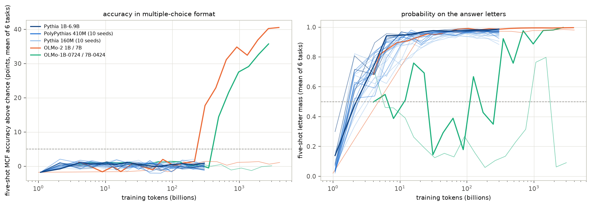
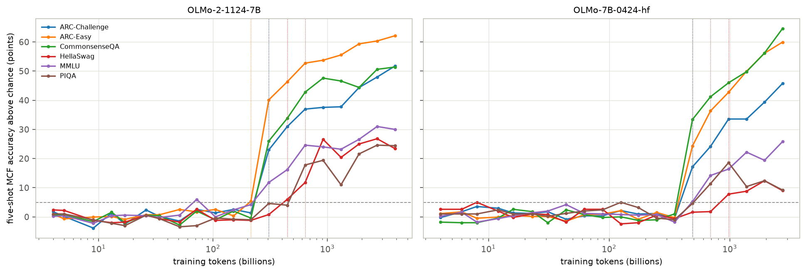
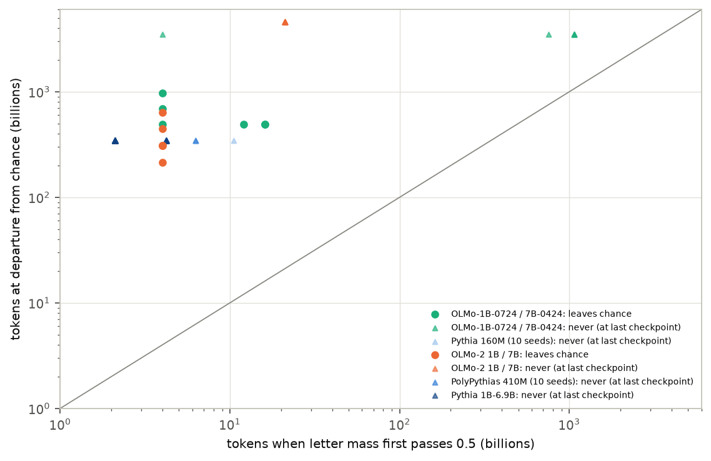

# When do language models learn to answer multiple-choice questions by letter?

*A preregistered test of answer-letter probability as a leading indicator, across 412 checkpoints of 28 open training runs*

Run directory: `research-lab/runs/llm-ml-science-mcf-emergence` · Preregistration: [`plan.md`](plan.md) ·
Every departure from it: [`deviations.md`](deviations.md) · 3 October 2026, revised after independent review

## In plain terms

Language models are often tested with multiple-choice questions: options labelled A, B, C, D, with the model scored on
which letter it picks. Small or partly trained models usually score at chance in this format, even when other tests
show they know the answers. So leaderboards may be measuring whether a model has learned the *format* rather than what
it *knows*. The lead behind this study proposed a cheap warning sign: watch how much of the model's prediction goes to
the answer letters, and the format should click soon after that share passes one half.

We tested this on 412 saved snapshots from 28 public training runs, from 160 million to 7 billion parameters, including
two small models each trained ten times from different random starts. Each snapshot answered six standard question sets.

What we found:

- **Only the two 7-billion-parameter OLMo models clearly learned the format.** They did so after about 300 and 490 billion
  training tokens (word pieces), on several question sets at once.
- **No Pythia model learned it**, up to 6.9 billion parameters and including all twenty random-start copies. Neither did
  a 1-billion-parameter OLMo model trained on 4 trillion tokens. Another 1-billion-parameter model showed the skill only
  at its very last snapshot, and only when allowed a line break before the letter.
- **The warning sign usually fires far too early to be useful.** Almost every model starts putting most of its
  prediction on the letters within its first few billion tokens, whether or not it ever learns the format.

So "puts weight on the letters" is necessary but says little about *when*, or *whether*, a model will answer
multiple-choice questions properly.

## Abstract

**Question.** Does a model's probability mass on the valid answer letters predict when its multiple-choice-format
(MCF) accuracy leaves chance?

**Design** (preregistered, `plan.md`, committed before any evaluation).

- **Runs:**
  - Pythia 1B–6.9B;
  - PolyPythias 410M and 160M, 10 seeds each;
  - OLMo-2 1B and 7B;
  - OLMo-1B-0724 and OLMo-7B-0424, added because OLMES reports the final Pythias near chance in MCF.
- **Checkpoints.** 412, fixed by formula.
- **Tasks.** ARC-Easy, ARC-Challenge, CommonsenseQA, PIQA, HellaSwag and MMLU (500 items each). Scored five-shot and
  zero-shot in MCF, and five-shot in cloze format (CF).
- **Units.** One unit is one run on one task, giving 168 units.
- **Departure.** The first checkpoint more than 5 points above chance that is still there at the next checkpoint.
- **Mass crossing.** The first checkpoint at which mean letter probability exceeds 0.5 and is still above it at the
  next checkpoint.

**Results.**

| Analysis | Result | Verdict |
|---|---|---|
| Units that leave chance (five-shot MCF) | 12 of 168, all from the two OLMo 7B runs | — |
| H1: departure never precedes mass crossing | 0 violations; but mass crosses in 167 units, 155 of which never depart | **supported** (uninformative) |
| H2: mass-crossing time predicts departure time (ρ ≥ 0.7) | only 2 runs have both events (≥ 3 required) | **not testable** |
| H3: never crossing means never departing | 1 never-crossing unit (from a run with erratic letter mass); it does not depart | consistent (n = 1) |
| Lead time, departing units | 31–244 times in tokens (median 77) under the preregistered rule; 1.4–3.9× for OLMo-7B-0424 if the crossing must hold to the end | not a reliable timing signal |
| Zero-shot indicator (secondary) | H1 inconclusive (1 violation), H2 not testable; median lead 21× | not better |
| Other 26 runs | never leave chance; final MCF within ±1.5 points of chance (mean of six tasks; −3.8 to +4.2 per task) | — |

**Conclusion.** In these runs, letter mass is a necessary condition for multiple-choice ability but not a usable
timing signal. Format acquisition occurred clearly only in the two 7B OLMo runs, nearly simultaneously across tasks.

## 1. Background and gap

- **Two ways to score a multiple-choice question.**
  - In cloze format (CF), each answer's text is scored by its likelihood.
  - In MCF, the options are labelled and the label is scored.
- **Why it matters.** OLMES (Gu et al. 2024) showed that weaker models score at chance in MCF while CF reveals their
  knowledge. It recommends taking the better of the two formats. In OLMo-7B-0424, MCF ability appeared after about 400B
  training tokens.
- **Closest work.** Wiegreffe et al. (2024) localised answer-symbol binding in one OLMo run. Wiegreffe et al. (2023)
  warned that more probability on answer choices does not always mean higher accuracy.
- **The gap.** No study was found that describes the onset across scales and seeds, or tests a cheap leading indicator.

## 2. Data, rules and validation

- **Checkpoints** (`data/checkpoints.csv`).
  - Pythia: 14 per run, steps 512–143,000 (1–300B tokens).
  - OLMo: 16–20 per run, log-spaced from 1–4B tokens to 2.7–4.0T tokens (D1).
- **Prompts.** OLMES style, with five fixed shots. Fifteen MMLU items keep 2–4 shots so that every prompt fits in 1,900
  tokens (D1).
- **Numerics.** fp16 for Pythia, bf16 for OLMo.
- **Rules.**
  - Both events need persistence at the next checkpoint, so a first exceedance at a run's last checkpoint cannot count.
    Under the preregistered prompt no unit is affected: the largest final excess in a never-departing unit is +4.2.
  - The crossover rule compares MCF on 500 items with CF on the first 200 of them.
- **Validation** (D1, D2).
  - Random-initialisation checkpoints score at chance on every task. One cell is +3.2 points against a 3-point
    criterion, within sampling noise (standard error about 1.9).
  - On OLMo-7B-0424's released `main` checkpoint, MCF accuracy matches OLMES within 2.6 points for ARC-C, ARC-E and
    CSQA, and within 4.0 for PIQA. The planned trajectory ends at 2,731B tokens, beyond the released model; that
    checkpoint scores PIQA 59.2 (−6.4).
  - MMLU's 500-item gap (−5.8) shrank to −0.9 on 2,000 items averaged by subject. It was sampling noise plus averaging.
  - HellaSwag MCF is lower than OLMES (36 against 50), because OLMES preprocesses HellaSwag contexts.
- **A data problem found and fixed** (D5).
  - Eleven pythia-2.8b checkpoint branches on Hugging Face contain a stale, identical `model.safetensors` beside the
    real step weights, so they first evaluated as the final model.
  - An audit of all 412 branches found no other case.
  - The 11 checkpoints were re-run with the correct weight files.

## 3. Results

### 3.1 Only the two OLMo 7B runs clearly leave chance

Figure F1 shows every run. Averaged over the six tasks, the final five-shot MCF accuracy above chance is:

| Run | Final MCF accuracy above chance (points) |
|---|---|
| OLMo-2-1124-7B | +40.5 |
| OLMo-7B-0424 | +35.7 |
| All other 26 runs | −1.3 to +1.5 (per task −3.8 to +4.2) |

The models that never leave chance still learn the content. At the end of training their mean CF accuracy is 0.58
(Pythia-6.9B) and 0.60 (OLMo-2 1B), far above chance.

**Not training length alone.** At about 300B tokens (E3):

| Run | MCF accuracy above chance (mean of 6 tasks) | Stage |
|---|---|---|
| OLMo-2 7B | +17.7 points | mid-training |
| Pythia-6.9B | +0.9 points | end of training |
| OLMo-7B-0424 (at 348B) | −0.5 points | its departure comes at 490B |

- Pythia-6.9B stops at 300B, so only the OLMo-2-7B comparison rules out training length. Pythia might have acquired the
  format with OLMo-7B-0424's 490B.
- OLMo-2 1B stays at chance after 4 *trillion* tokens (+1.1 points).

### 3.2 Format acquisition is a near-simultaneous, whole-model event (E1)

| Run | Departure range | Tasks departing together |
|---|---|---|
| OLMo-2 7B | 214–638B tokens | three at 307B; four of six within one checkpoint |
| OLMo-7B-0424 | 490–976B tokens | four at 490B: ARC-C, ARC-E, CSQA, MMLU |

PIQA and HellaSwag lag in both runs. The OLMo-7B-0424 timing agrees with OLMES's estimate of about 400B (Figure F2).
HellaSwag's MCF accuracy stays well below its CF accuracy even at the end (0.48 against 0.86 for OLMo-2 7B).

### 3.3 Letter mass is necessary but not a reliable timing signal (H1–H3)

- **Five-shot letter mass passes 0.5 in 167 of 168 units.** 163 cross by 21B tokens. Four OLMo-1B-0724 units cross late,
  at 754–1,069B.
- **Most crossing units never depart.** 155 of them never leave chance.
- **H1** (no departure before mass crossing) **is supported with zero violations.** But the mass crosses so early and so
  universally that this says little.
- **Lead times.** Under the preregistered rule, the 12 departing units crossed at 4–16B tokens, 31–244 times earlier
  than departure (median 77; Figure F3).
- **H2 is not testable.** Only two runs have both events.
- **H3.** The single never-crossing unit (OLMo-1B-0724, PIQA) does not depart. It comes from the run with erratic
  letter mass (below).

**Sensitivity of the crossing rule** (after review, D6). The preregistered rule needs only two checkpoints in a row.
OLMo-7B-0424's mean letter mass then falls back below 0.5 at 7 of the next 11 checkpoints: 0.14 at 31B and 0.18 at 88B.
If the crossing must hold to the end of training, the two acquiring runs disagree:

| Run | Mass holds above 0.5 from | Departures | Lead time |
|---|---|---|---|
| OLMo-7B-0424 | 125–348B | 490–976B | 1.4–3.9× (just before) |
| OLMo-2 7B | 4B | 214–638B | 54–160× |

The "far too early" conclusion therefore rests on OLMo-2 7B. In OLMo-7B-0424, *stable* high letter mass arrived
shortly before the format did. With two acquiring runs this cannot be resolved; it is a question for future work.

**OLMo-1B-0724 is anomalous** (D6, E5).

- Its five-shot letter mass is lower than its zero-shot mass at 13 of 20 checkpoints. Its mean swings from 0.73 (4B) to 0.06
  (186B), back to 0.80 (1,515B), and ends at 0.09.
- At its final checkpoint it puts 84–100% of its next-token probability on a newline after "Answer:", not on a letter.
- Read *after* that newline, the final checkpoint answers above chance on CSQA (+18.6 points), ARC-Easy (+12.5) and
  ARC-Challenge (+6.8). Earlier checkpoints are at chance in both readings through 2,150B tokens.
- So this model acquires some MCF ability only at its last checkpoint, in a slightly different format. The persistence
  rule cannot count that.

**Zero-shot letter mass** (secondary) crosses later and closer to departure (median lead 21×).

- Under the same rules, zero-shot H1 is inconclusive (one violation) and H2 is not testable.
- The violation: OLMo-7B-0424 PIQA departs at 1,375B tokens, before its zero-shot mass crosses at 1,937B.
- 103 units never cross at zero-shot, and none of them depart.

### 3.4 The cloze-to-MCF crossover is unreliable as defined (E4, D6)

- **Only 4 of 78 defined crossovers are genuine:** ARC-Easy and CSQA in the two 7B runs, at 976–2,714B tokens.
- **The other 74 are artefacts.**
  - 68 are in runs that never leave chance.
  - 6 are at the first checkpoint of the 7B runs.
- **The first-checkpoint crossovers.** Nineteen in all: 11 Pythia units at 1.07B tokens and 8 OLMo units at 4B. In 17
  of them CF accuracy is below chance.
- **MCF departs from chance long before it overtakes CF.** PIQA and HellaSwag never genuinely cross.

### 3.5 Random seeds

No PolyPythias run leaves chance:

- 410M: final excess −1.3 to +0.8 points across 10 seeds (mean of six tasks);
- 160M: −1.1 to +1.4 points.

The planned seed-spread analysis of departure timing is therefore moot. At these sizes and with 300B tokens of the Pile,
MCF does not emerge in any seed.

## 4. Discussion

**What this study establishes:**

1. **Early letter mass is not a usable leading indicator of MCF ability.**
   - Models learn to put probability on the answer letters (format surface) within a few billion tokens, including
     the 155 units that never acquire the format.
   - Mapping content to the right letter (symbol binding) arrives hundreds of billions of tokens later, if at all.
   - Whether *sustained* high mass is a better signal is open: it was in one acquiring run but not the other.
2. **Among the Pythia and OLMo families tested, MCF ability was rare below 7B.**
   - Only the two 7B OLMo runs clearly acquired it.
   - Pythia-6.9B (300B tokens) and OLMo-2 1B (4T tokens) did not.
   - OLMo-1B-0724 showed it only at its final checkpoint and only after a newline.
   - For these families this supports OLMES's use of cloze scoring for small models.
3. **Acquisition is near-simultaneous across tasks.** In each run four of six tasks leave chance within one or two
   checkpoints, consistent with a single skill (binding the letter to the chosen content) rather than task-specific
   learning.
4. **MCF measurement is fragile to formatting.** A model that expects a line break before its answer scores at chance
   with the standard prompt. At-chance MCF should be checked against the model's own next-token preferences before it
   is read as absence of ability.
5. **Checkpoint repositories need integrity checks.** Hugging Face branches for a widely used model can serve stale
   weights. Results identical across checkpoints should be treated as a red flag.

**What it does not establish:**

- **Why only these runs acquire the format.** This study cannot separate data mix, architecture, scale or training
  stage. The OLMo-1B-0724 jump at its final checkpoint may reflect a late training phase; this was not investigated.
- **Whether other indicators would lead.** Item-level predicted labels and correct-label probabilities were not stored
  (D4), so label bias and continuous accuracy measures could not be tested.

## 5. Limitations

1. **Only two runs clearly acquire the format.** Cross-run timing claims (H2) are untestable with this set, and the
   lead-time conclusion depends on the crossing rule (§3.3).
2. **Checkpoint spacing.** Departure is resolved only to the nearest checkpoint (for example 214, 307 or 445B tokens).
3. **One prompt template.**
   - OLMo-1B-0724 shows that a format mismatch can hide MCF ability.
   - HellaSwag differs from OLMES's preprocessing.
4. **500 items per task.** The standard error near chance is about 2 points; the +5-point threshold with persistence
   guards against noise.
5. **The added runs** (OLMo-7B-0424, OLMo-1B-0724) were chosen with prior knowledge that one of them acquires the format.
   This is disclosed in the plan.
6. **Exploratory analyses.** The sustained-crossing rule, the newline reading and E1–E5 were defined after seeing the
   primary results (D4, D6).

## 6. Reproducibility

The code is in `code/`:

- `choose_checkpoints.py`: checkpoint list;
- `build_items.py`: items and prompts;
- `evaluate.py`: scoring;
- `pipeline.py`: download, evaluate, delete;
- `validate_mmlu.py`: validation diagnostic;
- `analysis.py`: units and hypotheses;
- `explore.py`: E1–E4;
- `review_checks.py`, `newline_check.py`, `newline_trajectory.py`, `explore_newline.py`: checks added after review;
- `make_figures.py`, `build_report_html.py`: presentation.

**Results:**

- Per-checkpoint item-level results (412 files, 7,200 rows each) are in `results/evals/`, and the newline-variant
  results in `results/evals_newline/`.
- Tables are in `results/tables/`, including `weight_file_audit.csv` and `weight_overrides.csv`.
- The model weights are public on Hugging Face.
