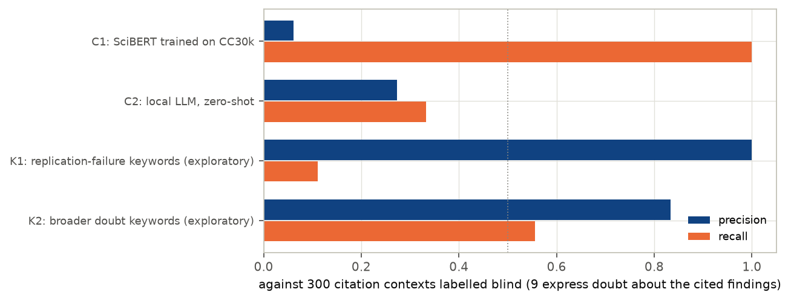
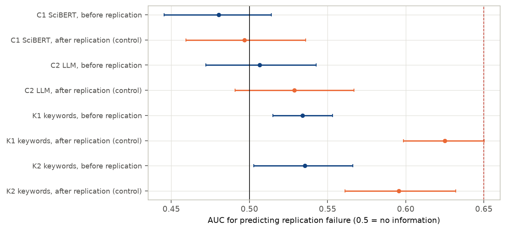
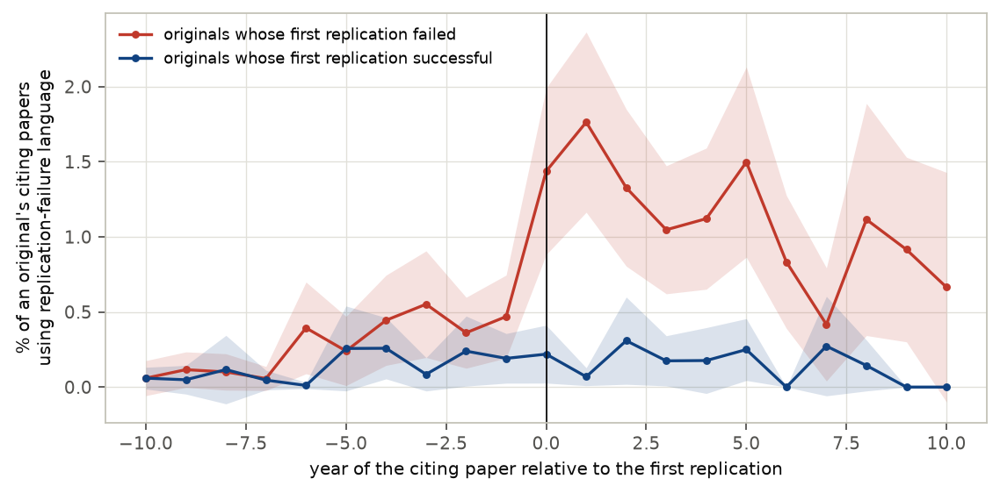

# Does the literature see replication failures coming?

*A preregistered test of whether citing language before a replication predicts its outcome, 1,075 replicated findings*

Run directory: `research-lab/runs/metascience-citation-context-replication` · Preregistration: [`plan.md`](plan.md) ·
Every departure from it: [`deviations.md`](deviations.md) · 1 October 2026, revised after independent review

## In plain terms

Many published findings, especially in psychology, fail when other scientists repeat the study. When researchers cite
a paper, the surrounding sentence often shows what they think of it: "as shown by…", "consistent with…", or "this has
been questioned…". If scientists doubted a finding before anyone re-tested it, those doubts might show up in that
language, giving a cheap early warning for shaky results.

We tested this on 1,075 findings that were later re-tested, about half of them successfully. For each we gathered the
sentences in which other papers cited it before the re-test. The plan was written down before any data were collected.

What we found:

- **Doubt is rare.** Only about 3% of citing sentences (between 1% and 6%) question the cited finding.
- **The planned measuring tools failed.** A classifier trained on a published dataset flagged 44% of all sentences as
  negative, mostly ordinary "however…" statements. A local AI model missed most real doubts. Neither could even
  detect the wave of "failed to replicate" remarks that follows a failed re-test, so their results cannot answer the
  question.
- **A simple search does work after the fact.** Searching for phrases like "failed to replicate" finds that wave. Once a
  failed re-test is published, such phrases become three to four times more common.
- **Before the re-test, it gives only a faint hint.** Findings that later failed already drew slightly more of these
  phrases (14% of them had at least one, against 7%). But as a predictor it barely beats a coin toss, scoring 0.53 where
  0.5 is chance and 1 is perfect.

So the research literature records replication failures once they happen. Its citing language gives, at most, a faint
advance warning.

## Abstract

**Question.** Does reproducibility-oriented negative sentiment in the contexts citing a finding, before its first
replication, predict whether that replication fails? Replicability can be predicted from paper text, markets and
surveys. Citation contexts, the community's running commentary, had not been tested against known outcomes at scale.

**Design** (preregistered, `plan.md`, committed before any citation context was collected).

- **Outcomes.** FORRT's FLoRA database: 2,116 replicated original findings with DOIs.
- **Citation contexts.** 787,384 contexts from 815,570 citing papers, from Semantic Scholar. Replication papers
  themselves are excluded.
- **Primary sample.** 1,075 originals with at least 5 citing papers with contexts before their first replication; 524
  failed.
- **Classifiers** (preregistered):
  - C1, SciBERT fine-tuned on the CC30k citation-sentiment dataset;
  - C2, a local LLM, zero-shot.
- **Validation.** Before any outcome was joined, both were validated on 300 contexts labelled blind.
- **Positive control.** Contexts published after the replication must predict its outcome.

**Results.**

- **The preregistered measurement failed**, in two ways:
  - **Validation:** C1 F1 0.115 (flags 44% of contexts), C2 F1 0.30 [0.00, 0.56]; the bar was 0.5.
  - **Positive control:** neither C1 (0.497) nor C2 (0.529 [0.491, 0.567]) can predict outcomes even from
    post-replication citations.

  Under the plan, H1–H3 are therefore **uninformative**. The point estimates are all near chance.

| Hypothesis | C1 (SciBERT) | C2 (LLM) | Verdict |
|---|---|---|---|
| H1: pre-replication negative share predicts failure, AUC ≥ 0.65 | 0.480 [0.445, 0.514] | 0.507 [0.472, 0.543] | uninformative |
| Positive control (851 originals) | 0.497 [0.459, 0.536], fails | 0.529 [0.491, 0.567], fails | — |
| H2: adds ≥ 0.05 AUC over metadata (baseline AUC 0.54) | +0.004 [−0.015, +0.034] | −0.006 [−0.018, +0.008] | uninformative |
| H3: the same, with the original's n and p (329 originals) | +0.000 [−0.018, +0.021] | −0.004 [−0.023, +0.018] | uninformative |

**Exploratory.** A transparent keyword detector for replication-failure language (K1) was written after the
classifiers failed, and fixed before being run against outcomes.

- **It passes the positive control:** 0.625 [0.598, 0.650].
- **Before the replication it shows only a faint signal:** AUC 0.534 [0.515, 0.553]; 0.525 with a window ending 2 years
  before.
- **Incremental value** over metadata: +0.014 [−0.006, +0.031].
- **Share of originals flagged:** 13.9% of findings that later failed had a pre-replication citing paper with such
  language, against 7.3% of those that replicated.
- **Timing.** Weighting originals equally, the rate is higher but flat in the six years before a recorded failure, and
  three to four times higher from the replication year.

The citing literature registers replication failures after they are published. Before, its language carries at most a
faint signal.

## 1. Background and the gap

- **Replication can be predicted from the paper itself.** Paper text and metadata (Yang, Wu & Uzzi 2020, PNAS),
  prediction markets and surveys (Dreber et al. 2015; Camerer et al. 2018), and simple statistics such as the original
  sample size and p-value all predict replication outcomes above chance.
- **Replications change later citations, modestly.** Citations fall modestly after a failed replication (von Hippel
  2023, PNAS; Schafmeister 2021). Non-replicable papers are cited more (Serra-Garcia & Gneezy 2021). Disputing
  citations are rare: 0.83 per Reproducibility Project: Psychology paper in a decade, in scite's classification.
  Contradicting results change citing patterns slowly (Hardwicke et al. 2021).
- **Tools for citing sentiment.** CC30k (Obadage, Rajtmajer & Wu 2025) holds 30,734 labelled contexts of
  reproducibility-oriented citation sentiment, from machine-learning papers.
- **The gap.** Nobody had tested whether citing language *before* a replication anticipates its outcome, across a large
  set of replications with known results.

## 2. Data

- **Replication outcomes.** FLoRA (FORRT Library of Reproduction and Replication Attempts; github.com/forrtproject/
  FReD-data): 2,246 replication pairs whose original has a DOI, covering 2,116 originals.
  - For each original: the first replication year and the outcome of that year's replications (majority; ties are
    mixed).
  - Among the 2,065 originals published before their first replication: 860 successful, 705 failed, 483 mixed
    (excluded from the primary analysis) and 17 other.
- **Original-study statistics.** FReD: sample size and p-value for 520 of the originals.
- **Citation contexts.** The Semantic Scholar Graph API (public, no key):
  - 1,969 originals found; 141 not found;
  - 6 very highly cited originals truncated at 9,000 citing papers by the API's offset limit;
  - 815,570 citing papers, 43% of them with contexts;
  - 787,384 contexts in total.
  - Citing papers whose DOI is a replication paper in FLoRA or FReD are excluded (`deviations.md` D7).
- **Covariates.** OpenAlex: venue two-year mean citedness, and the original's field (psychology, economics and
  business, other).

## 3. Methods

**Windows.** Citing papers are grouped by publication year:

- **pre-replication** (primary): from the original's year up to the year before the first replication;
- **first 3 years** after publication;
- **a leakage-safe window**, ending 2 years before the replication;
- **post-replication**, from a year after the replication on; this is the positive control.

**Predictor.** The share of citing papers with at least one context classified as negative.

**Classifiers** (preregistered):

- **C1.** SciBERT fine-tuned on CC30k. On CC30k's own held-out data it reaches NEGATIVE F1 0.91.
- **C2.** The local LLM (`nemotron_3_nano_omni`), zero-shot, asked whether the context expresses doubt about the
  reliability, replicability or validity of the cited findings.
  - The server is shared, so C2 scored up to 100 pre-replication and 50 post-replication citing papers per original,
    sampled at random and seeded per original (D3).
  - C1 restricted to the same sample gives the same answers.

**Validation, before any outcome was joined** (D4, D7).

- **Pool.** 20,000 contexts: 75% pre-window and 25% post-window contexts of eligible originals.
- **Sample.** 300 contexts from the pool: 150 that either classifier flagged negative, 150 others.
- **Labels.** Assigned by the analyst (the AI agent running this study), blind to paper and outcome, and saved before
  any comparison.
- **Rule.** The better classifier is primary if its F1 is at least 0.5.

**Statistics.**

- **AUC.** Of the share for failure, with 2,000 bootstrap resamples of originals.
- **Incremental AUC.** Cross-validated (10-fold × 20), adding the share to a logistic baseline:
  - log citing papers;
  - original year;
  - field;
  - venue citedness;
  - years to replication;
  - in H3, also the original's log n and p-value category.
- **Incremental intervals.** 200 bootstrap resamples with grouped 5-fold cross-validation.
- **Positive control.** Computed on the primary originals with at least 5 post-replication citing papers (851). If it
  fails, H1–H3 are uninformative (plan §5).

## 4. Results

### 4.1 Doubt is rare, and the preregistered classifiers cannot find it

Of the 300 validation contexts, 9 express doubt about the cited findings and 16 explicitly confirm them. All 9 doubts
came from the classifier-flagged half. Weighted back to the pool, doubt appears in **2.6% [1.4%, 6.2%]** of contexts.

Examples of genuine doubt:

- "This also fails to replicate previous research by Casenhiser and Goldberg (2005)…"
- "…it still remains unclear what factors have influenced the same context advantage found so convincingly by Godden
  and Baddeley (1975)"
- "Some of the auditory stimuli used in previous studies were also questionable…"

| Detector | Precision | Recall | F1 [95%] |
|---|---|---|---|
| C1: SciBERT on CC30k | 0.061 | 1.00 | 0.115 [0.052, 0.184] |
| C2: local LLM | 0.273 | 0.333 | 0.300 [0.000, 0.556] |
| K1: replication-failure keywords (exploratory) | 1.00 (1 of 1) | 0.11 | 0.20 |
| K2: broader doubt keywords (exploratory) | 0.83 | 0.56 | 0.67 |

- **C1 learned the wrong thing.** CC30k's "negative" class covers any contrastive or limitation statement, such as
  "however, X cannot be applied to…". C1 flags a negative in every original. Its 0.91 F1 on CC30k does not transfer.
- **C2's estimate is imprecise.** Only 11 C2-flagged contexts reached the sample, because C1 dominates the flagged
  stratum. Its F1 is probably below 0.5 (bootstrap probability of reaching 0.5: 7%), but not certainly.
- **The labels are ambiguous in places.** The target citation is not marked in multi-citation contexts.
- **Second look.** The independent reviewer re-examined about 90 contexts and agreed with about 95% of the labels.

### 4.2 The preregistered test is uninformative

Primary sample:

- 1,075 originals, 49% failed;
- half psychology;
- median publication year 2010;
- median 8 years to the first replication;
- median 32 citing papers with contexts before it.

| Analysis | C1 (SciBERT) AUC | C2 (LLM) AUC |
|---|---|---|
| H1: pre-replication negative share | 0.480 [0.445, 0.514] | 0.507 [0.472, 0.543] |
| First 3 years after publication | 0.467 | 0.480 |
| Window ending 2 years before replication | 0.471 | 0.511 |
| Positive control: post-replication share (851 originals) | 0.497 [0.459, 0.536] | 0.529 [0.491, 0.567] |
| Psychology originals only | 0.443 | 0.519 |
| Excluding OpenAlex-sourced FLoRA entries | 0.470 | 0.509 |
| "Mixed" outcomes counted as failed | 0.473 | 0.504 |

- **Both classifiers fail the positive control.** Neither can predict the outcome even from citations written *after*
  a published failure, when citing papers say "failed to replicate" several times more often (§4.3). Their null
  before the replication therefore says nothing about the literature: by the plan, H1–H3 are uninformative.
- **Incremental AUC.** The metadata baseline itself predicts poorly (cross-validated AUC 0.54; 0.59 with the
  original's n and p). Neither classifier adds anything:
  - H2: +0.004 (C1), −0.006 (C2);
  - H3: +0.000, −0.004.
- **Other windows and subsets** do not change this.

### 4.3 Exploratory: explicit replication language

After the preregistered classifiers failed validation, two transparent keyword detectors were fixed in code before
being run against outcomes (D5):

- **K1** matches explicit replication-failure phrases ("failed to replicate", "could not be reproduced", "non-replication",
  "replication … unsuccessful");
- **K2** adds general doubt language ("controversial", "criticized", "contradicts", "mixed results", "confound").

About 10% of K1 matches are generic statements about the replication crisis, or "not yet replicated".

| Detector | Before replication | Window ending 2 years before | Positive control (851) | Incremental AUC before |
|---|---|---|---|---|
| K1 | 0.534 [0.515, 0.553] | 0.525 [0.506, 0.544] | 0.625 [0.598, 0.650] | +0.014 [−0.006, +0.031] |
| K2 | 0.535 [0.503, 0.566] | 0.522 [0.488, 0.555] | 0.596 [0.561, 0.632] | +0.008 [−0.012, +0.032] |

K1 passes the positive control: after a failed replication, citing papers say so. Before it:

- 13.9% of originals that went on to fail already had at least one citing paper with explicit replication-failure
  language, against 7.3% of those that replicated;
- but most had none, so the prediction is weak (0.534), and it adds nothing significant beyond metadata.

The event study (Figure F3) weights each original equally and excludes replication papers:

- In the six years before the first recorded replication, findings that later failed draw such language at 0.24–0.55%
  of citing papers per year, against 0.01–0.26%. The rate is higher but not rising, probably echoing earlier
  attempts.
- From the replication year on, it is 1.1–1.8%.

## 5. Discussion

**What this study establishes:**

1. **Citing sentences rarely express doubt.** About 2.6% [1.4%, 6.2%] do, even though half of these findings would
   later fail. This extends the RPP observation (fewer than one disputing citation per paper in a decade) to over a
   thousand replicated findings across fields.
2. **Off-the-shelf sentiment tools do not measure reproducibility doubt here.** A classifier trained on CC30k's
   machine-learning labels detects contrastive language, not doubt. A general LLM, used zero-shot, misses most doubts
   and cannot even see post-replication failure talk. Future work needs labels built for the target literature.
3. **The literature reacts after a replication.** Explicit replication-failure language becomes three to four times
   more common and predicts the outcome (AUC 0.63).
4. **Before a replication there is at most a faint signal.** With the one detector that passes the positive control
   (exploratory), pre-replication AUC is 0.53, far below the 0.65 target, with no significant gain over metadata.

**What it does not establish:**

- **That the preregistered hypothesis is false.** The preregistered test is uninformative, because its classifiers
  failed validation and the positive control. The exploratory result points the same way, but it is exploratory.
- **That no early signal exists anywhere.** A domain-specific classifier might find more, and other channels were not
  measured: talks, social media, or citation counts.
- **Generality beyond FLoRA.** FLoRA over-represents psychology and large replication projects. At least one FLoRA
  "original" is itself a replication-project paper.

## 6. Limitations

1. **Measurement.** The preregistered classifiers failed. The keyword detectors are crude: K1 finds only explicit
   replication language, and about 10% of its matches are generic.
2. **Validation labels.** A single annotator (an AI model), 9 positive cases, and ambiguity in multi-citation contexts.
3. **Coverage.** Semantic Scholar supplies contexts for 43% of citing papers, more for recent open-access papers.
   Harvests of the six most-cited originals are truncated, four of them in the primary sample; excluding them changes
   nothing.
4. **Timing.** Citing papers are dated by year, so preprints and earlier unrecorded replications blur the "before"
   window. The window ending 2 years before gives the same answer.
5. **Outcome coding.** FLoRA codes the first replication from its authors' statements. 483 "mixed" outcomes are
   excluded (sensitivity: counted as failed).

## 7. Reproducibility

The code is in `code/`:

- `fetch_contexts.py`, `fetch_openalex.py`, `build_contexts.py`: data;
- `train_c1.py`, `score_contexts.py`, `validation.py`: classifiers and their validation;
- `analysis.py`: H1–H3, the positive control and robustness;
- `explore_keywords.py`: the exploratory keyword detectors;
- `make_figures.py`, `build_report_html.py`: presentation.

Tables are in `results/tables/` and figures in `results/figures/`.

- **Committed.** Derived per-original features (`originals_*.parquet`, no text) and the validation labels (context IDs
  only).
- **Not redistributed.** Citation contexts; they can be re-harvested from Semantic Scholar with the code.
