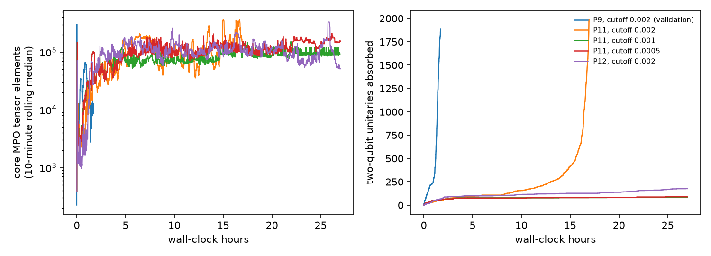

# Do generic tensor-network attacks recover the hidden answers of the 98-qubit peaked circuits?

*A preregistered test of three published classical attacks on BlueQubit's P11 and P12, scored against the
quantum-hardware answers, which were sealed unread. Overtaken during the study by a structure-aware attack that solved
both in minutes.*

Run directory: `research-lab/runs/quantum-simulation-peaked-98q-classical-crack` · Preregistration:
[`plan.md`](plan.md) (commit ff1996a) · Departures from it: [`deviations.md`](deviations.md) (D1–D7) · Independent
review: [`review/review.md`](review/review.md) · 6 October 2026, revised after review

## In plain terms

A "peaked circuit" is a quantum program built so that one particular 98-bit answer comes out far more often than any
other. A quantum computer can find it by running the program and counting. If an ordinary computer can find it too,
the circuit shows no quantum advantage. A 56-qubit circuit of this kind (P9) had already been cracked classically in
about an hour with a general-purpose method. Two 98-qubit circuits, P11 and P12, had been solved only by Quantinuum's
Helios-1 quantum computer.

We gave three published general-purpose attacks a budget of 72 hours on one A100 graphics card for each circuit. Before
running anything, we stored Helios-1's answers away without looking at them.

- **The attacks reproduced P9 exactly.** The method works on the smaller circuit.
- **They failed on P11 and P12.** The main attack either finished but lost the answer, or ran out of time early.
  When we opened the sealed answers, our best guess for P11 was 47 bits wrong out of 98, no better than chance.

**The circuits were cracked anyway, and quickly.** While our runs were going, someone else solved both circuits
classically in under four minutes on an ordinary computer. They noticed that most of each circuit is a disguised
reshuffling of the qubits, removed the disguise, and calculated the answer exactly from the small part left over.

So these circuits are not hard for ordinary computers. They are hard only for general-purpose methods that do not
look for how the circuits were built, and our study measured how far those methods fall short.

## Overtaken by events (5 October 2026)

**The external solution.** On 5 October 2026 at 15:43 UTC, a day after this study's plan was committed and while its
runs were in progress, Dylan Neve posted classical solutions of P11 and P12 to the Quantum Advantage Tracker (issues
#251 and #252).

**How it works.** Every two-qubit block has the same pattern, `u a; u b; cz a,b; u a; u b`. Single-qubit rotations in
the second half of the circuit are exact inverses of partners in the first half. Those inverse pairs fingerprint the
inserted identity blocks, and the hidden permutation is a 49-swap involution. With the blocks replaced by that
permutation, a small core remains, and its exact single-qubit marginals contract in seconds.

**Results.** P11 took 89 s and P12 182 s on a 16-vCPU virtual machine. The solver ran without access to the answer.
Both strings match Helios-1 bit for bit and were accepted by BlueQubit's portal.

**What it means here.** At the time of writing the issues were open and not yet reviewed by the tracker's maintainers.
The lead's premise, that P11 and P12 were unsolved classically, no longer holds.

**What we missed.** Our structural statistics (`code/structure.py`) looked at CZ counts, pair overlaps and degree
sequences. They did not look for inverse pairs between consecutive CZs, which is the structure the external attack
exploited.

## What was done

**Circuits and answers.** The QASM files for P9 (56 qubits, 1,917 RZZ gates), P11 (98 qubits, 1,999 CZ) and P12 (98
qubits, 2,457 CZ) came from the Quantum Advantage Tracker, with their hashes recorded. The Helios-1 peak strings for
P11 and P12 (issues #246 and #247) were extracted by a script that printed only their hashes. The issue pages had been
consulted for metadata when the lead was researched, before sealing. `code/score.py` read the sealed file once, after
the final candidates and their hashes were committed (0bf21f0, 14:02:24 on 6 October). The blinding protected the
attacks and the candidate selection, and the outcome would not change if it had failed: both candidates are at chance.

**Attacks.** These are the three named in the preregistered hypothesis:

- **A1. MPO middle-out cancellation with greedy unswapping** (Kremer & Dupuis, arXiv:2604.21908), using the authors'
  code at a pinned commit, unchanged.
- **A2. Low-bond MPS simulation with per-bit majority vote**, the same authors' distillation method. We ran it in
  complex128 instead of the notebook's complex64, because complex64 failed (D1).
- **A3. Heisenberg-picture propagation of each Z_i** with Pauli truncation, using qiskit-addon-obp.

**Budget.** The budget was 72 A100-hours per instance, counted in process-hours: every concurrent process was charged
its full wall-clock time (D3). This environment ran the P9 reference attack 1.5–2.3 times slower than the authors
reported (6,267 s against the paper's 4,059 s and the notebook's 2,722 s), so the effective budget in
authors'-hardware terms was smaller.

## Results

| Instance | Attack | Outcome | Process-hours | GPU wall-hours (sharing) | Peak GPU memory |
|---|---|---|---|---|---|
| P9 (validation) | A1, cutoff 0.002 | Published peak recovered exactly; top sample frequency 0.107 | 1.7 | 1.7 (alone) | 1.8 GB |
| P9 (validation) | A2, χ 256 | 30 of 56 bits wrong: chance level | 1.4 | 1.4 (with P11 A1) | 0.2 GB |
| P9 (validation) | A3 | Pauli growth exhausted 20,000–200,000 terms within 18 of 207 depth slices | CPU only | — | — |
| P11 | A1, cutoff 0.002 | Completed. The operator's bond peaked at 511, and the most frequent of 1,000 samples occurred once: no peak | 17.0 | 17.0 (mostly alone) | 1.6 GB |
| P11 | A1, cutoff 0.001 | Capped at 27 h after absorbing 81 of 1,984 two-qubit blocks | 27.0 | 27.0 (shared by 3) | <2 GB |
| P11 | A1, cutoff 0.0005 | Capped at 27 h after absorbing 89 of 1,984 | 27.0 | the same 27.0 | <2 GB |
| P12 | A1, cutoff 0.002 | Capped at 27 h after absorbing 177 of 2,433 | 27.0 | the same 27.0 | <2 GB |
| P12 | A2, χ 256 | Candidate from per-bit majority vote. Mean margin 0.15, which is no reliability signal: P9's at-chance run had 0.11 | 3.7 | 3.7 (alone) | 0.4 GB |

GPU utilisation was not measured. P11 ran in about 44 GPU wall-hours, 27 of them shared three ways, and P12 in about
31. Progress was too irregular to extrapolate: the completed P11 run had absorbed 107 blocks after 7 hours and all
1,984 by 17 hours. In the capped runs, the P11 cutoff-0.001 run absorbed no further blocks in its last 8 hours.

**Scoring.** Two random 98-bit strings differ in 49 bits on average, with a standard deviation of 4.95.

| | Final candidate | Bits wrong (of 98) | Preregistered rule (plan §4) |
|---|---|---|---|
| **P11 (primary)** | A1, cutoff 0.002 | **47** (−0.4 SD from chance) | Contradicted: 5 or more bits wrong, with the budget exhausted under D3's accounting |
| P12 (secondary) | A2, χ 256 | 57 (+1.6 SD) | Not scored: the rule needs an exhausted budget, and P12 used 30.7 of 72 h |

**Verdict: Refuted (Contradicted under plan §4), for the three preregistered attacks within this budget.**

- **The hypothesis tested.** As worded in the lead, it was that one of attacks (a)–(c) would recover P11's peak within
  72 A100-hours.
- **The result.** The best candidate is 47 bits wrong.
- **The budget.** It counts as exhausted only under D3's process-hour accounting. In GPU wall-hours about 28 hours
  remained, and the attack could not have used them productively, given the stalled runs.
- **The broader question.** Can an open classical method recover these peaks? An independent party answered yes during
  the study (see above).

**Why A1 fails on P11.**

- **Where the time goes.** Most of A1's work is unswapping, a search for the hidden permutations that let the two
  halves of the circuit cancel. Absorption of two-qubit blocks speeds up once enough structure has cancelled. For P9
  that happened within 1.5 hours; for P11 at cutoff 0.002 it took about 15 hours.
- **Losing the peak.** The method's only approximation is the SVD cutoff, so the loss of the P11 peak must come from
  truncation. We did not log the discarded weight, so we cannot separate truncation at a good permutation from a poor
  permutation chosen by the greedy search.
- **Bond dimension.** P9's operator repeatedly collapses to bond dimension 16 or less once about 40% of the circuit is
  absorbed. P11's stays above about 25 throughout (`results/figures/a1_bond_vs_absorbed.png`).
- **Tighter cutoffs.** At tighter cutoffs, unswapping did not get past the first 4–5% of the circuit in 27 hours, with
  three runs sharing the GPU. The shared runs reached 50 absorbed blocks faster than the solo run did, so contention
  was probably mild.

P11 has fewer CZ gates per qubit than P9 (41 against 68). Its two halves share 111 qubit pairs. That is what chance
predicts for 98 qubits (113), just as P9's 340 is close to chance for 56 (322), so the statistic says nothing about how
scrambled the circuits are.

## Caveats

- **Scope.** The result covers three general-purpose attacks, one GPU, and this budget. The circuits are classically
  easy for a structure-aware attack (above).
- **Budget accounting.** D3's process-hour convention, fixed before any follow-up result, charged concurrent runs in
  full. That makes "budget exhausted" easier to reach than the plan's natural reading of A100-hours would, and so
  weakens the refutation rather than strengthening it.
- **Reduced A2 grid.** A2 was run once, at χ 256 on P12, instead of over the planned grid of χ values and qubit orders,
  after it was at chance on P9 (D1, D5, D7).
- **Bit order.** The bit-order convention was checked on P9 only, where the published string matches the notebook's
  order. Our P11 and P12 candidates are at chance under either order.
- **Reference answer.** We assume the Helios-1 strings are the true peaks; the external classical solution agrees
  with them.

## Deviations (summary)

- **D1.** A2 run in complex128 after complex64 failed; A2 at chance on P9, so it was reduced to a single run.
- **D2.** A3 not run on P11 or P12 (infeasible on P9).
- **D3.** The first P11 run resolved no peak. Tighter cutoffs replaced the planned max_bond 16,384, and the
  process-hour accounting rule was set.
- **D4.** A tie rule for candidate selection, fixed before any follow-up candidate existed.
- **D5.** The follow-up runs hit their 27 h caps, closing P11's budget.
- **D6.** Final candidates committed before scoring.
- **D7.** Revisions after review: the external crack, P12 unscored, the reduced A2 grid, budget semantics, and the
  table correction.

The decision rule itself never changed.
