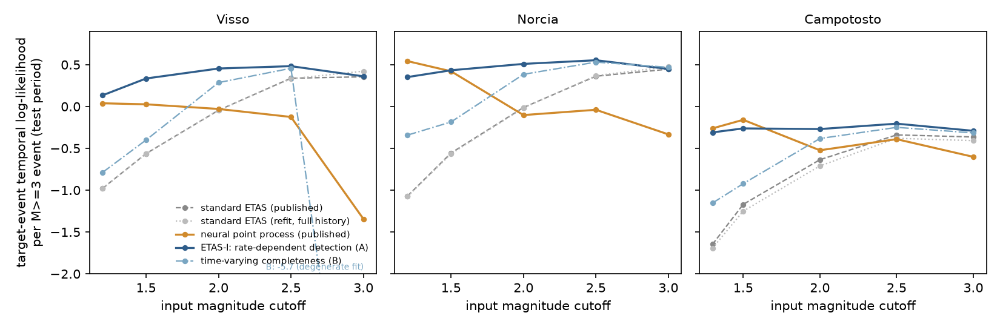

# Do neural earthquake forecasts win only because the ETAS baseline ignores missing earthquakes?

*A preregistered re-test of the neural point process advantage on the 2016–17 Central Apennines sequence, against ETAS models that account for short-term catalog incompleteness*

Run directory: `research-lab/runs/seismology-geophysics-npp-gain-incompleteness-baseline` · Preregistration: [`plan.md`](plan.md) ·
Every departure from it: [`deviations.md`](deviations.md) · 4 October 2026, revised after independent review

## In plain terms

Earthquake forecasting models are usually judged by how well they predict when the next sizeable earthquake
(magnitude 3 or more) will happen. The standard model, ETAS, assumes each earthquake can trigger more. In 2023, a
neural network model was reported to beat ETAS clearly on the 2016–17 earthquake sequence in central Italy. The
advantage was largest when the models were fed many small earthquakes.

But right after a big earthquake, seismic networks miss many small ones: the recordings overlap and smaller events are
hidden. Standard ETAS assumes nothing is missed, so it misjudges how productive big earthquakes are. We asked whether
that handicap, rather than anything the neural network learned, explains its advantage.

We gave ETAS a simple model of missed detections. When earthquakes come thick and fast, small ones are lost for a few
tens of seconds after each event. We fitted it to exactly the same data and scored it on exactly the same earthquakes.
The test was written down before we fitted it.

**What we found.** The improved ETAS closes 88–109% of the neural network's advantage in all three test periods. That
meets the preregistered test. It does not clearly beat the neural network: in one period the network is still a
little better, and in the other two they are statistically tied. Most of the improvement comes from the hours just
after the largest shocks.

On a computer-generated test catalog, the improved ETAS did not close the gap. So this result is about how this
catalog misses earthquakes, not a general law.

## What was done

**Data and protocol.** The plan was committed (795c015) before any incompleteness-aware ETAS was fitted. Everything
uses the released data and protocol of Stockman, Lawson & Werner (2023):

- the machine-learning-enhanced AVN catalog;
- three train/test splits (Visso, Norcia and Campotosto);
- input events above a cutoff (magnitude 1.2 or 1.3);
- target events of magnitude 3 or more;
- the same test-period targets and scoring windows.

**Reproduction.** Our re-implementation reproduces their released standard-ETAS scores exactly (difference 0.0). The
neural model's advantage G is +1.02, +1.61 and +1.39 nats per target event.

**Models.**

| Model | Description |
|---|---|
| S0 | Stockman's published standard ETAS. |
| S2 | Standard ETAS refitted here with full history. |
| A | ETAS-I. Events are detected unless a larger one occurred within a blind time T_b, so detection falls when activity is high (Hainzl 2016, 2021). It has 2 extra parameters, T_b and b. |
| B | ETAS with a completeness magnitude that rises after each large shock and decays (Helmstetter et al. 2006). |

All are fitted by maximum likelihood on training data only. Of A and B, the primary model is the one with the better
training fit. That was A in every configuration.

**Statistic.** The recovery fraction R = (A − S0) / (NPP − S0), with a 24-hour block-bootstrap CI. **Supported** if
R ≥ 0.75 in at least 2 of 3 configurations.

**Validation.** Before any real-data evaluation, the fitting code was checked on simulated catalogs where the truth is
known. Both A and B recover their generating parameters on average over 16 seeds. The fitted likelihood reaches at
least the true-parameter likelihood in 16 of 16 seeds for each model. One seed of A has two parameters 2–3 standard
errors off (D1, D3).

## Results

| Sequence (cutoff) | Neural gap G | ETAS-I score | Neural score | Recovery R (95% CI) |
|---|---|---|---|---|
| Visso (1.2) | +1.02 | 0.134 | 0.038 | **1.09** (0.69–1.31) |
| Norcia (1.2) | +1.61 | 0.352 | 0.542 | **0.88** (0.80–0.97) |
| Campotosto (1.3) | +1.39 | −0.310 | −0.261 | **0.97** (0.81–1.08) |

Scores are mean temporal log-likelihoods per target event; the published standard ETAS scores −0.978, −1.070 and
−1.646.

**Verdict: Supported.** R ≥ 0.75 in all three configurations. The lower bound is above 0.75 in two; Visso's interval
includes it.

**Where the gap comes from:**

- Giving ETAS its full history changes almost nothing (−0.001 to −0.037 nats).
- Refitting standard ETAS changes nothing (0.000 to −0.009).
- The detection model adds +1.11, +1.43 and +1.38.
- What remains between the neural model and ETAS-I is −0.10, +0.19 and +0.05.

**ETAS-I does not beat the neural model at the preregistered cutoffs.** Per target event, ETAS-I minus NPP is:

- +0.10 (95% CI −0.30 to +0.31) at Visso;
- −0.19 (−0.33 to −0.04) at Norcia, where the neural model is significantly better;
- −0.05 (−0.35 to +0.10) at Campotosto.

**The gain is concentrated.** The single 24-hour period containing the Norcia M6.1 mainshock (Visso and Norcia), or
the January 2017 Campotosto shocks, carries 39–50% of ETAS-I's improvement over standard ETAS. The top three days carry
49–68%.

**History is not the source of the gain.** Scored with the same truncated history as the published ETAS, ETAS-I
still gives R = 1.06, 0.86 and 0.96.

### Other input cutoffs (secondary)

- **The neural advantage disappears at higher cutoffs.** The published neural gap shrinks as the cutoff rises, and is
  zero or negative from about magnitude 2.0–2.5. There, R is undefined.
- **ETAS-I scores above the neural model in 12 of 15 configurations,** with a CI above zero in 8. It is the best of
  the five models in 10.
- **Much of that margin is the neural model failing at high cutoffs, not ETAS-I excelling.** For example, at Visso
  3.0 the neural model scores −1.34 against standard ETAS's +0.36.

### Synthetic incomplete catalog (secondary)

On Stockman's synthetic incomplete catalog (cutoff 2.0), the neural model's advantage over published ETAS is +0.22.

- ETAS-I collapses to standard ETAS: its blind time goes to zero. Its R is −0.41 with full history, and 0.02 with
  truncated history.
- The completeness model B recovers only 12%.

There, the gap comes from a training-period bias in the ETAS parameters that neither detection model repairs. The AVN
result therefore reflects the rate-dependent incompleteness of this real catalog. It is not evidence that incompleteness
explains NPP gains in general.

## Caveats

- **ETAS-I is a strong baseline, not a physical measurement.**
  - Its fitted b-value (about 1.5 at the primary cutoffs) is higher than the catalog's at large magnitudes (1.1–1.25).
  - Its branching ratio exceeds 1 in several fits.
  - Its blind time rises with the cutoff, although a real network's blind time should not.
- **One sequence.** One sequence with three overlapping test periods.
- **The Fusion model (Xiong et al. 2026) was not tested.** Its released checkpoints do not match any released script.
- **Fitting needed care** (D2–D6):
  - The first fit at Norcia was a local optimum, which gave R = 0.51; a wider search found the better optimum.
  - Two numerical failure modes of the kernel approximation had to be guarded against.
  - The preregistered decision rule never changed.

## Independent review

The reviewer independently re-derived the ETAS-I target likelihood and re-integrated it with exact sums and finer
quadrature, confirming it to within 0.0023 nats. They also confirmed there was no test leakage. The review was
"fix first":

- **Norcia local optimum.** The reviewer found that the first Norcia fit was a local optimum. With the wider search,
  R rose from 0.51 to 0.88.
- **Stale validation tables.** The validation tables came from an earlier version of the code; they were regenerated.
- **No b-value leak.** The plan's claimed b-value leak in the published ETAS was wrong, and is withdrawn.
- **Requested additions.** The reviewer required the ETAS-I-minus-neural comparison, the concentration analysis,
  the truncated-history check, the synthetic result and the parameter caveats above.

The wider search then exposed a further numerical exploit, fixed by an accuracy guard (D6). All results are from the
final code.
